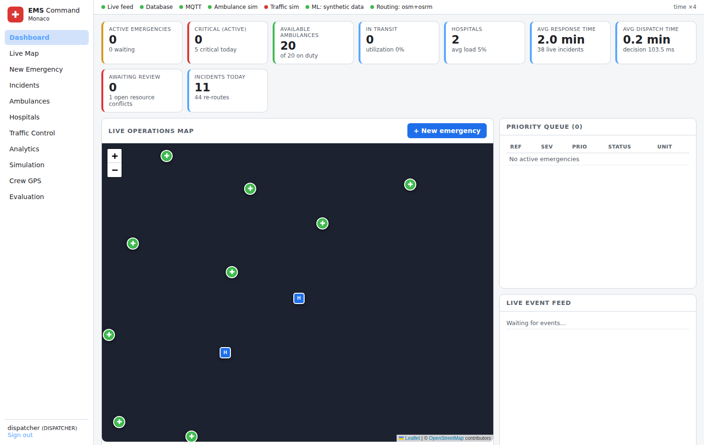
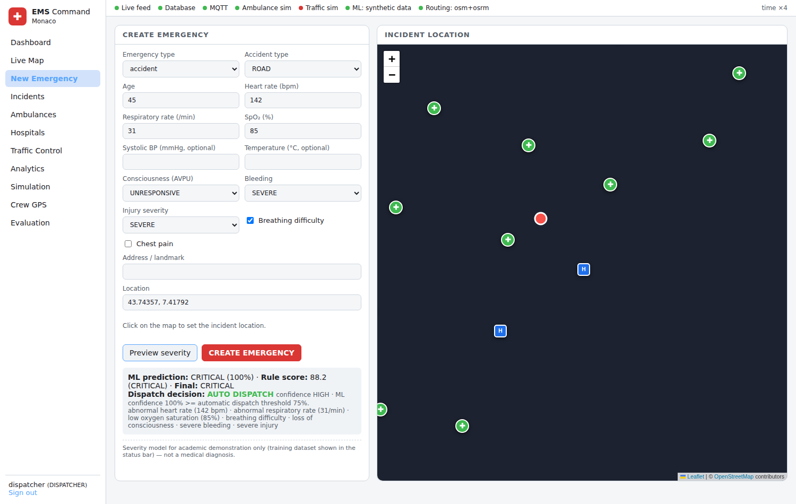
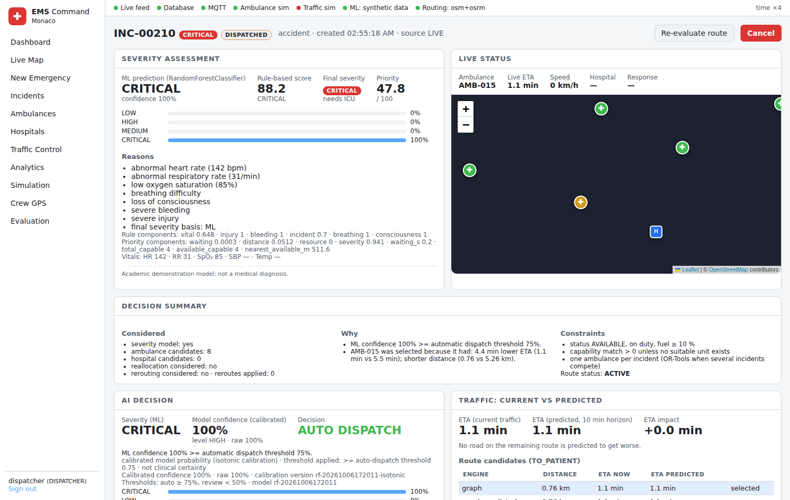
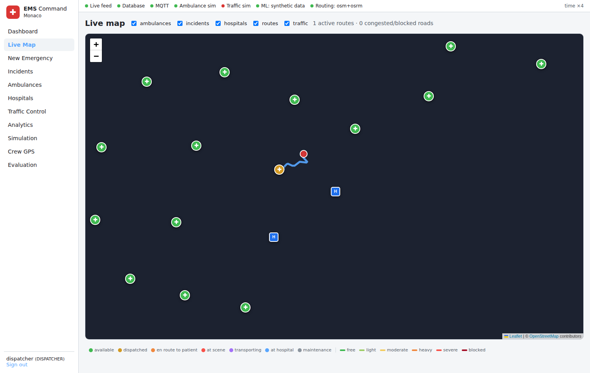
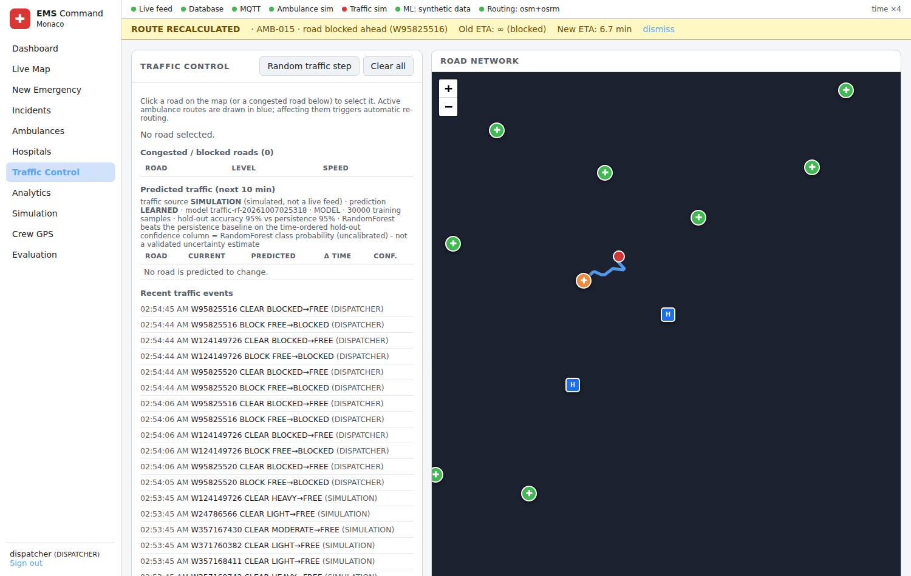
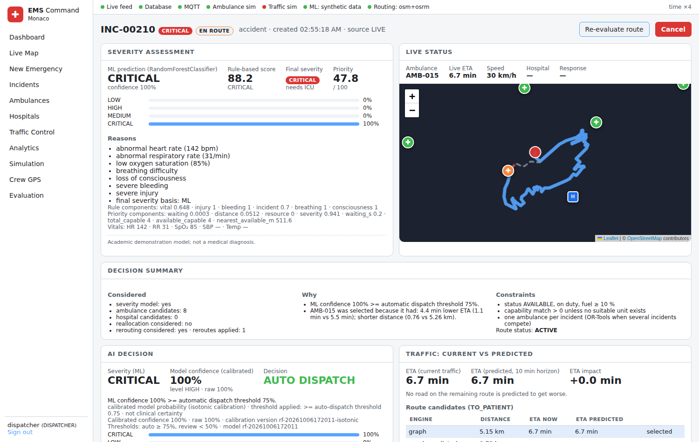
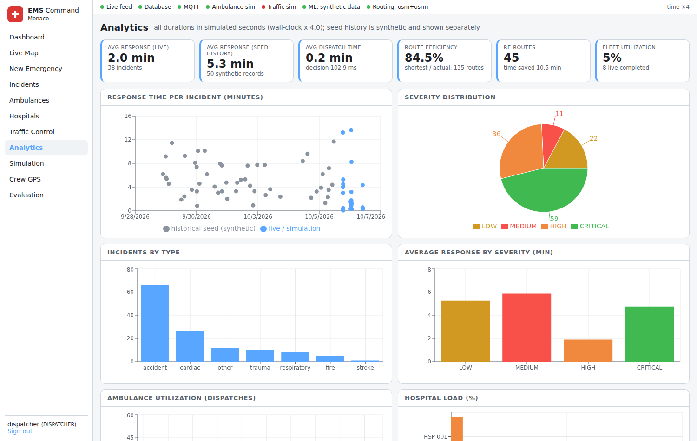
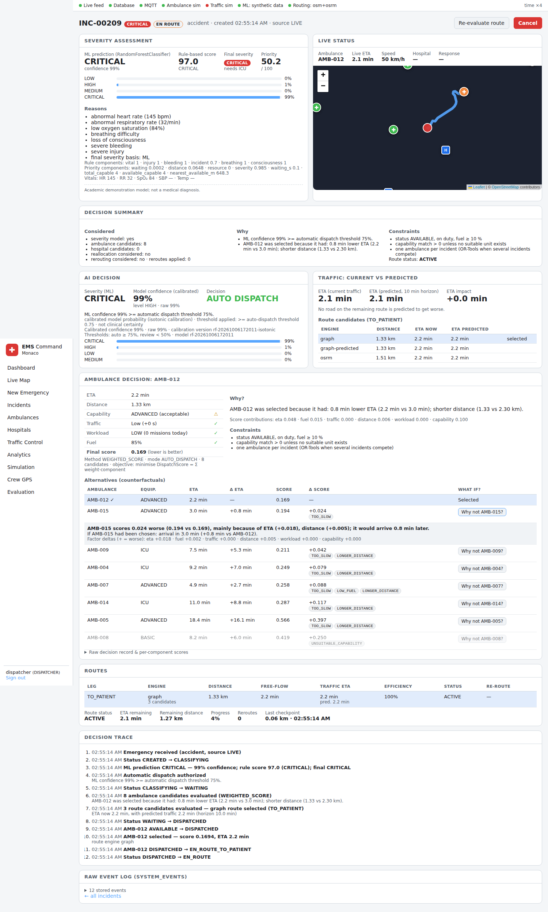
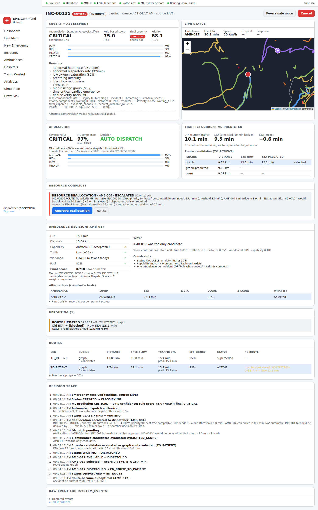
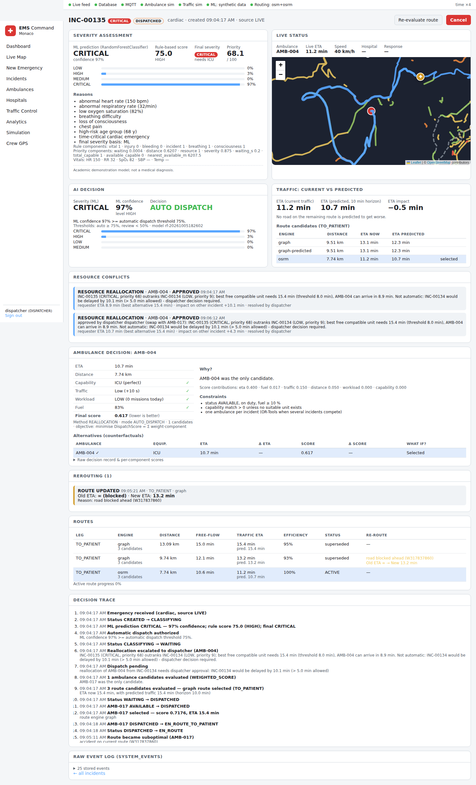

# AI-Powered Emergency Vehicle Dispatch & Traffic-Aware Routing System

A working, locally-runnable emergency response command center: emergencies are classified by a
trained ML model plus a transparent rule score, prioritised in a queue, matched to the best ambulance
by a multi-criteria optimiser over **traffic-aware road routes**, tracked live over **MQTT → PostGIS →
WebSocket**, re-routed automatically when simulated traffic degrades the current route, and delivered
to the most suitable hospital. Every number in the UI is computed by the backend and stored in
PostgreSQL/PostGIS.

> **Academic project.** Traffic and GPS are *simulated*; the severity model is trained on a *synthetic*
> dataset and is **not** a medical device and does not provide diagnoses. See [Limitations](#21-limitations).

---

## Contents
1. [Problem statement](#1-problem-statement) · 2. [Motivation](#2-motivation) · 3. [Objectives](#3-objectives) ·
4. [Features](#4-features) · 5. [Architecture](#5-architecture) · 6. [Technology stack](#6-technology-stack) ·
7. [Database](#7-database-architecture) · 8. [ML](#8-ml-architecture) · 9. [Routing](#9-routing-architecture) ·
10. [Traffic simulation](#10-traffic-simulation) · 11. [Dispatch algorithm](#11-dispatch-algorithm) ·
12. [Formulas](#12-formulas) · 12a. [Decision intelligence](#12a-decision-intelligence) · 12b. [Research evaluation](#12b-research-evaluation-progressive-baselines-and-ablation) · 12c. [Reliability & provenance](#12c-reliability-calibration-and-data-provenance) · 13. [Installation (Windows)](#13-installation-windows-powershell) ·
14. [Running](#14-running-the-project) · 15. [Docker](#15-option-b-docker-compose) · 16. [Demo](#16-demo-scenario) ·
17. [API](#17-api) · 18. [Testing](#18-testing) · 19. [Measured results](#19-measured-results) ·
20. [Screenshots](#20-screenshots) · 21. [Limitations](#21-limitations) · 22. [Future work](#22-future-work)

---

## 1. Problem statement
Dispatching the *geographically nearest* ambulance is often wrong: the nearest unit may lack the
equipment the patient needs, be stuck behind an accident, be low on fuel or already overworked, and
the nearest hospital may have no ICU or cardiac unit. The best decision depends on **severity, travel
time under current traffic, unit status and capability, road closures, workload, hospital
capability and hospital load**, and it must be re-evaluated as conditions change.

## 2. Motivation
Every minute of response time matters for cardiac arrest, stroke and major trauma. Commercial
dispatch systems combine triage, GIS and live traffic. This project rebuilds that pipeline with free,
open-source components so each step (prediction, scoring, routing, re-routing) is inspectable.

## 3. Objectives
* Classify emergency severity with a real, evaluated ML model and an explainable rule score.
* Prioritise incidents with a priority queue instead of first-come-first-served.
* Select ambulances by a weighted multi-criteria score computed on **traffic-adjusted road ETAs**.
* Use OpenStreetMap + PostGIS + a local OSRM server for geospatial work and routing.
* Simulate IoT devices (ambulance GPS, traffic sensors, hospital capacity) over MQTT.
* Push all state changes to the browser in real time (WebSocket).
* Detect route degradation and re-route automatically; select hospitals by suitability.
* Store every decision for analytics; make every decision explainable; make simulations reproducible.

## 4. Features
| Area | What is implemented |
|---|---|
| Emergency intake | validated form/API, PostGIS `ST_Contains` service-area check, statuses `CREATED → … → COMPLETED/CANCELLED` |
| Severity | RandomForest (scikit-learn, joblib) + rule score with reasons + safety override |
| Priority | PriorityScore (severity, waiting time, distance to nearest free unit, resource scarcity) + heap queue |
| Dispatch | PostGIS KNN candidate search → route per candidate → DispatchScore → best unit; OR-Tools CP-SAT for several simultaneous incidents; manual override |
| Routing | OSM road graph in PostGIS, scipy Dijkstra on live traffic weights, local OSRM alternatives re-costed with live traffic |
| Traffic | per-road congestion level, closures, accident multiplier, vehicle density; dispatcher controls + MQTT traffic simulator |
| Re-routing | triggers: road blocked ahead, ETA +20 %, SEVERE congestion ahead, accident on route; old/new ETA and time saved stored |
| Hospitals | HospitalScore (ETA, capability mismatch, load, traffic delay), capacity updates, warnings when no suitable hospital exists |
| Live tracking | MQTT simulator → backend → batched PostGIS writes → WebSocket → Leaflet markers |
| Analytics | response/dispatch time, route efficiency, re-routes, utilisation, hospital load, severity/type distributions, ML metrics |
| Security | JWT (HS256), bcrypt password hashes, roles ADMIN / DISPATCHER / VIEWER |
| Simulation | seeded schedules (`seed=42` reproducible), 16-step scripted demo scenario |
| Decision intelligence | confidence-aware dispatch with human review, explanations + counterfactuals, predictive traffic and hospital congestion, multi-emergency reallocation, telemetry-driven rerouting without oscillation ([§12a](#12a-decision-intelligence)) |
| Ops | `/api/health`, structured JSON logs, Prometheus `/metrics`, Docker Compose |

## 5. Architecture
```
 React + Vite + TypeScript (Leaflet/OSM, Recharts)            Python IoT simulators
   Dashboard · Live map · Emergencies · Traffic control         ambulance_simulator.py  traffic_simulator.py
   Analytics · Simulation                                        (GPS, telemetry)        (road sensors, hospital discharges)
          │ REST /api/*        ▲ WebSocket /ws                          │  ▲ MQTT (Mosquitto broker)
          ▼                    │                                         ▼  │
 ┌──────────────────────────── FastAPI backend ─────────────────────────────────────────────┐
 │ API routers ─ services: incident · dispatch · mission · routes(reroute) · traffic ·       │
 │                         telemetry(batch) · analytics · simulation · auth                 │
 │ ML engine (RandomForest)   Dispatch engine (scores, priority queue, OR-Tools CP-SAT)     │
 │ Routing engine: RoadGraph (scipy Dijkstra, live weights) + OSRM client (local)           │
 │ background loops: telemetry flush 1 s · missions 1 s · dispatcher 3 s · route monitor 5 s │
 └─────────────────────────────────┬────────────────────────────────────────────────────────┘
                                   ▼
            PostgreSQL 16 + PostGIS 3 (geography points/lines, GIST indexes)          OSRM (Docker, car.lua, MLD)
```
Data flow for a live update: simulator publishes `ambulance/AMB-004/location` → `MqttBridge` thread →
`TelemetryBuffer` (updates route progress + remaining ETA, broadcasts `AMBULANCE_LOCATION_UPDATED`) →
flushed every second in one transaction to `ambulances` and `ambulance_locations` → map marker moves.

State changes are written with `emit()` into `system_events` **inside the same DB transaction**; the
WebSocket broadcast and MQTT publications run only after the commit succeeds
(`app/services/events.py`), so clients never see state that was rolled back.

Project layout:
```
emergencydispatch/
├─ backend/app/
│  ├─ main.py  config.py  database.py  migrate.py  seed.py
│  ├─ api/          auth, emergencies, fleet, routes, traffic, analytics, ml, simulation, health
│  ├─ models/       SQLAlchemy/GeoAlchemy2 mappings     schemas/  Pydantic validation
│  ├─ services/     incident, dispatch, mission, routes (re-routing), traffic, telemetry, analytics, simulation, events, auth, metrics
│  ├─ ml/           dataset.py (synthetic generator) train.py predict.py artifacts/metrics.json
│  ├─ routing/      graph.py engine.py osrm_client.py traffic.py eta.py network_import.py
│  ├─ dispatch/     severity.py priority.py scoring.py optimizer.py
│  ├─ mqtt/         client.py handlers.py         websocket/manager.py     utils/
│  └─ tests/        40 pytest tests
├─ frontend/src/    pages/ components/ map/ hooks/useLive.tsx services/ types/   e2e/ (Playwright)
├─ simulator/       ambulance_simulator.py traffic_simulator.py run_simulator.py common.py
├─ database/        migrations/0001_initial.sql   seed/seed_data.py
├─ data/maps/       monaco.osm.pbf (sample) + README (your own city)
├─ scripts/         setup_windows.ps1 start_windows.ps1 setup_osrm.ps1/.sh benchmark.py
├─ docker/ monitoring/ docker-compose.yml .env.example requirements.txt
```

## 6. Technology stack
Every component has a concrete role:

| Technology | Role in this system |
|---|---|
| Python 3.11, FastAPI, Pydantic | REST + WebSocket API, request validation, OpenAPI docs at `/docs` |
| SQLAlchemy 2 + GeoAlchemy2 + psycopg 3 | ORM, transactions, row locks (`FOR UPDATE`) during dispatch |
| PostgreSQL 16 + PostGIS 3 | all persistent state; `GEOGRAPHY` points/lines; `ST_DWithin`, `ST_Distance`, `<->` KNN, `ST_Contains`, `ST_Buffer` |
| OpenStreetMap + pyosmium | road network import (ways, speeds, one-ways) |
| OSRM (Docker) | candidate routes and alternatives on the OSM network |
| numpy / scipy | vectorised edge weights, C Dijkstra (`scipy.sparse.csgraph`), KD-tree node snapping |
| scikit-learn, pandas, joblib | severity classifier training/evaluation/serving |
| Google OR-Tools (CP-SAT) | optimal multi-incident ambulance assignment |
| paho-mqtt + Mosquitto | IoT messaging between simulators and backend |
| FastAPI WebSockets | real-time push to dispatchers |
| PyJWT + bcrypt | authentication and password hashing |
| prometheus-client | `/metrics` (optional Prometheus/Grafana via compose profile) |
| React 18, TypeScript, Vite, Leaflet, Recharts | command-center UI, maps, charts |
| pytest, HTTPX/TestClient, Playwright | unit, API, integration and browser E2E tests |
| Docker Compose | Option B deployment; OSRM preprocessing |

Redis is **not** used: in-process caches (route cache, live telemetry) are sufficient at this scale,
so it was left out instead of adding an unused dependency.

## 7. Database architecture
Schema: `database/migrations/0001_initial.sql`, applied by `python -m app.migrate` (ordered SQL files
recorded in `schema_migrations`).

| Table | Purpose / key columns |
|---|---|
| `users` | UUID, username, bcrypt `password_hash`, `role` (ADMIN/DISPATCHER/VIEWER) |
| `service_areas` | `boundary GEOMETRY(POLYGON,4326)`, used with `ST_Contains` to validate incident locations |
| `road_nodes` | OSM node id, `location GEOGRAPHY(POINT)` |
| `road_conditions` | one row per road (OSM way): speed limit, `congestion_level`, `blocked`, `incident_multiplier`, `vehicle_density`, `geom GEOGRAPHY(LINESTRING)` |
| `road_edges` | directed edges between consecutive OSM nodes → `road_id`, `length_m` |
| `emergency_incidents` | UUID, `reference`, location, vitals, ML + rule results, `priority`, `status`, lifecycle timestamps, `source` |
| `ambulances` | `AMB-001`…, `location`, status, `equipment_level`, fuel, speed, `current_incident`, `missions_today` |
| `ambulance_locations` | GPS history (batched inserts) |
| `hospitals` | capacity, ICU beds, trauma/cardiac/stroke flags, `current_load`, `location` |
| `dispatches` | chosen unit, score, all candidate scores (JSONB), explanation, hospital candidates/explanation, decision time |
| `routes` / `route_segments` | every planned/re-planned route with geometry, free-flow and traffic ETA, OSRM ETA, shortest distance, re-route reason, old ETA, time saved; per-segment road and planned speed |
| `traffic_events` | every congestion change / accident / closure with source (SIMULATOR, DISPATCHER, SCENARIO, SIMULATION, SEED) |
| `iot_messages` | every MQTT message received (JSONB) |
| `model_predictions` | features, class probabilities, model version, latency per incident |
| `system_events` | append-only log of all decisions/state changes (analytics + incident timelines) |

Indexes: GIST on all geography columns; B-tree on incident status/created_at, ambulance status,
route `active` (partial), `route_segments(road_id)`, traffic event road/time, system event type/time.

PostGIS is used for real work: nearest available ambulances (`ORDER BY location <-> incident.location`),
distance to nearest free unit (`ST_Distance`) in the priority score, roads near an accident point
(`ST_DWithin` + KNN), nearest road to a map click, hospital pre-selection by KNN, service-area
containment (`ST_Contains`), and the service area itself (`ST_Buffer`).

## 8. ML architecture
`app/ml/dataset.py` → `app/ml/train.py` → `app/ml/artifacts/model.joblib` → `app/ml/predict.py` → API.

* **Dataset**: 6 000 synthetic cases (seed 42). Each case draws a latent acuity class (prior depends on
  emergency type), then class-conditional vitals and observations with overlap, plus 4 % label noise.
  *It is synthetic and medically inspired only.*
* **Features**: age, heart rate, respiratory rate, SpO₂, consciousness (AVPU 0–3), bleeding (0–3),
  injury severity (0–3), breathing difficulty, chest pain, emergency type (one-hot), accident type (one-hot).
* **Target**: LOW / MEDIUM / HIGH / CRITICAL. **Split**: 80/20 stratified (4 800 / 1 200).
* **Models compared**: Logistic Regression, Random Forest (deployed, 200 trees, depth 14, balanced),
  Gradient Boosting. Metrics are written to `artifacts/metrics.json` and shown on the Analytics page.
* **Serving**: loaded once at start-up; each prediction is stored in `model_predictions`. If the model
  file is missing the incident is marked `ml_status = UNAVAILABLE`, the rule score is used and the UI
  says so: it never pretends a prediction happened.
* **Final severity**: ML prediction, unless the rule score is ≥ 2 levels higher (safety override).

Measured on the held-out test set (synthetic data, so these numbers describe how separable the
generator is, **not** real-world clinical performance):

| Model | Accuracy | Precision (macro) | Recall (macro) | F1 (macro) |
|---|---|---|---|---|
| Logistic Regression | 0.930 | 0.936 | 0.933 | 0.934 |
| **Random Forest (deployed)** | **0.955** | **0.960** | **0.955** | **0.957** |
| Gradient Boosting | 0.959 | 0.963 | 0.960 | 0.961 |

RandomForest confusion matrix (rows = true, cols = predicted; LOW, MEDIUM, HIGH, CRITICAL):
`[[260,20,0,0],[6,363,7,0],[0,11,311,4],[0,0,6,212]]`. Most important features: SpO₂ (0.35),
heart rate (0.31), respiratory rate (0.17), consciousness (0.06).

## 9. Routing architecture
```
point → nearest road node (KD-tree) → candidates ─┬─ graph: Dijkstra on current traffic-adjusted edge times (closures removed)
                                                  └─ OSRM: up to 3 alternatives (car profile, MLD) → re-costed edge-by-edge
       → choose min traffic-adjusted duration → distance, free-flow duration, adjusted duration, geometry, segments
```
* The road graph (`road_nodes`, `road_edges`, `road_conditions`) is imported from the OSM extract with
  pyosmium and reduced to its largest strongly-connected component.
* OSRM knows nothing about our simulated traffic, so each OSRM route is mapped back onto our edges via
  OSM node ids (`annotations=nodes`) and re-costed with live speeds. Unmappable node pairs keep OSRM's
  own estimate. Both engines are always compared, and the result records which won (`routes.engine`).
* **Fallback**: no OSRM → graph only. No OSM extract → a synthetic grid network (status bar shows
  `synthetic-fallback`). Points more than 1.5 km from any road are rejected.
* Verified in this environment with the bundled Monaco extract: 11 250 nodes, 19 562 directed edges,
  1 108 roads; OSRM built with `osrm-extract/partition/customize` in Docker.

## 10. Traffic simulation
* Each road has `congestion_level ∈ {FREE, LIGHT, MODERATE, HEAVY, SEVERE, BLOCKED}`, `blocked`,
  `incident_multiplier ∈ (0,1]`, `vehicle_density`.
* **Traffic simulator** (`simulator/traffic_simulator.py`, seeded): every 5–10 s it applies a Markov
  drift to a few roads (major roads 3× more likely), creates accidents (SEVERE, multiplier 0.5) that may
  escalate to closures and clear after ~25–40 s, and publishes `traffic/{road_id}/status` (retained),
  `traffic/{road_id}/speed`, `traffic/events`. `--target-routes 0.3` aims 30 % of ticks at roads on
  active ambulance routes so that re-routing is exercised.
* **Dispatcher traffic control** (UI/API): accident, block, unblock, congestion level, clear, random
  step, clear all.
* The backend is the single source of truth: `traffic_service.apply_update()` updates PostGIS, the
  in-memory graph, `traffic_events`, MQTT (for the ambulance simulator), WebSocket, then triggers the
  route monitor.

## 11. Dispatch algorithm
1. `create_incident`: validate → `ST_Contains` → ML → rule score → final severity → required capability
   (CRITICAL→ICU, HIGH/cardiac/stroke→ADVANCED, else BASIC) → PriorityScore → `WAITING`.
2. `dispatcher_cycle` (on creation, every 3 s, after units free up): recompute priorities of waiting
   incidents, pop up to 5 from the heap-based priority queue.
3. Candidates: nearest 8 `AVAILABLE`, on-duty units with ≥ 10 % fuel by PostGIS KNN, plus the 2 nearest
   units meeting the capability requirement.
4. A traffic-aware route is computed for each candidate; the DispatchScore components are normalised
   across the candidate set; units with capability match 0 are only used if no suitable unit exists.
5. One incident → minimum score. Several incidents → **OR-Tools CP-SAT** maximises
   Σ x·(10·priority − 100·score) with one unit per incident and one incident per unit, so scarce units
   go to the highest-priority incidents. If the optimiser gives an incident a unit other than its
   individually best one, the explanation says why.
6. Commit: dispatch row (all candidates + explanation), route + segments, statuses, events; after
   commit the route is published to `ambulance/{id}/command` (retained) for the simulator.
7. Mission state machine (`mission_service`): `ROUTE_STARTED` → EN_ROUTE; `ARRIVED` → ARRIVED;
   after scene time → PATIENT_LOADED → **hospital selection** → TO_HOSPITAL; `ARRIVED` at hospital;
   after handover time → COMPLETED, unit AVAILABLE.
8. Route monitor: after every traffic change touching a road ahead (and every 5 s) it compares the
   remaining ETA at current speeds with the remaining ETA at planned speeds and re-routes from the next
   junction if a trigger fires and the alternative is faster by ≥ max(10 s, 5 %). A road closure always
   forces a new route.

## 12. Formulas
All implemented in code (file in brackets) and unit-tested.

* **Haversine** (`utils/geo.py`, fallback only): a = sin²(Δφ/2) + cos φ1·cos φ2·sin²(Δλ/2);
  c = 2·atan2(√a, √(1−a)); d = R·c, R = 6 371 000 m.
* **Base ETA** (`routing/eta.py`): ETA_base = Distance / Speed (m, m/s → s).
* **Traffic** (`routing/traffic.py`): AdjustedSpeed = SpeedLimit × CongestionFactor × IncidentMultiplier,
  factors FREE 1.00 · LIGHT 0.85 · MODERATE 0.70 · HEAVY 0.50 · SEVERE 0.30 · BLOCKED 0;
  ETA_adjusted = Distance / AdjustedSpeed (∞ when blocked). Route ETA = Σ segment times.
* **Route efficiency**: ShortestPossibleDistance / ActualRouteDistance (shortest = network shortest
  path by length, ignoring traffic).
* **Time saved**: OldETA − NewETA (OldETA = remaining ETA on the degraded route).
* **Degradation**: (current remaining ETA − planned remaining ETA) / planned; re-route trigger > 0.20.
* **SeverityScore** (`dispatch/severity.py`) = 100 × (0.25·Vital + 0.20·Consciousness + 0.20·Breathing +
  0.15·Bleeding + 0.10·Injury + 0.10·Incident); 0–25 LOW · 26–50 MEDIUM · 51–75 HIGH · 76–100 CRITICAL.
  An engineering prioritisation heuristic, **not** a validated clinical score.
* **PriorityScore** (`dispatch/priority.py`) = 100 × (0.50·Severity + 0.20·TimeWaiting +
  0.15·DistanceToPatient + 0.15·ResourceUrgency), with Severity = 0.5·level + 0.5·rule/100,
  TimeWaiting = min(1, wait/600 s), Distance = min(1, nearest free unit / 10 km),
  ResourceUrgency = 1 − available capable units / total capable units.
* **DispatchScore** (`dispatch/scoring.py`, lower is better) = 0.40·ETA + 0.20·Capability + 0.15·Traffic +
  0.10·Workload + 0.10·Fuel + 0.05·Distance, where ETA = eta/max eta, Capability = 1 − match
  (match 1.0 perfect, 0.5 acceptable, 0 unsuitable), Traffic = delay/max delay, Workload = min(1, missions/6),
  Fuel = 1 − fuel/100, Distance = distance/max distance.
  (The specification lists capability as "1.0 = perfect", but the score is minimised, so the code uses
  the *mismatch* 1 − match. Otherwise a perfect match would be penalised.)
* **HospitalScore** (lower is better) = 0.45·ETA + 0.25·CapabilityMismatch + 0.15·CapacityLoad +
  0.15·TrafficDelay; mismatch = unmet requirements / requirements (ICU for CRITICAL, trauma for severe
  accident/trauma/fire, cardiac, stroke); full hospitals are ranked last.

## 12a. Decision intelligence
The six features below share one decision engine. Each one reads and writes the same incident, dispatch,
route and event records. Every panel in the UI is built from stored data: the `system_events` trace and
the `dispatches`, `routes`, `traffic_predictions`, `hospital_predictions` and `resource_conflicts` rows.
None of it is recomputed for display. Thresholds are set in `.env` (see `.env.example`).

| # | Feature | Code | Rule (what the code actually does) |
|---|---|---|---|
| 1 | Confidence-aware dispatch | `dispatch/confidence.py`, `services/incident_service.py`, `services/dispatch_service.py` | confidence = RandomForest top-class probability. `≥ DISPATCH_CONFIDENCE_HIGH` → **AUTO_DISPATCH**; `< DISPATCH_CONFIDENCE_LOW` → **HUMAN_REVIEW**; otherwise **DISPATCH_WITH_REVIEW**. The safety override never lowers the level. A HUMAN_REVIEW incident waits for `POST /review`; after `HUMAN_REVIEW_TIMEOUT_S` it is released at the most severe plausible level (`HUMAN_REVIEW_TIMEOUT` event). Stored: predicted severity, confidence, class probabilities, level, mode and reason. |
| 2 | Explainable + counterfactual dispatch | `dispatch/explain.py` | per-factor contributions of the DispatchScore (weight × normalised value). "Why not X?" compares the chosen unit with X on the stored candidate rows: score delta, ETA delta, trade-offs and the factor that decided. The summary says so when the runner-up would have arrived earlier. The hospital choice is explained the same way. |
| 3 | Predictive traffic | `ml/traffic_model.py`, `services/traffic_prediction.py`, `routing/graph.py`, `routing/engine.py` | A RandomForest is trained on the `traffic_events` history to predict the level `TRAFFIC_PREDICTION_HORIZON_MIN` ahead. It is used (`method=MODEL`) **only if it beats the persistence baseline** on a time-ordered 25 % hold-out. Otherwise the transparent **FALLBACK** applies: next = cur + (mean − cur)·(1 − e^(−h/τ)), with τ and the incident duration estimated from the history. Predictions are stored per road (road, time, horizon, current/predicted level, speed, delay, confidence, model version). Routing blends live and predicted speed along the route: w = min(1, t/H) at time t into the trip, and candidates are ranked by that predicted ETA. |
| 4 | Predictive hospital congestion | `services/hospital_prediction.py`, `dispatch/scoring.py` | L(h) = L0·e^(−h/stay) + incoming(h) + λ·h, where λ and the stay are observed arrival/discharge rates (defaults while there are fewer than 3 observations). Expected wait = slot·ρ/(1−ρ), ρ = L/capacity, capped. Hospitals are scored on their forecast **at the ambulance's arrival time**, using time-to-treatment = ETA + wait. Missing capabilities always rank a hospital lower. Every value is labelled `estimated: true` with its method and confidence. |
| 5 | Multi-emergency reallocation | `services/reallocation.py`, `api/dispatch.py` | Considered only when the best free unit's ETA exceeds `RESOURCE_REALLOCATION_THRESHOLD`. A committed unit may be diverted only from a **strictly less severe** incident with priority lower by `REALLOCATION_PRIORITY_MARGIN`, if it arrives at least `REALLOCATION_MIN_GAIN_S` sooner and the donor's extra delay is ≤ `REALLOCATION_MAX_DONOR_DELAY_S`. Otherwise the conflict is **ESCALATED** to the dispatcher (approve or reject). The donor immediately gets the best remaining unit. Every case is stored in `resource_conflicts` (KEEP / REALLOCATED / ESCALATED / APPROVED / REJECTED). |
| 6 | Telemetry-driven rerouting | `services/routes_service.py`, `simulator/ambulance_simulator.py` | Triggers: a blocked road ahead, live or predicted degradation, SEVERE congestion, or an accident on the route. Accept iff new_eta + max(`REROUTE_MIN_ETA_SAVINGS`, old_eta·`REROUTE_MIN_IMPROVEMENT_PERCENT`%) ≤ old_eta, **and** not within `REROUTE_COOLDOWN_SECONDS`, **and** the route is not ≥ 80 % similar (Jaccard on roads) to an abandoned one. A blocked road or an infinite ETA overrides cooldown and similarity. The new route is computed from the ambulance's current GPS position on the real road graph and sent as MQTT `ROUTE_UPDATED`. The simulator snaps onto the new route from where it is, with no teleport. |

**Events** (in `system_events` and on the WebSocket): `CONFIDENCE_ASSESSED`, `DISPATCH_DECISION`,
`DISPATCH_EXPLANATION_GENERATED`, `COUNTERFACTUAL_EVALUATED`, `TRAFFIC_PREDICTION_CREATED`,
`HOSPITAL_CONGESTION_PREDICTED`, `RESOURCE_CONFLICT_DETECTED`, `RESOURCE_REALLOCATED`,
`ROUTE_DEGRADATION_DETECTED`, `REROUTE_EVALUATED`, `REROUTE_TRIGGERED`, `ROUTE_UPDATED`, `HUMAN_REVIEW_TIMEOUT`.

**Database:** migration `database/migrations/0004_decision_intelligence.sql` adds:
* incident columns: `class_probabilities`, `confidence_level`, `decision_mode`, `decision_reason`, `reviewed_by/at`;
* dispatch columns: `counterfactuals`, `decision_mode`, and the status `REALLOCATED`;
* route columns: `predicted_duration_s`, `prediction_horizon_min`;
* tables `traffic_predictions`, `hospital_predictions` and `resource_conflicts`.

Apply it with `python -m app.migrate`.

**UI** (Emergency details page): the AI Decision panel (confidence bar, class probabilities, review
buttons), the Ambulance Decision panel (factor contributions, *Why?*, alternatives with *Why not?*),
Predicted Traffic, Rerouting history, Hospital decision (predicted load and wait, estimated), Resource
conflicts (approve/reject) and the Decision trace. The Dashboard shows "Awaiting review" and open
conflicts. Traffic Control has a predicted-traffic table with the model status; Hospitals has predicted
load and wait columns.

**Live measurements** (Monaco OSM + OSRM + MQTT + simulators):
* Traffic model on 4 270 samples from the simulator history: `traffic-rf`, hold-out accuracy
  **0.692 vs 0.604** for persistence (MAE 0.602 vs 0.683 levels), so `method=MODEL`.
* A CRITICAL demo call was classified at 99.2 % confidence → AUTO_DISPATCH. It was rerouted live via
  `ROUTE_UPDATED` (the simulator snapped on at 0 m offset) and completed.
* A CRITICAL-vs-LOW conflict was **ESCALATED** because the donor delay of 10.1 min exceeded 5 min. The
  dispatcher approved it, the units were swapped, and the cost was +4.3 min for the LOW call.

## 12b. Research evaluation (progressive baselines and ablation)
The repository includes a research evaluation layer. It replays the **same seeded scenarios** under five
progressively stronger decision strategies (A BASELINE → B SEVERITY → C TRAFFIC → D HOSPITAL → E FULL) and
under six FULL-minus-one ablations. It reports paired statistics: Shapiro–Wilk, then a paired t-test or
Wilcoxon signed-rank, 95 % CI, and Holm-adjusted p-values.

Every decision is taken by the production code (triage, DispatchScore, OR-Tools, routing engine on a clone
of the real road graph plus OSRM, traffic and hospital prediction, the reallocation policy, the re-route
rules, explanations). Experiments write only the new `experiment_*` tables (migration `0005_evaluation.sql`)
and `evaluation/results/<run>/`.

```powershell
cd backend
python -m app.migrate
python -m app.evaluation.run_experiment --all --scenarios 100 --seed 42        # systems A-E
python -m app.evaluation.run_experiment --ablation --scenarios 100 --seed 42   # FULL and FULL-minus-one
```

Results appear as CSV/JSON, `REPORT.md` and SVG plots, and on the **Evaluation** page (`/evaluation`).
Methodology, metric definitions, statistical tests, assumptions and limitations:
**[docs/RESEARCH_EVALUATION.md](docs/RESEARCH_EVALUATION.md)**.

> **Data used for these results: Monaco, not Bengaluru.** The 100-scenario experiment and the live backend-restart
> validation were run in the development container on the bundled **Monaco** OpenStreetMap extract (with an OSRM
> instance built from that extract), with **synthetic** severity training data, **simulated** calls, traffic and
> hospital load. No Bengaluru map, OSRM build or Bengaluru data was used, so none of these numbers describe
> Bengaluru. A Bengaluru installation must re-run the experiment (`python -m app.evaluation.run_experiment --all
> --ablation --scenarios 100 --seed 42`). Provenance of every stored run: [evaluation/README.md](evaluation/README.md).

**Results: Monaco OSM + OSRM, seed 42.** Design: **100 scenarios × 11 strategy configurations = 1 100 simulation
runs** (0 failed). The 11 configurations are the 5 progressive systems A–E plus 6 FULL-minus-one ablations; FULL is
run once and serves both families. The 100 scenarios contain 562 emergency calls, identical in every configuration,
giving 562 × 11 = 6 182 simulated call outcomes. **The unit of analysis is the scenario.** Each table value is a
mean over the 100 scenario-level values of one configuration (fewer where a metric does not exist in a scenario,
e.g. 64 scenarios contain a CRITICAL patient). Paired tests compare the same scenario under two configurations (at
most 100 pairs); runs are never pooled across configurations. The report's "Design and denominators" section
lists every *n*.
(`evaluation/results/upgrade-s42-n100/`, re-run after the reliability upgrade; calibrated severity model; LEARNED traffic model; ESCALATED reallocations
rejected by the simulated dispatcher). These are simulated decision-support results, not clinical or real-world
performance. All numbers below are means over scenarios; "sig." means a Holm-adjusted paired Wilcoxon p < 0.05.

| Metric | A BASELINE | B SEVERITY | C TRAFFIC | D HOSPITAL | E FULL |
|---|---:|---:|---:|---:|---:|
| Response time (s) | 471.8 | 501.9 | 488.3 | 501.7 | 487.5 |
| Critical-case response (s) | 503.7 | 499.4 | 496.8 | 508.3 | 480.7 |
| Critical delay beyond 8 min (s) | 182.9 | 155.3 | 146.0 | 156.2 | 135.0 |
| Unsuitable first unit vs simulated need (%) | 25.0 | 13.9 | 13.4 | 13.3 | 11.9 |
| Hospital capability gap (%) | 38.2 | 34.2 | 34.3 | 34.3 | 34.2 |
| Hospital wait, simulated (s) | 1 944 | 1 980 | 1 987 | 1 534 | 1 529 |
| Creation → ED treatment, simulated (s) | 2 905 | 2 973 | 2 958 | 2 548 | 2 527 |
| \|ETA error\| (s) | 78.0 | 84.9 | 45.8 | 46.0 | 37.4 |
| Re-route ETA savings per scenario (s) | 0 | 0 | 0 | 0 | 11.9 |
| Review rate (%) / manual interventions per scenario | 0 / 0 | 0 / 0 | 0 / 0 | 0 / 0 | 2.8 / 0.41 |
| Under-triage vs simulated label (%) | n/a | 12.7 | 12.7 | 12.7 | 11.5 |
| Priority violations per scenario (vs simulated label) | 0.02 | 0.02 | 0.02 | 0.02 | 0.06 |
| Route failures (no drivable route) per scenario | 0.43 | 0.53 | 0.51 | 0.50 | 0.50 |
| Units stopped at a closure per scenario | 0.28 | 0.32 | 0.27 | 0.27 | 0.20 |
| Unsafe reallocations per scenario (vs simulated label) | 0 | 0 | 0 | 0 | 0.02 |

What the paired tests support (and what they do not):
* **Severity awareness has a measurable cost and a measurable benefit.** Sending capable units raises mean response
  time (+30 s vs BASELINE, sig., rank-biserial r = 0.51, large), but it halves unsuitable first units (25.0 % → 13.9 %, sig., r = −0.94) and reduces
  hospital capability gaps (−4.0 points, sig.). The nearest-unit baseline is fast because it often sends the wrong unit.
* **Traffic awareness mainly improves predictability.** |ETA error| falls by 39.1 s (sig., r = −0.91). Response time is not
  significantly different from SEVERITY.
* **Hospital intelligence gives the largest effect.** Simulated ED wait falls by 454 s (r = −0.87) and creation-to-treatment by
  411 s (r = −0.74), both sig. vs TRAFFIC. Removing it from FULL raises the wait by 470 s (sig., r = 0.92), at the price of 11.0 s longer
  response (sig., r = −0.49 for FULL−HOSPITAL, i.e. FULL is slower), because the chosen hospital is sometimes farther.
* **Dynamic re-routing helps.** Removing it from FULL adds 12.8 s response time (sig., r = 0.88) and 0.25 reactive detours per
  scenario (sig.).
* **Confidence-aware review** holds 2.8 % of calls and lowers potentially inappropriate automatic dispatch
  (sig.). Its effect on under-triage (12.7 % → 11.5 %) and on critical delay rests on too few non-zero pairs for a test.
* **Reallocation** found 42 conflicts in 30 of 100 scenarios: 11 automatic reallocations and 31 escalations (rejected
  by the simulated dispatcher). Removing it changes no time metric significantly.
* **Explainability** changes no decision (identical results in every scenario), as designed.
* **Traffic prediction did not help in this experiment.** The LEARNED model was trained on the live traffic
  simulator's history. Scored against the simulated state H minutes later it reaches 76.5 % accuracy (FULL), versus
  98.7 % for persistence and 32.6 % for the rule fallback, and removing it (FULL−TRAFFIC) does not change response time significantly. The
  scenario traffic changes far less often than the live simulator, so the learned dynamics do not transfer.
  This is reported, not tuned away; the live system only uses the model while it beats persistence on its own
  history (in this run 0.955 vs 0.950 hold-out accuracy; rule fallback 0.528).
* **Critical-case metrics** have 0.97 CRITICAL patients per scenario (64 of 100 scenarios have one), so most critical comparisons have
  too few non-zero pairs for a test. The trend favours FULL (critical delay 134.9 s vs 182.9 s), but it is not
  established.
* **Severity model on the scenario patients** (simulated label): accuracy 0.965 on clear reports, 0.597 on the
  35 % uncertain reports. Calibration ECE is 0.007 (clear) and 0.26 (uncertain): it does not transfer to noisy
  reports.
* **New operational metrics are rare events.** Priority violations (FULL 0.06 vs BASELINE 0.02 per scenario) rest
  on 3 non-zero paired differences, so no test was run. The difference is reported, not established, and its
  cause was not analysed. Route failures do not differ (Wilcoxon p = 0.94, r = 0.02).
  The 2 unsafe reallocations (FULL) are cases where the system's triage ranked the donor lower than the requester
  while the simulated label did not.
* **Hospital forecast vs simulated load** (SIMULATION, FULL): load MAE 0.56 patients vs persistence 0.59, but wait
  MAE 276 s vs persistence 264 s. The queueing forecast is not better than persistence for waits.
* **Effect sizes and medians** for every test are in `paired_tests.csv` and on the Evaluation page. Out of 91 tested
  comparisons, 49 vs BASELINE and 32 in the ablation family remain significant after Holm.
* **Note on tests.** Wilcoxon tests the location of the paired differences while the CI is for the mean, so a
  significant Wilcoxon result can sit with a mean CI that crosses 0 (e.g. SEVERITY's time-to-treatment). Such
  results are not claimed as improvements.


## 12c. Reliability, calibration and data provenance

| Improvement | What changed | Where |
|---|---|---|
| **Restart recovery** | The telemetry flush now persists each live route's progress and last ETA (`routes.progress_m / last_eta_s / progress_updated_at`, `ambulance_locations.progress_m`, migration `0006_route_progress.sql`). After a backend restart the active routes are restored *with* that progress. After a **simulator** restart, the route commands the broker replays are held, not driven. The simulator announces itself (`simulator/hello`), and the backend re-sends each live route with the last persisted GPS fix and progress (`ROUTE_RESUMED`). The unit continues where it is: same route id, no duplicate route, no jump to the route start. If GPS and stored progress disagree by more than 75 m, the route is re-planned from the GPS fix instead of guessing. | `services/routes_service.resume_simulated_routes`, `simulator/ambulance_simulator.py` |
| **No walking-speed "ambulance route"** | When every road route crosses a closed road, the router raises `NoDrivableRouteError` naming the closures, instead of driving through them at 5 km/h. Dispatch then reports **ROUTE UNAVAILABLE** with dispatcher review (the incident note names the closed roads). A moving ambulance gets one `ROUTE_UNAVAILABLE` event (ambulance, position, closed roads, `alternative_exists=false`, `dispatcher_required=true`) and a red banner, and keeps its route until a detour exists or the closure clears. The legacy behaviour is opt-in: `CLOSURE_ACCESS_FALLBACK=true`. | `routing/engine.py`, `services/dispatch_service.py`, `services/routes_service.py` |
| **Calibrated severity probabilities** | The RandomForest's class probability is a *model confidence*, not clinical certainty. Training now carves a calibration split out of the training data. Isotonic regression is used with ≥ 1 000 calibration rows, Platt (sigmoid) below that, and no calibration below 200 rows or 20 per class. Raw and calibrated models are compared on the untouched test split, and the calibrated model is deployed only if it lowers **both** Brier and ECE without losing more than 1 point of accuracy. On the synthetic dataset, calibration was applied (isotonic): Brier 0.1013 → 0.0827, ECE 0.0756 → 0.0126, accuracy 0.9558 → 0.9542, macro-F1 0.9581 → 0.9566. The raw forest was under-confident. Reliability curves are in `ml/artifacts/metrics.json`. Thresholds were **not** changed (0.75 / 0.50). Because calibrated probabilities are higher, fewer clean cases fall below 0.75 (test split: 10.7% → 1.1%). | `ml/calibration.py`, `ml/train.py`, `ml/predict.py` |
| **Confidence trace** | The decision trace / AI panel shows the predicted severity, the raw and the calibrated probability, the calibration method, the threshold that applied, the decision mode and the reason. It is labelled "model confidence, not clinical certainty". Decision modes map onto the requested vocabulary: AUTO = `AUTO_DISPATCH`, REVIEW = `DISPATCH_WITH_REVIEW`, CLARIFY = `HUMAN_REVIEW` (the dispatcher confirms or corrects severity before dispatch), ABSTAIN = model unavailable (the ML abstains; the rule score decides, with review). No new modes were invented. | `services/decision_service.py`, `DecisionPanels.tsx` |
| **Traffic source labels** | The traffic API and page state `traffic_source = SIMULATION`; whether the prediction is LEARNED or FALLBACK and why; training samples; the hold-out comparison against persistence; and what the confidence number means (the uncalibrated RF class probability, or the empirical persistence rate for the fallback). | `services/traffic_prediction.py`, `Traffic.tsx` |
| **Traffic model training storm (bug fix)** | Concurrent traffic events each retrained the model at start-up. The log showed 25 trainings on 30 000 samples, which saturated the CPU and stalled the API. Training is now serialised with a double-checked lock (1 training). | `services/traffic_prediction.py` |
| **Hospital data quality** | A capability status is derived from the data source: `VERIFIED_YES/NO` (CSV), `OSM_TAG_YES`, `UNKNOWN` (absent OSM tag, **never** "no"), `SIMULATED_YES/NO` (demo seed). Capacity is labelled verified / estimated / simulated, and load as SIMULATION. In ranking, a hospital whose required capability is only *unknown* ranks after confirmed-capable hospitals but before confirmed-lacking ones; with complete data the order is unchanged. Warnings distinguish "lacks" from "unknown". | `services/mission_service.py`, `dispatch/scoring.py` |
| **Hospital why / why not** | Every alternative hospital gets factual reasons: lacks / unknown capability, at capacity, slower, longer estimated wait, higher predicted load, or higher overall score. Hospital forecasts carry `source = SIMULATION`. | `dispatch/scoring.hospital_why_not`, `dispatch/explain.py` |
| **Reallocation candidates** | Every committed unit is assessed and the result stored in the conflict (`details.candidates`): unavailable (with reason), unreachable, insufficient gain, feasible / not feasible (with estimated donor delay). Among the 3 fastest options, the fastest *feasible* one is reallocated automatically. If none is feasible, the fastest is escalated, as before. It is still one donor per conflict; multi-unit chain reallocation is outside the current optimisation scope. The evaluation simulator uses the same ranking function. | `services/reallocation.rank_donor_options` |
| **Provenance labels** | Synthetic seed incidents show as `HISTORICAL_SEED / SYNTHETIC`, and simulation/scenario incidents as simulated. | `format.ts`, Incidents / details pages |
| **Evaluation** | The research evaluation (§12b) now also reports the severity model on the scenario patients (accuracy, macro P/R/F1, Brier, ECE, confidence distribution, split by clear / uncertain reports) and **traffic-prediction quality**: every prediction is scored against the simulated state H minutes later, next to the persistence baseline. | `evaluation/runner.py`, `evaluation/simulator.py` |
| **Route checkpoint + backend restart recovery** | Migration `0007_route_checkpoint.sql` adds `routes.checkpoint_lat/lon/segment`. The telemetry flush saves a checkpoint (progress, segment, position, ETA, time) at most every `ROUTE_CHECKPOINT_INTERVAL_S` (default 2 s) per active route and logs `ROUTE_CHECKPOINT_SAVED`. When the backend starts (after MQTT connects), every active route is reloaded from the database. If the latest GPS fix is within `ROUTE_CHECKPOINT_REPLAN_THRESHOLD_M` (default 75 m) of the checkpoint, the route continues from the checkpoint and the ETA is recomputed from the remaining route (`ROUTE_RECOVERED`). Otherwise the route is replanned from the GPS position (`ROUTE_RECOVERY_REPLAN`). Both events store the checkpoint, the current position, the distance, the threshold, the old/new ETA and the reason. In a live run in the development container (Monaco OSM extract, simulated ambulance, not Bengaluru), a backend killed mid-route came back and resumed the route at the 363.1 m checkpoint (distance 0 m, same route id). The route then completed normally. | `services/telemetry_service.py`, `services/routes_service.recover_active_routes`, `main.py` |
| **Structured ROUTE UNAVAILABLE** | `POST /api/routes/calculate` answers **409** with `{status: "ROUTE_UNAVAILABLE", reason, blocked_roads, origin, destination, dispatcher_action_required: true}` when no drivable route exists. For a moving ambulance, the route row stores `unavailable_reason / unavailable_at`, and `ROUTE_AVAILABLE` is emitted when the closure clears. The incident page shows a red "ROUTE UNAVAILABLE - dispatcher action required" banner naming the incident, the ambulance and the closed roads. Tests cover all five cases: a normal route, one closure with an alternate road, every access closed, fallback disabled (default) and fallback explicitly enabled. | `routing/engine.py`, `api/routes.py`, `EmergencyDetails.tsx` |
| **Calibration outputs** | Training writes `evaluation/severity_calibration.json`. It records the train 60 % / calibration 20 % / untouched test 20 % split, the method, the version, the raw and calibrated Brier and ECE, accuracy / precision / recall / F1, the sample counts and the ECE bins, and it logs `CALIBRATION_EVALUATED`. Each prediction keeps both the raw and the calibrated vectors, plus `calibration_version`, in `CONFIDENCE_ASSESSED`. With `CALIBRATION_ENABLED=false`, decisions use the raw probabilities. Current file (synthetic data, 1 200 test rows): Brier 0.1013 → 0.0827, ECE 0.0756 → 0.0126. | `ml/train.py`, `ml/predict.py` |
| **Traffic: ML vs fallback vs persistence** | `python -m app.evaluation.traffic_eval` scores the three predictors on the time-ordered hold-out of the stored (SIMULATION) traffic history and writes `evaluation/traffic_prediction.json` (logs `TRAFFIC_PREDICTION_EVALUATED`). Measured: ML accuracy 0.9532 / MAE 0.0841 levels, rule fallback 0.4793 / 0.5883, persistence 0.9504 / 0.1060 (30 000 samples, 7 500 hold-out). The learned model only marginally beats persistence, and the rule fallback is much worse than persistence. | `evaluation/traffic_eval.py`, `ml/traffic_model.py` |
| **Decision summary + rejection codes** | `GET /api/emergencies/{id}/decision` adds a `summary` covering what was considered (severity model, ambulance and hospital candidates, units with no drivable route, whether reallocation and rerouting were considered), why, the constraints and the route status. Each rejected candidate carries structured codes. Ambulance codes are `UNSUITABLE_CAPABILITY`, `TOO_SLOW`, `HEAVY_TRAFFIC`, `LOWER_CAPABILITY_MATCH`, `HIGHER_WORKLOAD`, `LOW_FUEL`, `LONGER_DISTANCE`, `HIGHER_SCORE`, `ASSIGNED_TO_HIGHER_PRIORITY`, `NO_DRIVABLE_ROUTE`. Hospital codes are `LACKS_CAPABILITY`, `CAPABILITY_UNKNOWN`, `HOSPITAL_FULL`, `TOO_SLOW`, `HOSPITAL_CONGESTION`, `HIGHER_SCORE`. Reallocation candidate codes are `DONOR_EQUAL_OR_HIGHER_SEVERITY`, `LOWER_PRIORITY_MARGIN` (= lower priority not low enough), `UNSUITABLE_CAPABILITY`, `NO_DRIVABLE_ROUTE`, `INSUFFICIENT_GAIN`, `NO_REPLACEMENT`, `DONOR_DELAY_TOO_HIGH`, `FEASIBLE` (logged as `RESOURCE_REALLOCATION_EVALUATED`). | `services/decision_service.py`, `dispatch/explain.py`, `dispatch/scoring.py`, `services/reallocation.py` |

**What is real, simulated, predicted or estimated**

| Data | Status |
|---|---|
| Road network, hospital names/locations | REAL PUBLIC DATA (OpenStreetMap) when the OSM extract is installed; synthetic grid otherwise |
| Hospital capabilities | VERIFIED only after the CSV import; OSM tags are partial evidence; missing tags are UNKNOWN |
| Hospital capacity / load | capacity estimated (OSM beds or default) unless verified; load is SIMULATION (dispatch admissions, simulated discharges) |
| Hospital load / wait prediction | MODEL OUTPUT, an ESTIMATE from a queueing approximation on simulated load |
| Traffic states | SIMULATION (traffic simulator + dispatcher events); no live external feed |
| Traffic prediction | MODEL OUTPUT, LEARNED only if it beats persistence on the stored (simulated) history, else FALLBACK |
| Severity | MODEL OUTPUT on SYNTHETIC training data (demo) or on a REAL PUBLIC triage dataset (KTAS, Korea, ED triage, not Indian pre-hospital care). Not a diagnosis, not clinically validated |
| Incidents | live dispatcher input, SIMULATION/SCENARIO (simulated), HISTORICAL_SEED (SYNTHETIC) |
| Ambulance GPS | SIMULATION (MQTT simulator), or the crew phone's real GPS (Crew GPS page) |

**Not implemented (with reason)**

| Feature | Status | Reason | What would be required | Current safe behaviour |
|---|---|---|---|---|
| Multi-unit / chain reallocation | NOT IMPLEMENTED | needs a joint optimisation over all active missions, a major change to the dispatch architecture | a fleet-wide assignment model (e.g. CP-SAT over active and waiting incidents) with impact constraints | one donor per conflict, ranked candidates, escalation when not feasible |
| Hospital-load prediction vs persistence on real data | NOT MEASURABLE WITH CURRENT DATA | no real occupancy history; in the *simulation* the forecast is now scored against the simulated load (load and wait MAE vs persistence, labelled SIMULATION, §12b) | historical snapshots of incoming ambulances plus real occupancy data | forecast labelled ESTIMATE / SIMULATION |
| Validated uncertainty for traffic predictions | NOT IMPLEMENTED | the RF class probability is uncalibrated, and the history is simulated | a calibration study on real traffic data | the number is shown with its exact meaning, never as a validated uncertainty |
| Real traffic / real hospital occupancy | NOT IMPLEMENTED | no free real-time source for Bengaluru | a licensed traffic API / hospital information-system integration | clearly labelled simulation |

## 13. Installation (Windows PowerShell)
Get the code (into `D:\emergencydispatch`):
```powershell
cd D:\
git clone https://github.com/jagan1344/emergencydispatch.git
cd D:\emergencydispatch
```

Prerequisites (all free): **Python 3.11+**, **Node.js 20+**, **PostgreSQL 16 with PostGIS**,
**Mosquitto**, and **Docker Desktop** (only for OSRM / Option B).

```powershell
# 1) PostgreSQL + PostGIS
winget install PostgreSQL.PostgreSQL.16
#    then run "Application Stack Builder" (installed with PostgreSQL) → Spatial Extensions → PostGIS 3.x
#    Create the databases (password = the one chosen during installation; .env assumes "postgres"):
& "C:\Program Files\PostgreSQL\16\bin\psql.exe" -U postgres -c "CREATE DATABASE ems;"
& "C:\Program Files\PostgreSQL\16\bin\psql.exe" -U postgres -c "CREATE DATABASE ems_test;"

# 2) Mosquitto MQTT broker (runs as a Windows service on port 1883)
winget install EclipseFoundation.Mosquitto
Start-Service mosquitto

# 3) Project (from the project folder, e.g. D:\emergencydispatch)
Copy-Item .env.example .env          # edit DATABASE_URL password, JWT_SECRET, CITY_* if needed
python -m venv .venv
.\.venv\Scripts\Activate.ps1
pip install -r requirements.txt
cd backend
python -m app.ml.train               # trains + evaluates the models, writes app/ml/artifacts/
python -m app.migrate                # creates the PostGIS schema
python -m app.seed                   # road network, users, 20 ambulances, 5 hospitals, 50 historical incidents
cd ..\frontend
npm install
cd ..
```
`scripts\setup_windows.ps1` performs step 3 in one go. Without an OSM extract, the seed generates the
synthetic fallback network around `CITY_LAT/CITY_LON` (default Bengaluru). For real roads:

```powershell
# Real map data: bundled Monaco sample …
#   in .env: CITY_NAME=Monaco  CITY_LAT=43.7384  CITY_LON=7.4246  CITY_RADIUS_M=5000  OSM_PBF_PATH=../data/maps/monaco.osm.pbf
# … or your own city (see data\maps\README.md for downloading a small extract)
cd backend; python -m app.seed --reset-network; cd ..

# OSRM (Docker Desktop):
.\scripts\setup_osrm.ps1 -Pbf data\maps\monaco.osm.pbf
docker run -d --name osrm -p 5000:5000 -v "${PWD}\data\maps:/data" osrm/osrm-backend osrm-routed --algorithm mld /data/monaco.osrm
#   set OSRM_URL=http://localhost:5000 in .env (leave empty to use only the built-in graph router)
```

Development accounts created by the seed (change for anything beyond local use):
`admin / admin123` (ADMIN), `dispatcher / dispatch123` (DISPATCHER), `viewer / viewer123` (VIEWER).

## 13a. Real-data mode (switch off the demo data)

Out of the box the system runs on demo data so that it works with no downloads. Every synthetic part can
be replaced with free, real data:

| Component | Demo default | Real data (free) | How |
|---|---|---|---|
| Road network | synthetic grid around `CITY_LAT/LON` | **OpenStreetMap** roads of your city | `scripts\setup_real_data.ps1` (Overpass download) |
| Routing | built-in graph | **OSRM** on the same OSM extract | same script (Docker Desktop) |
| Hospitals | 5 templates marked "(synthetic)" | **real hospitals** from OSM (`amenity=hospital`), with capabilities **verified by you** in a CSV | same script + `app.hospital_data import` |
| Severity model | synthetic generator | **real ED triage data**: KTAS (1 267 patients, Kaggle) or MIMIC-IV-ED | `python -m app.ml.train --dataset ktas --data data.csv` |
| Ambulance GPS | MQTT simulator | **the crew's phone GPS** (Crew GPS page) | `npm run dev:https`, open `/crew` on the phone |
| Traffic | simulator + dispatcher events | *no free real-time source for Indian cities* | stays simulated (see Limitations) |

**Step 1: real roads, routing and hospitals (one command).** PostgreSQL/PostGIS and Docker Desktop must be running.
```powershell
cd D:\emergencydispatch
.\.venv\Scripts\Activate.ps1
.\scripts\setup_real_data.ps1                         # Bengaluru, 6 km radius (edit -City/-Lat/-Lon/-Radius)
# what it does: scripts\fetch_osm.py downloads roads + hospitals from the Overpass API (≈20-80 MB, once)
#   -> writes CITY_*, OSM_PBF_PATH, HOSPITALS_CSV, OSRM_URL into .env
#   -> python -m app.seed --reset-network   (road graph into PostGIS + real OSM hospitals)
#   -> exports data\hospitals_bengaluru.csv -> builds OSRM and starts it on :5000
```
Restart the backend. The status bar should show `Routing: osm+osrm`, and the Hospitals page should show
`data_source = OSM`. If the Overpass servers are busy, re-run later. You can also download a
Geofabrik/BBBike extract and pass it with `-OsmFile path\to\file.osm.pbf` (see `data/maps/README.md`).

**Step 2: verify hospital capabilities.** OpenStreetMap gives real names and locations, but it rarely says
whether a hospital has an ICU, a trauma centre, a cath lab (cardiac) or a stroke unit. Those flags are
set only when OSM tags or the hospital's own name state them. Everything else starts as unknown, so a
CRITICAL patient shows a "no fully suitable hospital" warning until you verify the data.
Open `data\hospitals_bengaluru.csv` in Excel and fill in `icu_available` (beds), `trauma_available`,
`cardiac_available`, `stroke_available` and `emergency_capacity` from each hospital's website or the
Karnataka health department directory. Delete hospitals that have no emergency department, then:
```powershell
cd backend; python -m app.hospital_data import ..\data\hospitals_bengaluru.csv   # -> data_source = VERIFIED
```
The CSV is also re-applied automatically on every `app.seed` run (via `HOSPITALS_CSV` in `.env`).
Commit it to Git; it becomes part of your project's data.

**Step 3: train the severity model on real triage data.**
1. Create a free Kaggle account and download **"Emergency Service - Triage Application"** (`data.csv`).
   It is the dataset of Moon et al., *PLOS ONE* 14(9):e0216972 (2019), CC BY 4.0: 1 267 adult ED visits
   with vitals, mental state, chief complaint and expert KTAS level (1-5).
2. Train:
   ```powershell
   cd backend
   python -m app.ml.train --dataset ktas --data C:\Users\<you>\Downloads\data.csv
   ```
   (or pass `-KtasCsv` to `setup_real_data.ps1`). KTAS 1/2/3/4-5 map to CRITICAL/HIGH/MEDIUM/LOW. The model
   uses age, HR, RR, SpO₂, systolic BP, temperature, AVPU, injury, chest pain and breathing difficulty.
   Missing values are imputed. The intake form has optional SBP and temperature fields for this model.
3. Restart the backend. The status bar shows `ML: ktas data`, and Analytics shows the new held-out metrics.
   Expect much lower accuracy than on synthetic data, because real triage is noisy. Report the real
   number; it is the honest one.
   *MIMIC-IV-ED* (`--dataset mimic-ed --data triage.csv`) is also supported if you complete the free
   PhysioNet credentialing.

**Step 4: real GPS from a phone.**
```powershell
cd frontend; npm run dev:https          # https://<laptop-IP>:5173 (self-signed certificate)
```
Allow port 5173 in Windows Firewall. Then:
1. Connect the phone to the same Wi-Fi and open `https://<laptop-IP>:5173/crew`.
2. Accept the certificate warning and log in as `dispatcher`.
3. Pick the ambulance and tap **Start sharing GPS**.

From then on the simulator stops moving that unit. The phone's position is map-matched onto the planned
route to compute progress and live ETA. Arrival is detected within 40 m of the destination, or the crew
taps **Confirm arrival**. If the phone leaves the route by more than 100 m on two fixes in a row, a new
route is computed from the real position. **Stop & hand back to simulator** returns the unit to the
simulator. (Phones only allow location access on HTTPS pages, which is why `dev:https` exists.)

**What stays simulated, and why:** live traffic. Real-time traffic for Indian cities is only available
from commercial APIs (Google, TomTom, HERE, Mapbox), which this zero-cost project deliberately avoids.
The traffic simulator and the dispatcher's Traffic Control remain the source of congestion, accidents
and closures.

## 14. Running the project
Three terminals (PostgreSQL and Mosquitto already running), or `.\scripts\start_windows.ps1`:
```powershell
# Terminal 1 - backend (REST, WebSocket, MQTT consumer, background workers)
cd backend; ..\.venv\Scripts\Activate.ps1; uvicorn app.main:app --port 8000

# Terminal 2 - IoT simulator (ambulance GPS + dynamic traffic + hospital discharges)
.\.venv\Scripts\Activate.ps1; python simulator\run_simulator.py --target-routes 0.2
#   ambulances only (traffic changed only by you / the scenario):  python simulator\run_simulator.py --no-traffic

# Terminal 3 - frontend
cd frontend; npm run dev
```
Open **http://localhost:5173** (UI) · **http://localhost:8000/docs** (OpenAPI) ·
**http://localhost:8000/api/health** · **http://localhost:8000/metrics**.

The status bar shows the live connection state of the WebSocket, database, MQTT, both simulators, the ML
model and the routing mode. Simulated time runs `SIM_TIME_SCALE` (default 4) × faster than wall-clock.
All durations shown are simulated seconds.

### Troubleshooting: an emergency stays WAITING
The incident page shows a yellow **"Why is this incident waiting?"** box with the exact reason, and the
Dashboard priority queue shows it under the status. The usual causes:
* **The ambulance simulator is not running** (status bar: *Ambulance sim* red). Dispatched units then
  never move, never finish their missions and never become available again. Once all units are busy, new
  incidents wait. Fix: start `python simulator\run_simulator.py`, or use **Simulation → Reset operations**
  to return all units to base.
* **No unit can reach the location.** Incidents must be within 1 km of a road of the imported network.
  Points in water, parks or outside the imported radius are rejected at creation with a message.
* **All suitable units were given to higher-priority incidents.** The OR-Tools assignment serves
  the highest priority first; the incident is dispatched as soon as a unit frees up.
You can always press **Dispatch now** to retry immediately; any error is shown in red.

## 15. Option B: Docker Compose
```powershell
Copy-Item .env.example .env
docker compose up --build                                   # postgres+postgis, mosquitto, backend, simulator, frontend
docker compose --profile osrm up -d osrm                    # after running scripts\setup_osrm.ps1 (OSRM_DATASET=monaco)
docker compose --profile monitoring up -d                   # Prometheus :9090, Grafana :3000 (optional)
```
UI at http://localhost:5173. Inside compose, set `DOCKER_OSRM_URL=http://osrm:5000` to enable OSRM.
Verification status in the development sandbox: the **backend image** (`backend/Dockerfile`, also used
by the simulator service) was built, including the model-training step, and the container started healthy
against PostGIS/Mosquitto/OSRM (`/api/health` → `ok`, `osm+osrm`). The OSRM container commands were also
run. The complete `docker compose up` and the frontend image were **not** run there: the sandbox's
TLS-intercepting proxy blocks package downloads inside image builds. Run them on your machine.

## 16. Demo scenario
UI: **Simulation → Run demo scenario** (or `POST /api/simulation/demo-scenario`). Requires the
ambulance simulator. Steps, all executed by the real system:

1. all units but three set OFFLINE (nearest BASIC, ADVANCED and ICU units 1.2–4 km away)
2. a critical road accident is created → 3. ML predicts CRITICAL, rule score shown
4. the three candidates are routed and scored → 5. the best unit is dispatched (not necessarily the nearest)
6. the unit moves (MQTT) → 7. an accident is injected on a road ahead on its route
8–11. the route monitor detects the degradation and computes and selects the alternative
(if SEVERE congestion still leaves no faster detour, the road is then closed and the forced re-route is shown)
12. arrival → 13. hospital selection with explanation → 14. transport → 15. completion → 16. analytics.

Recorded run in the dev environment (Monaco OSM + OSRM, seed 42, time scale 4):
ML CRITICAL (0.99), rule score 97.0; AMB-014 (ICU) chosen, ETA 5.4 min; accident on road `W317837860`
→ **ROUTE RECALCULATED: old ETA 6.3 min → new ETA 5.8 min, time saved 0.5 min**; hospital
"City General Hospital (synthetic)"; completed after 257 s wall-clock.

**Simulation mode** (UI Simulation → START SIMULATION): `seed=42`, 10 ambulances, 5 hospitals,
20 incidents, 30 traffic events spread over `duration_s`. The schedule is deterministic per seed
(`GET /api/simulation/schedule-preview?seed=42` returns identical events every time).

Manual demo: create an emergency on the map → watch the details page (candidate table, explanation,
live ETA) → Traffic Control → click a road on the blue route → *Block road* → the yellow
"ROUTE RECALCULATED" banner shows old/new ETA.

## 17. API
Interactive docs: `/docs`. All endpoints except login/health require `Authorization: Bearer <JWT>`.

| Method | Path | Role | Description |
|---|---|---|---|
| POST | `/api/auth/login` | – | JWT login |
| GET | `/api/auth/me` · `/api/users` · POST `/api/users` | any · ADMIN | current user, user management |
| POST | `/api/emergencies` | DISPATCHER | create (ML + rule + priority, auto-dispatch by default) |
| GET | `/api/emergencies` `?active=&status=&source=` | any | list |
| GET | `/api/emergencies/{id}` | any | details: dispatch decision, routes, prediction, timeline, live ETA |
| POST | `/api/emergencies/{id}/dispatch` `{ambulance_id?}` | DISPATCHER | dispatch now (optional manual override) |
| GET | `/api/emergencies/{id}/candidates` | any | candidate evaluation preview |
| POST | `/api/emergencies/{id}/review` `{severity?, dispatch}` | DISPATCHER | confirm/correct the AI severity (HUMAN_APPROVED), optionally dispatch |
| GET | `/api/emergencies/{id}/decision` | any | unified decision record: confidence, explanation, counterfactuals, routes, reroutes, traffic, hospital, conflicts, trace |
| GET | `/api/emergencies/{id}/alternatives` `?ambulance_id=` | any | "why not this unit?" counterfactuals |
| GET | `/api/dispatch/conflicts` `?open_only=` | any | resource conflicts / reallocations |
| POST | `/api/dispatch/conflicts/{id}/approve` · `/reject` | DISPATCHER | resolve an escalated reallocation |
| GET/POST | `/api/traffic/predictions` `?changed_only=` · `/predictions/refresh` `?retrain=` | any / DISPATCHER | predicted traffic + model status · recompute |
| GET | `/api/hospitals/predictions` · `/api/hospitals/{id}/prediction` `?horizon_min=` | any | predicted hospital load and wait (estimated) |
| GET | `/api/evaluation/runs` · `/runs/{id}` · `/runs/{id}/results?strategy=` · `/strategies` · `/job` | any | stored experiments, comparison, paired statistics, per-scenario metrics |
| GET | `/api/evaluation/model-quality` | any | severity calibration (Brier/ECE raw vs calibrated) and traffic ML vs fallback vs persistence, read from `evaluation/*.json` (NOT RUN if absent) |
| POST | `/api/evaluation/runs` `{progressive, ablation, strategies, scenarios<=200, seed (default EVALUATION_SEED)}` | ADMIN | start an experiment in the background (use the CLI for large runs) |
| POST | `/api/emergencies/{id}/reroute` · `/cancel` | DISPATCHER | re-evaluate route · cancel |
| GET | `/api/ambulances` `?status=&near_lat=&near_lon=&radius_m=` · `/{id}` | any | fleet (PostGIS `ST_DWithin` filter), track |
| POST/PATCH | `/api/ambulances` · `/{id}` | ADMIN | manage units |
| POST | `/api/ambulances/{id}/gps` · `/arrived` · `/gps/release` | DISPATCHER | real device GPS fix (map-matched) · crew confirms arrival · hand unit back to simulator |
| GET/POST/PATCH | `/api/hospitals` | any / ADMIN | hospitals |
| GET | `/api/routes` `?active=` · `/api/routes/{id}` | any | routes with segments, status (ACTIVE / UNAVAILABLE / COMPLETED / SUPERSEDED), last checkpoint, remaining distance, reroute count |
| POST | `/api/routes/calculate` | any | traffic-aware route between two points; 409 `ROUTE_UNAVAILABLE` (structured) when every route crosses a closure |
| GET | `/api/traffic/roads` · `/roads/nearest` · `/events` · `/network` | any | road states/geometry, events, graph stats |
| POST | `/api/traffic/events` | DISPATCHER | ACCIDENT · BLOCK · UNBLOCK · CONGESTION(level) · CLEAR by road or point |
| POST | `/api/traffic/simulate` · `/api/traffic/reset` | DISPATCHER | random traffic step(s) · clear all |
| GET | `/api/analytics/summary` · `/response-times` · `/breakdowns` · `/reroutes` | any | analytics |
| GET/POST | `/api/ml/model` · `/api/ml/predict` | any | metrics · predict without creating an incident |
| POST | `/api/simulation/start` · `/demo-scenario` · `/stop` · `/reset`; GET `/status` · `/schedule-preview` | DISPATCHER / any | simulation |
| GET | `/api/health` · `/metrics` | – | component health (503 if DB/graph down) · Prometheus |
| WS | `/ws?token=<JWT>` | any | events: `AMBULANCE_LOCATION_UPDATED`, `AMBULANCE_STATUS_CHANGED`, `EMERGENCY_CREATED`, `EMERGENCY_STATUS_CHANGED`, `EMERGENCY_PRIORITY_CHANGED`, `EMERGENCY_CLASSIFIED`, `DISPATCH_CREATED`, `ROUTE_RECALCULATED`, `ROUTE_CHECK`, `TRAFFIC_CHANGED`, `HOSPITAL_SELECTED`, `HOSPITAL_CAPACITY_CHANGED`, `HOSPITAL_WARNING`, `INCIDENT_COMPLETED`, `SIMULATION_STATUS`, and the decision events in [§12a](#12a-decision-intelligence) |

MQTT topics: `ambulance/{id}/location|status|telemetry|command` (commands `FOLLOW_ROUTE`, `ROUTE_UPDATED`, `IDLE`), `traffic/{road_id}/status|speed`,
`traffic/events`, `emergency/{id}/created|status`, `hospital/{id}/capacity`, `simulator/heartbeat`.

## 18. Testing
```powershell
# backend: 113 tests (wipes and recreates TEST_DATABASE_URL, default database ems_test)
cd backend; python -m pytest

# frontend E2E (backend on :8000 and `npm run dev` running; simulator optional)
cd frontend; npx playwright install chromium; npx playwright test
```
* `test_formulas.py`: Haversine, congestion factors, adjusted speed, ETA, efficiency, time saved,
  severity score/levels/reasons, safety override, priority score and queue, DispatchScore (exact value),
  unsuitable-candidate handling, HospitalScore (capability beats proximity).
* `test_routing.py`: route selection on a hand-built network reacting to SEVERE and BLOCKED roads,
  remaining-ETA maths, OR-Tools assignment (priority first, global optimum, capability constraint).
* `test_ml.py`: deterministic dataset, model loading/prediction, metrics report.
* `test_api.py`: health, login/RBAC, validation (bad coordinates, outside service area), create →
  retrieve → candidates → dispatch → cancel, "no available ambulance" error, traffic events change
  routes, analytics, ML endpoint, deterministic simulation schedule, WebSocket auth + streaming,
  zero-length route regression.
* `test_integration.py`: full workflow emergency → severity → selection → route → dispatch → movement
  → road closure → automatic re-route → arrival → hospital → completion → analytics; OR-Tools batch dispatch.
* `test_real_data.py`: KTAS / MIMIC-IV-ED loaders (decimal commas, missing markers, acuity mapping),
  training + prediction on the KTAS format, OSM hospital import from the real Monaco extract, verified CSV round-trip.
* `test_device_gps.py`: phone-GPS fixes drive the mission (map-matching, progress, off-route re-route from the
  real position, arrival radius), input validation and RBAC.
* `test_confidence.py`: confidence bands; AUTO_DISPATCH, DISPATCH_WITH_REVIEW and HUMAN_REVIEW paths end-to-end (review API); safety timeout.
* `test_explain.py`: factor contributions, counterfactual deltas, trade-off sentence, decision API with infinite ETAs.
* `test_predictions.py`: traffic fallback maths, model-vs-persistence gate, prediction storage and routing use,
  hospital forecast/wait formula, a slightly farther hospital with a shorter wait wins, prediction APIs.
* `test_rerouting_rules.py`: savings/percent/cooldown/oscillation rules, forced reroute on blocked roads.
* `test_simulator_reroute.py`: `ROUTE_UPDATED` continues from the current position (no teleport).
* `test_reallocation.py`: never takes from an equally or more critical call, reallocates with a replacement when safe,
  escalates when the donor delay is too large (then approval), contested unit goes to the higher priority, swap approval.
* `test_e2e_decision.py`: deterministic end-to-end run on the synthetic network with a recording MQTT bridge.
  It covers confidence → dispatch → explanation → predicted traffic → road block → `ROUTE_UPDATED` →
  cooldown holds → hospital forecast → completion, and checks the decision-trace order. No internet or OSRM needed.
* `test_restart_recovery.py`: the simulator holds replayed routes and resumes at the persisted position (no
  teleport, no duplicate route); progress/ETA are persisted and restored after a backend restart; re-planning from GPS
  when it disagrees with the stored progress; ROUTE_UNAVAILABLE through the API (one alert, no walking route, dispatcher
  review note).
* `test_calibration.py`: Brier / ECE / reliability definitions, calibration not forced on small data, raw vs calibrated
  deployment, old model files still load, and the confidence trace states the probability type and threshold.
* `test_data_labels.py`: tri-state hospital capabilities, unknown vs lacking ranking, why-not reasons, SIMULATION labels.
* `test_traffic_training_lock.py`: concurrent callers train the traffic model once.
* `test_routing.py::test_no_drivable_route_is_reported_not_walked`, `test_reallocation.py::test_donor_ranking_prefers_safest_feasible_option`.
* `test_evaluation.py`:
  * strategy definitions and ablations;
  * BASELINE picks the nearest unit, SEVERITY the capable one, TRAFFIC avoids a congested unit, HOSPITAL
    avoids a congested hospital, FULL enables every capability;
  * explanations never change decisions, and the live graph is untouched;
  * reproducibility: same seed gives the same scenarios and results;
  * scenario coverage, metric definitions, paired statistics and Holm correction;
  * runner persistence with failure isolation, and operational tables unchanged;
  * every strategy runs on identical calls; API and RBAC.
* `frontend/e2e/evaluation.spec.ts`: an ADMIN runs an experiment from the Evaluation page; viewers are read-only.
* `frontend/e2e/decision.spec.ts`: decision panels (why / why-not, trace) and the predicted-traffic table.
  `e2e/global-setup.ts` resets operations before a run.
* `frontend/e2e/crew.spec.ts`: emulated phone geolocation on the Crew GPS page drives an ambulance to ARRIVED.
* `frontend/e2e/dispatch.spec.ts`: login (bad + good), create emergency via form and map click, see
  dispatch explanation, see the ambulance marker on the map, traffic event → re-route banner and route
  table, analytics, viewer is read-only.

Last run in the development environment: **backend 100 passed** (69 from before the evaluation work + 14 evaluation + 17 reliability/calibration/data-quality), **Playwright 8 passed** (3 consecutive runs).

## 19. Measured results
Measured in the development container (Linux, 4 vCPU, Python 3.11) on the Monaco OSM network
(11 250 nodes / 19 562 edges) with a local OSRM server. Raw output: [`docs/benchmark.json`](docs/benchmark.json).
Re-measure on your machine with `python scripts\benchmark.py` (it writes test rows; re-seed afterwards).

| Operation | Median | p95 |
|---|---|---|
| Traffic-aware graph route (snap + Dijkstra + segment build) | 1.35 ms | 1.83 ms |
| Full route incl. OSRM alternatives + re-costing | 5.15 ms | 10.69 ms |
| ML severity prediction (RandomForest, 1 case) | 9.82 ms | 10.16 ms |
| DispatchScore for 100 candidates | 0.17 ms | 0.19 ms |
| Telemetry: ingest + flush 100 GPS fixes to PostGIS | 5.97 ms | 11.4 ms |

Seeded simulation run (seed 42, 10 ambulances, 5 hospitals, 20 incidents within 2 minutes,
30 scheduled traffic events + live traffic simulator; details in
[`docs/simulation_run.json`](docs/simulation_run.json)): all **20/20 incidents completed** with no backend
errors. There were **6 automatic re-routes saving 305 simulated seconds** in total, 9 dispatches via the
OR-Tools batch assignment, average route efficiency 0.961, and an average dispatch decision time of 59.7 ms.
The average response time (1 021 simulated s) includes queueing, because 20 incidents competed for 10 units.

## 20. Screenshots
Captured by the Playwright E2E test (`docs/screenshots/`). Map tiles are blank in these captures
because the sandbox could not reach the OSM tile server; on a normal machine the OSM base map shows.

| | |
|---|---|
|  |  |
|  |  |
|  |  |
|  |  |
|  |  |

## 21. Limitations
* **Traffic is simulated** (Markov model + scripted/dispatcher events). No free real-time traffic source
  exists for Indian cities; commercial APIs are deliberately not used.
* **The severity model is educational and not clinically validated.** In demo mode it is trained on
  synthetic data, so its accuracy describes the generator only. In real-data mode it reproduces the
  triage levels assigned in a public dataset (KTAS, Korea, 1 267 adult ED visits). That is a different
  population and setting from Indian pre-hospital care. It does not diagnose and must not be used for real triage.
* **Ambulance GPS** is simulated unless a crew phone shares its location (Crew GPS page). Simulated units
  drive at the traffic-adjusted road speed (no lights-and-sirens model).
* OSM/OSRM represent the road network, not live road conditions. OSM speed limits are often missing and
  replaced by per-road-class defaults.
* **Hospital capabilities** imported from OSM are incomplete until verified in the hospitals CSV. Hospital
  load is simulated (admissions from dispatches, simulated discharges).
* **Incidents** are entered by the dispatcher or generated by the simulation. The 50 "historical" seed
  incidents are synthetic (source `HISTORICAL_SEED`).
* If no open (drivable) route exists, the system reports ROUTE UNAVAILABLE and requires a dispatcher decision.
  The legacy walking-pace access through a closure is only used with `CLOSURE_ACCESS_FALLBACK=true`.
* The weighted scores are engineering choices; they do not guarantee the fastest possible response.
* Single backend process; dispatch serialisation uses an in-process lock plus row locks, which suits one
  instance (horizontal scaling would need a distributed lock/queue).
* **Predictions are estimates.** Hospital load and wait come from a queueing approximation on simulated
  admissions and discharges. They are labelled as estimates and are not real ED data. The traffic model learns
  from simulated traffic only, so it is used only while it beats persistence.
* Confidence is the RandomForest's class probability, calibrated (isotonic) on held-out synthetic data when that
  measurably improves Brier/ECE. It is calibrated against the dataset's labels, **not** against clinical outcomes.
* Reallocation considers one donor unit per conflict. Chains of reassignments are escalated to the dispatcher
  rather than optimised.
* Simulator restart recovery resumes from the last *persisted* position (telemetry is flushed about every second),
  so a restart can lose up to about one second of movement. An old backend that does not answer `simulator/hello`
  leads to the previous behaviour (route start) after `SIM_RESUME_WAIT_S`, and this is logged as RESUME_UNAVAILABLE.
* Backend restart recovery resumes from the last route **checkpoint** (saved at most every
  `ROUTE_CHECKPOINT_INTERVAL_S`). Movement during the backend outage is not recorded. If the ambulance moved more
  than `ROUTE_CHECKPOINT_REPLAN_THRESHOLD_M` away, the route is replanned rather than guessed.
* The traffic predictor learns from **simulated** traffic. On the stored history it beats persistence only
  marginally (0.953 vs 0.950 accuracy), and the rule fallback is far worse than persistence (0.479). Inside the
  research simulation, persistence was the stronger predictor (§12b). None of this measures real Bengaluru traffic.
* The research evaluation is a simulation. Effect sizes and p-values describe differences between strategies on
  simulated scenarios, not real-world or clinical outcomes.

## 22. Future work
* Real traffic feeds (open city data / probe vehicles) and travel-time prediction (e.g. gradient boosting
  per road and time of day); OSRM `--segment-speed-file` updates for traffic-aware OSRM itself.
* Demand forecasting and proactive ambulance repositioning (coverage optimisation with OR-Tools).
* Turn-by-turn instructions, lights-and-sirens speed model, multi-patient incidents.
* Calibrated clinical scores (e.g. NEWS2) in place of the synthetic model, with clinician input.
* Redis/Kafka event bus for multiple backend instances; installable offline-capable crew PWA.
* Real incident history: anonymised call records from the state 108 emergency service (via an
  institutional data-sharing agreement) to calibrate demand and response-time analytics.

---

## Resume bullet points
* Built a full-stack emergency dispatch system (FastAPI, React/TypeScript, PostgreSQL/PostGIS) that
  assigns ambulances by a multi-criteria score over traffic-adjusted OpenStreetMap routes instead of
  straight-line proximity, with explanations for every decision.
* Implemented traffic-aware routing combining a scipy-Dijkstra road graph with live edge weights and a
  locally hosted OSRM server whose alternatives are re-costed per edge; automatic re-routing on closures,
  accidents or >20 % ETA degradation, recording old/new ETA and time saved.
* Trained and evaluated a scikit-learn severity classifier (RandomForest, 0.955 accuracy / 0.957 macro-F1
  on a held-out synthetic test set) alongside a transparent rule-based score with a safety override.
* Designed an IoT pipeline: Python MQTT simulators (ambulance GPS, traffic sensors) → Mosquitto →
  backend → batched PostGIS writes → WebSocket push to a Leaflet command-center UI.
* Used Google OR-Tools CP-SAT to assign multiple simultaneous incidents globally by priority; PostGIS
  KNN/`ST_DWithin`/`ST_Contains` for candidate search and validation.
* Added JWT/RBAC, structured logging, Prometheus metrics, Docker Compose, 40 pytest tests (unit, API,
  integration) and Playwright E2E tests; reproducible seeded simulations.

## Interview questions & answers (based on this implementation)
**Q: Why not just send the nearest ambulance?**
A: Nearest by straight line ignores roads, traffic and capability. We route every candidate and score
ETA (40 %), capability mismatch (20 %), traffic delay (15 %), workload, fuel and distance. In the recorded
demo, the nearest unit was BASIC and unsuitable for a CRITICAL patient, so the ICU unit was chosen.

**Q: How does traffic affect routing if OSRM is static?**
A: Two candidate sources. Our own graph is Dijkstra-routed on *current* edge times (length /
(limit × congestion factor × incident multiplier)), with blocked roads removed. OSRM alternatives are
mapped back to our edges via OSM node ids and re-costed with the same live speeds. The lowest adjusted
ETA wins, and the route records which engine produced it.

**Q: When exactly does re-routing happen?**
A: After every traffic change on a road ahead of an active ambulance, plus a periodic 5 s check. Triggers
are: closure ahead, accident ahead, SEVERE congestion ahead, or remaining ETA more than 20 % above the
planned remaining ETA. The alternative starts at the next junction (the ambulance finishes its current
edge) and is accepted only if it is faster by at least max(10 s, 5 %), except for closures. Rejected
alternatives are logged as `ROUTE_CHECK KEEP_CURRENT` and the baseline is updated to avoid flapping.

**Q: How do you keep the database, map and simulator consistent?**
A: All state changes go through services in one DB transaction. Events are queued on the SQLAlchemy
session and broadcast/published in an `after_commit` hook, and dropped on rollback. The backend is
the traffic authority: simulator observations are applied through the same `apply_update()`, then
re-published retained on MQTT so the ambulance simulator drives at the same speeds the backend assumes.

**Q: How does the system cope with 100 ambulances sending GPS every second?**
A: Fixes are applied in memory immediately (WebSocket push, route progress, ETA). They are written to
PostGIS once per second as one batched `UPDATE` + `INSERT`. Graph routing uses scipy's C Dijkstra and
cached CSR matrices that are invalidated only when traffic changes.

**Q: Why is the ML accuracy so high? Is it overfitting?**
A: The data is synthetic, so the accuracy measures how separable my generator is, not clinical validity.
It is reported on a stratified 20 % hold-out with all three models compared. The rule score is shown
next to the prediction, and a large disagreement escalates the case.

**Q: What happens if a component is down?**
A: No ML model → `ml_status=UNAVAILABLE` and the rule score is used, visibly. OSRM down → circuit breaker,
graph router only. MQTT down → status bar red, dispatch still works but units do not move. Database or
graph down → `/api/health` returns 503. No unit available → HTTP 409 with a clear message, and the incident
stays WAITING in the priority queue until a unit frees up.

**Q: Why OR-Tools if you already have a score?**
A: With several waiting incidents, greedy per-incident choice can give the best unit to a less urgent
case. CP-SAT maximises Σ(10·priority − 100·score) with one-to-one constraints, which serves high-priority
incidents first when units are scarce. A test (`test_ortools_assignment_serves_high_priority_first`) shows
a case where the global optimum differs from greedy.

**Q: How is the simulation reproducible?**
A: Schedules are generated from `random.Random(seed)` and the dataset generator from
`numpy.random.default_rng(seed)`. The same seed yields identical incidents and traffic events, which a
test asserts. Wall-clock timing still varies slightly with machine load.
