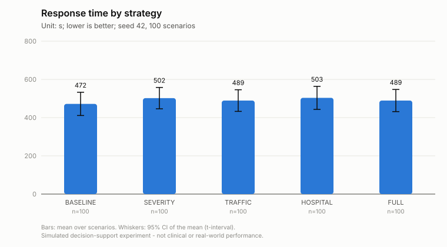
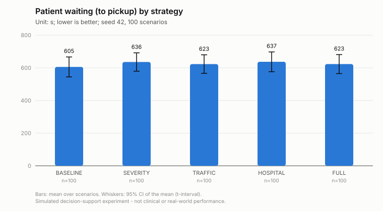
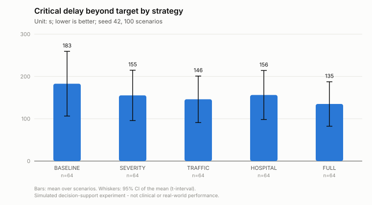
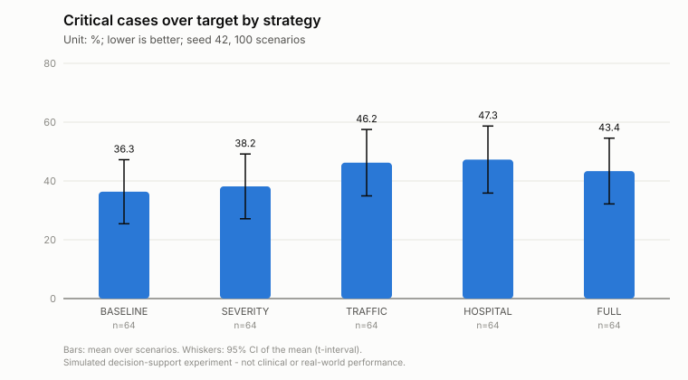
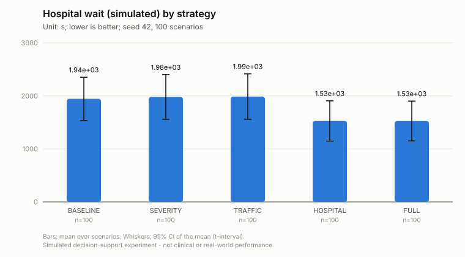
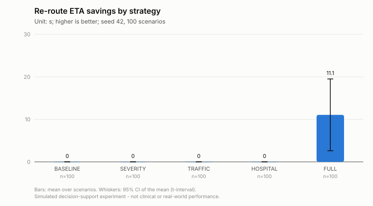
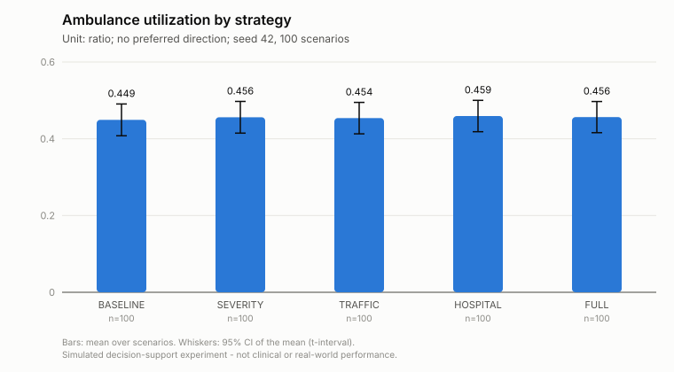
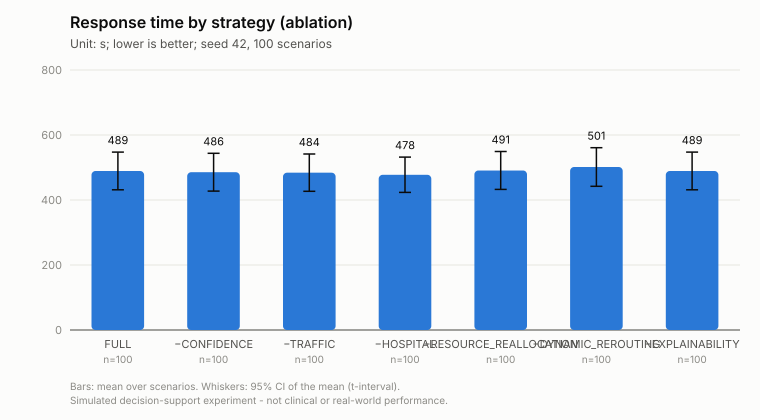
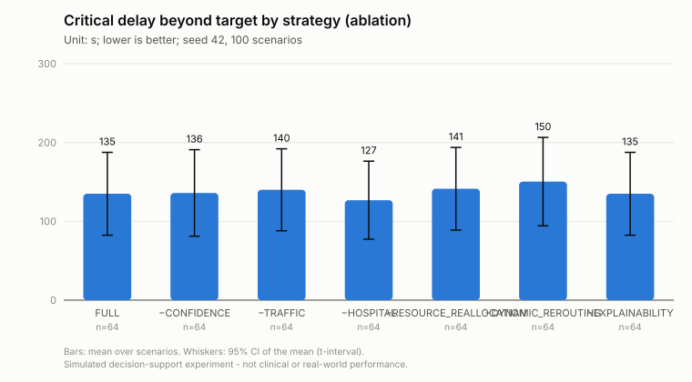
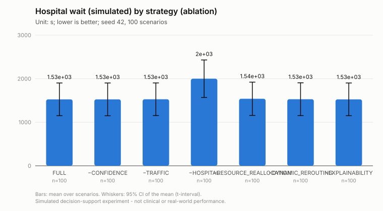

# Experiment final-s42-n100

Simulated decision-support experiment. Values are measured in a deterministic simulation on the real road graph with simulated patients, traffic and hospital load; they are not clinical outcomes or real-world emergency-service performance.

* Status: **COMPLETED**, failures: 0
* Seed: 42, scenarios: 100, strategies: BASELINE, SEVERITY, TRAFFIC, HOSPITAL, FULL, FULL-CONFIDENCE, FULL-TRAFFIC, FULL-HOSPITAL, FULL-RESOURCE_REALLOCATION, FULL-DYNAMIC_REROUTING, FULL-EXPLAINABILITY
* Code: `a2116caa46932fa024c47167e2d141d4e233568d` (branch research-evaluation, uncommitted changes: True)
* City: Monaco, road network: osm (11250 nodes, 19562 edges, sha 6cd79e4808ed8123), OSRM: enabled (http://localhost:5000)
* Severity model: rf-20261006161821 (dataset: synthetic)
* Traffic prediction: **LEARNED** (traffic-rf-20261006163537) - RandomForest beats the persistence baseline on the time-ordered hold-out
* Hospital prediction: hospital-queue-v1 - ESTIMATE (queueing approximation)
* Started 2026-10-06T16:35:41.878589+00:00, completed 2026-10-06T16:52:38.530705+00:00

<!-- design-and-denominators:start -->
## Design and denominators

**Unit of analysis: the scenario.** Every number in this report is derived from the counts below.

| Quantity | Value | How it is obtained |
|---|---:|---|
| Scenarios | 100 | generated once from seed 42; scenario *k* uses RNG seed (42, *k*) and has a stored fingerprint |
| Strategy configurations | 11 | 5 progressive systems (BASELINE, SEVERITY, TRAFFIC, HOSPITAL, FULL) + 6 ablations of FULL (FULL-CONFIDENCE, FULL-TRAFFIC, FULL-HOSPITAL, FULL-RESOURCE_REALLOCATION, FULL-DYNAMIC_REROUTING, FULL-EXPLAINABILITY); FULL is run once and serves as the last progressive system **and** the ablation reference |
| **Simulation runs** | **1100** | 100 scenarios × 11 configurations: every scenario is replayed once under every configuration (same patients, fleet, hospitals, traffic, disruptions; only the decision strategy differs) |
| Failed runs | 0 | recorded in failures.csv and excluded from that configuration's statistics |
| Emergency calls per configuration | 562 | sum of the calls of the 100 scenarios (216 with an uncertain report); identical for every configuration |
| Simulated call outcomes | 6182 | 562 calls × 11 configurations (incident_results.csv) |

**How the statistics use these runs.**
* *Comparison table*: each cell is the mean over the scenarios of one configuration (scenario-level value = mean over that scenario's calls, or a count/share for the scenario). It is NOT a mean over 1100 runs.
* *Paired tests*: one pair per scenario (the same scenario under two configurations), so at most 100 pairs per test; the runs of different configurations are never pooled. Families: vs BASELINE (4 comparisons); incremental, each system vs the previous one (4); ablation vs FULL (6). Holm correction is applied within each comparison over all metrics.
* A metric that does not exist in a scenario (e.g. no CRITICAL patient, no re-route) is NULL there, so its *n* is smaller than the number of scenarios:

| Metric | scenarios with a value (FULL) | why |
|---|---:|---|
| Re-route improvement | 10 | scenarios with an accepted re-route with a finite old ETA |
| Critical response time | 64 | scenarios with at least one patient whose simulated label is CRITICAL |
| Critical delay beyond target | 64 | scenarios with at least one patient whose simulated label is CRITICAL |
| Critical cases over target | 64 | scenarios with at least one patient whose simulated label is CRITICAL |
| Worst critical delay | 64 | scenarios with at least one patient whose simulated label is CRITICAL |
| Delay imposed on donor missions (est.) | 10 | scenarios with an executed reallocation |
| Requester delay avoided (est.) | 3 | scenarios with an executed reallocation where a free alternative unit existed (otherwise the avoided delay is undefined) |

<!-- design-and-denominators:end -->

## Comparison (mean over scenarios)

| Metric | BASELINE | SEVERITY | TRAFFIC | HOSPITAL | FULL | FULL-CONFIDENCE | FULL-TRAFFIC | FULL-HOSPITAL | FULL-RESOURCE_REALLOCATION | FULL-DYNAMIC_REROUTING | FULL-EXPLAINABILITY |
|---|---:|---:|---:|---:|---:|---:|---:|---:|---:|---:|---:|
| Response time (s) | 472 s (7.9 min) | 502 s (8.4 min) | 489 s (8.2 min) | 503 s (8.4 min) | 489 s (8.2 min) | 486 s (8.1 min) | 484 s (8.1 min) | 478 s (8.0 min) | 491 s (8.2 min) | 501 s (8.4 min) | 489 s (8.2 min) |
| Patient waiting (to pickup) (s) | 605 s (10.1 min) | 636 s (10.6 min) | 623 s (10.4 min) | 637 s (10.6 min) | 623 s (10.4 min) | 619 s (10.3 min) | 618 s (10.3 min) | 611 s (10.2 min) | 625 s (10.4 min) | 635 s (10.6 min) | 623 s (10.4 min) |
| Dispatch delay (queue + review) (s) | 94.99 | 90.56 | 88.79 | 100.29 | 100.06 | 96.78 | 99.50 | 92.57 | 99.04 | 104.61 | 100.06 |
| Initial route ETA (s) | 282 s (4.7 min) | 308 s (5.1 min) | 333 s (5.5 min) | 335 s (5.6 min) | 333 s (5.6 min) | 333 s (5.5 min) | 334 s (5.6 min) | 330 s (5.5 min) | 335 s (5.6 min) | 333 s (5.6 min) | 333 s (5.6 min) |
| Actual travel to scene (s) | 374 s (6.2 min) | 406 s (6.8 min) | 391 s (6.5 min) | 394 s (6.6 min) | 379 s (6.3 min) | 379 s (6.3 min) | 376 s (6.3 min) | 376 s (6.3 min) | 383 s (6.4 min) | 387 s (6.4 min) | 379 s (6.3 min) |
| |ETA error| (actual - planned) (s) | 77.97 | 84.86 | 46.27 | 46.74 | 38.38 | 39.30 | 33.95 | 37.89 | 38.53 | 44.58 | 38.38 |
| Proactive re-routes (count) | 0.00 | 0.00 | 0.00 | 0.00 | 0.41 | 0.41 | 0.46 | 0.44 | 0.40 | 0.00 | 0.41 |
| Re-route ETA savings (s) | 0.00 | 0.00 | 0.00 | 0.00 | 11.06 | 11.06 | 33.82 | 12.29 | 11.06 | 0.00 | 11.06 |
| Re-route improvement (%) | n/a | n/a | n/a | n/a | 26.82 | 26.82 | 28.64 | 26.53 | 26.82 | n/a | 26.82 |
| Reactive detours at closures (count) | 0.26 | 0.23 | 0.25 | 0.25 | 0.00 | 0.00 | 0.00 | 0.00 | 0.00 | 0.25 | 0.00 |
| Ambulance utilization (ratio) | 0.449 | 0.456 | 0.454 | 0.459 | 0.456 | 0.457 | 0.456 | 0.451 | 0.457 | 0.458 | 0.456 |
| Time with no unit available (%) | 15.40 | 15.85 | 15.85 | 16.38 | 16.12 | 16.12 | 16.18 | 15.62 | 16.21 | 16.25 | 16.12 |
| Reserve availability (ratio) | 0.532 | 0.525 | 0.527 | 0.522 | 0.525 | 0.524 | 0.525 | 0.530 | 0.525 | 0.523 | 0.525 |
| Hospital wait (simulated) (s) | 1944 s (32.4 min) | 1980 s (33.0 min) | 1987 s (33.1 min) | 1527 s (25.4 min) | 1526 s (25.4 min) | 1525 s (25.4 min) | 1528 s (25.5 min) | 1999 s (33.3 min) | 1539 s (25.7 min) | 1529 s (25.5 min) | 1526 s (25.4 min) |
| Hospital wait (predicted) (s) | n/a | n/a | n/a | 1521 s (25.4 min) | 1498 s (25.0 min) | 1499 s (25.0 min) | 1501 s (25.0 min) | n/a | 1521 s (25.4 min) | 1508 s (25.1 min) | 1498 s (25.0 min) |
| Hospital capability gap (%) | 38.18 | 34.18 | 34.25 | 34.25 | 34.18 | 34.25 | 34.18 | 34.18 | 34.18 | 34.18 | 34.18 |
| Unsuitable first unit (vs simulated need) (%) | 25.03 | 13.88 | 13.40 | 13.26 | 11.89 | 12.05 | 11.69 | 11.87 | 13.09 | 11.69 | 11.89 |
| Perfect unit capability match (%) | 39.41 | 46.65 | 54.63 | 54.87 | 55.59 | 55.24 | 55.83 | 56.04 | 54.94 | 55.93 | 55.59 |
| Creation -> ED treatment (simulated) (s) | 2905 s (48.4 min) | 2973 s (49.5 min) | 2959 s (49.3 min) | 2542 s (42.4 min) | 2524 s (42.1 min) | 2520 s (42.0 min) | 2520 s (42.0 min) | 2958 s (49.3 min) | 2540 s (42.3 min) | 2542 s (42.4 min) | 2524 s (42.1 min) |
| Critical response time (s) | 504 s (8.4 min) | 499 s (8.3 min) | 497 s (8.3 min) | 509 s (8.5 min) | 481 s (8.0 min) | 481 s (8.0 min) | 488 s (8.1 min) | 473 s (7.9 min) | 494 s (8.2 min) | 497 s (8.3 min) | 481 s (8.0 min) |
| Critical delay beyond target (s) | 183 s (3.0 min) | 155 s (2.6 min) | 146 s (2.4 min) | 156 s (2.6 min) | 135 s (2.2 min) | 136 s (2.3 min) | 140 s (2.3 min) | 127 s (2.1 min) | 141 s (2.4 min) | 150 s (2.5 min) | 135 s (2.2 min) |
| Critical cases over target (%) | 36.33 | 38.15 | 46.22 | 47.27 | 43.36 | 43.36 | 45.70 | 43.88 | 47.27 | 43.36 | 43.36 |
| Worst critical delay (s) | 258 s (4.3 min) | 215 s (3.6 min) | 209 s (3.5 min) | 218 s (3.6 min) | 186 s (3.1 min) | 186 s (3.1 min) | 193 s (3.2 min) | 181 s (3.0 min) | 191 s (3.2 min) | 216 s (3.6 min) | 186 s (3.1 min) |
| Review-trigger rate (%) | 0.00 | 0.00 | 0.00 | 0.00 | 2.85 | 0.00 | 2.85 | 2.85 | 2.85 | 2.85 | 2.85 |
| Automatic decision rate (%) | 100.00 | 100.00 | 100.00 | 100.00 | 93.47 | 95.07 | 93.02 | 93.69 | 98.28 | 93.61 | 93.47 |
| Potentially inappropriate auto-dispatch (count) | 0.16 | 0.16 | 0.16 | 0.16 | 0.06 | 0.16 | 0.06 | 0.06 | 0.06 | 0.06 | 0.06 |
| Under-triage vs simulated label (%) | n/a | 12.65 | 12.65 | 12.65 | 11.51 | 12.65 | 11.51 | 11.51 | 11.51 | 11.51 | 11.51 |
| Resource conflicts detected (count) | 0.00 | 0.00 | 0.00 | 0.00 | 0.42 | 0.42 | 0.43 | 0.40 | 0.00 | 0.41 | 0.42 |
| Automatic reallocations (count) | 0.00 | 0.00 | 0.00 | 0.00 | 0.11 | 0.11 | 0.09 | 0.11 | 0.00 | 0.11 | 0.11 |
| Conflicts escalated (count) | 0.00 | 0.00 | 0.00 | 0.00 | 0.31 | 0.31 | 0.34 | 0.29 | 0.00 | 0.30 | 0.31 |
| Delay imposed on donor missions (est.) (s) | n/a | n/a | n/a | n/a | -2.95 | -70.63 | -31.99 | -2.95 | n/a | -19.65 | -2.95 |
| Requester delay avoided (est.) (s) | n/a | n/a | n/a | n/a | 315 s (5.2 min) | 298 s (5.0 min) | 342 s (5.7 min) | 315 s (5.2 min) | n/a | 315 s (5.2 min) | 315 s (5.2 min) |
| Manual interventions (count) | 0.00 | 0.00 | 0.00 | 0.00 | 0.41 | 0.31 | 0.44 | 0.39 | 0.10 | 0.40 | 0.41 |
| Calls not reached (count) | 0.00 | 0.00 | 0.00 | 0.00 | 0.00 | 0.00 | 0.00 | 0.00 | 0.00 | 0.00 | 0.00 |
| Traffic prediction accuracy (vs simulated state) (%) | n/a | n/a | 73.95 | 74.30 | 74.58 | 74.63 | n/a | 74.18 | 74.26 | 74.56 | 74.58 |
| Persistence baseline accuracy (%) | n/a | n/a | 98.63 | 98.72 | 98.72 | 98.72 | n/a | 98.62 | 98.71 | 98.73 | 98.72 |
| Traffic prediction MAE (levels) (levels) | n/a | n/a | 0.46 | 0.46 | 0.45 | 0.45 | n/a | 0.46 | 0.46 | 0.45 | 0.45 |
| Persistence baseline MAE (levels) (levels) | n/a | n/a | 0.05 | 0.05 | 0.05 | 0.05 | n/a | 0.05 | 0.05 | 0.05 | 0.05 |

## Severity model on the scenario patients

Reference: simulated generator label - not clinical ground truth. Triage is identical under every strategy.

| Calls | n | Accuracy | Precision (macro) | Recall (macro) | F1 (macro) | Brier | ECE | Median confidence | Share < 0.75 |
|---|---:|---:|---:|---:|---:|---:|---:|---:|---:|
| all | 562 | 0.824 | 0.837 | 0.833 | 0.831 | 0.282 | 0.100 | 0.969 | 0.084 |
| clear reports | 346 | 0.965 | 0.966 | 0.968 | 0.967 | 0.059 | 0.007 | 0.969 | 0.012 |
| uncertain reports | 216 | 0.597 | 0.629 | 0.617 | 0.605 | 0.638 | 0.261 | 0.912 | 0.199 |

### Paired comparisons against BASELINE

| Comparison | Metric | Pairs | Mean diff | 95% CI | Test | p (Holm) | Significant |
|---|---|---:|---:|---|---|---:|---|
| SEVERITY vs BASELINE | Response time | 100 | +30.11 | [12.8, 48.0] | Wilcoxon signed-rank | 0.0023 | yes |
| SEVERITY vs BASELINE | Patient waiting (to pickup) | 100 | +30.11 | [12.8, 48.0] | Wilcoxon signed-rank | 0.0023 | yes |
| SEVERITY vs BASELINE | |ETA error| (actual - planned) | 100 | +6.88 | [-4.8, 18.3] | Wilcoxon signed-rank | 0.5708 | no |
| SEVERITY vs BASELINE | Re-route ETA savings | 100 | +0.00 | [0.0, 0.0] | none (identical results in every scenario) | n/a | – |
| SEVERITY vs BASELINE | Reactive detours at closures | 100 | -0.03 | [-0.1, 0.0] | none (only 7 non-zero differences: no significance test) | n/a | – |
| SEVERITY vs BASELINE | Hospital wait (simulated) | 100 | +35.64 | [-85.2, 140.2] | Wilcoxon signed-rank | 1.0000 | no |
| SEVERITY vs BASELINE | Hospital capability gap | 100 | -4.00 | [-5.5, -2.5] | Wilcoxon signed-rank | 0.0003 | yes |
| SEVERITY vs BASELINE | Creation -> ED treatment (simulated) | 100 | +67.55 | [-48.6, 169.2] | Wilcoxon signed-rank | 0.0013 | yes |
| SEVERITY vs BASELINE | Critical delay beyond target | 64 | -27.64 | [-83.2, 21.2] | Wilcoxon signed-rank | 1.0000 | no |
| SEVERITY vs BASELINE | Critical cases over target | 64 | +1.82 | [-6.2, 9.6] | Wilcoxon signed-rank | 1.0000 | no |
| SEVERITY vs BASELINE | Under-triage vs simulated label | 0 | n/a | n/a | none (insufficient pairs (n=0 < 10): no significance test) | n/a | – |
| SEVERITY vs BASELINE | Manual interventions | 100 | +0.00 | [0.0, 0.0] | none (identical results in every scenario) | n/a | – |
| TRAFFIC vs BASELINE | Response time | 100 | +17.37 | [-6.2, 40.8] | Wilcoxon signed-rank | 0.1845 | no |
| TRAFFIC vs BASELINE | Patient waiting (to pickup) | 100 | +17.37 | [-6.2, 40.8] | Wilcoxon signed-rank | 0.1845 | no |
| TRAFFIC vs BASELINE | |ETA error| (actual - planned) | 100 | -31.71 | [-50.6, -14.8] | Wilcoxon signed-rank | 0.0000 | yes |
| TRAFFIC vs BASELINE | Re-route ETA savings | 100 | +0.00 | [0.0, 0.0] | none (identical results in every scenario) | n/a | – |
| TRAFFIC vs BASELINE | Reactive detours at closures | 100 | -0.01 | [-0.1, 0.1] | Wilcoxon signed-rank | 1.0000 | no |
| TRAFFIC vs BASELINE | Hospital wait (simulated) | 100 | +42.33 | [-125.0, 201.7] | Wilcoxon signed-rank | 1.0000 | no |
| TRAFFIC vs BASELINE | Hospital capability gap | 100 | -3.93 | [-5.5, -2.5] | Wilcoxon signed-rank | 0.0004 | yes |
| TRAFFIC vs BASELINE | Creation -> ED treatment (simulated) | 100 | +53.48 | [-114.0, 209.4] | Wilcoxon signed-rank | 0.3037 | no |
| TRAFFIC vs BASELINE | Critical delay beyond target | 64 | -36.91 | [-95.3, 14.4] | Wilcoxon signed-rank | 1.0000 | no |
| TRAFFIC vs BASELINE | Critical cases over target | 64 | +9.90 | [0.8, 19.5] | Wilcoxon signed-rank | 0.3743 | no |
| TRAFFIC vs BASELINE | Under-triage vs simulated label | 0 | n/a | n/a | none (insufficient pairs (n=0 < 10): no significance test) | n/a | – |
| TRAFFIC vs BASELINE | Manual interventions | 100 | +0.00 | [0.0, 0.0] | none (identical results in every scenario) | n/a | – |
| HOSPITAL vs BASELINE | Response time | 100 | +31.41 | [7.0, 55.5] | Wilcoxon signed-rank | 0.0057 | yes |
| HOSPITAL vs BASELINE | Patient waiting (to pickup) | 100 | +31.41 | [7.0, 55.5] | Wilcoxon signed-rank | 0.0057 | yes |
| HOSPITAL vs BASELINE | |ETA error| (actual - planned) | 100 | -31.23 | [-50.2, -14.2] | Wilcoxon signed-rank | 0.0000 | yes |
| HOSPITAL vs BASELINE | Re-route ETA savings | 100 | +0.00 | [0.0, 0.0] | none (identical results in every scenario) | n/a | – |
| HOSPITAL vs BASELINE | Reactive detours at closures | 100 | -0.01 | [-0.1, 0.1] | Wilcoxon signed-rank | 1.0000 | no |
| HOSPITAL vs BASELINE | Hospital wait (simulated) | 100 | -417.74 | [-569.8, -281.0] | Wilcoxon signed-rank | 0.0000 | yes |
| HOSPITAL vs BASELINE | Hospital capability gap | 100 | -3.93 | [-5.5, -2.5] | Wilcoxon signed-rank | 0.0003 | yes |
| HOSPITAL vs BASELINE | Creation -> ED treatment (simulated) | 100 | -363.32 | [-516.8, -225.9] | Wilcoxon signed-rank | 0.0009 | yes |
| HOSPITAL vs BASELINE | Critical delay beyond target | 64 | -26.72 | [-82.0, 23.9] | Wilcoxon signed-rank | 1.0000 | no |
| HOSPITAL vs BASELINE | Critical cases over target | 64 | +10.94 | [1.3, 21.4] | Wilcoxon signed-rank | 0.2165 | no |
| HOSPITAL vs BASELINE | Under-triage vs simulated label | 0 | n/a | n/a | none (insufficient pairs (n=0 < 10): no significance test) | n/a | – |
| HOSPITAL vs BASELINE | Manual interventions | 100 | +0.00 | [0.0, 0.0] | none (identical results in every scenario) | n/a | – |
| FULL vs BASELINE | Response time | 100 | +17.49 | [-5.4, 39.0] | Wilcoxon signed-rank | 0.0668 | no |
| FULL vs BASELINE | Patient waiting (to pickup) | 100 | +17.49 | [-5.4, 39.0] | Wilcoxon signed-rank | 0.0668 | no |
| FULL vs BASELINE | |ETA error| (actual - planned) | 100 | -39.59 | [-58.5, -23.5] | Wilcoxon signed-rank | 0.0000 | yes |
| FULL vs BASELINE | Re-route ETA savings | 100 | +11.06 | [3.9, 20.2] | Wilcoxon signed-rank | 0.0456 | yes |
| FULL vs BASELINE | Reactive detours at closures | 100 | -0.26 | [-0.4, -0.2] | Wilcoxon signed-rank | 0.0003 | yes |
| FULL vs BASELINE | Hospital wait (simulated) | 100 | -418.76 | [-570.9, -280.2] | Wilcoxon signed-rank | 0.0000 | yes |
| FULL vs BASELINE | Hospital capability gap | 100 | -4.00 | [-5.5, -2.5] | Wilcoxon signed-rank | 0.0003 | yes |
| FULL vs BASELINE | Creation -> ED treatment (simulated) | 100 | -380.84 | [-532.1, -245.4] | Wilcoxon signed-rank | 0.0002 | yes |
| FULL vs BASELINE | Critical delay beyond target | 64 | -47.99 | [-104.4, 3.9] | Wilcoxon signed-rank | 0.8839 | no |
| FULL vs BASELINE | Critical cases over target | 64 | +7.03 | [-2.1, 16.7] | Wilcoxon signed-rank | 0.8839 | no |
| FULL vs BASELINE | Under-triage vs simulated label | 0 | n/a | n/a | none (insufficient pairs (n=0 < 10): no significance test) | n/a | – |
| FULL vs BASELINE | Manual interventions | 100 | +0.41 | [0.3, 0.6] | Wilcoxon signed-rank | 0.0000 | yes |

### Incremental contribution (each system vs the previous one)

| Comparison | Metric | Pairs | Mean diff | 95% CI | Test | p (Holm) | Significant |
|---|---|---:|---:|---|---|---:|---|
| SEVERITY vs BASELINE | Response time | 100 | +30.11 | [12.8, 48.0] | Wilcoxon signed-rank | 0.0023 | yes |
| SEVERITY vs BASELINE | Patient waiting (to pickup) | 100 | +30.11 | [12.8, 48.0] | Wilcoxon signed-rank | 0.0023 | yes |
| SEVERITY vs BASELINE | |ETA error| (actual - planned) | 100 | +6.88 | [-4.8, 18.3] | Wilcoxon signed-rank | 0.5708 | no |
| SEVERITY vs BASELINE | Re-route ETA savings | 100 | +0.00 | [0.0, 0.0] | none (identical results in every scenario) | n/a | – |
| SEVERITY vs BASELINE | Reactive detours at closures | 100 | -0.03 | [-0.1, 0.0] | none (only 7 non-zero differences: no significance test) | n/a | – |
| SEVERITY vs BASELINE | Hospital wait (simulated) | 100 | +35.64 | [-85.2, 140.2] | Wilcoxon signed-rank | 1.0000 | no |
| SEVERITY vs BASELINE | Hospital capability gap | 100 | -4.00 | [-5.5, -2.5] | Wilcoxon signed-rank | 0.0003 | yes |
| SEVERITY vs BASELINE | Creation -> ED treatment (simulated) | 100 | +67.55 | [-48.6, 169.2] | Wilcoxon signed-rank | 0.0013 | yes |
| SEVERITY vs BASELINE | Critical delay beyond target | 64 | -27.64 | [-83.2, 21.2] | Wilcoxon signed-rank | 1.0000 | no |
| SEVERITY vs BASELINE | Critical cases over target | 64 | +1.82 | [-6.2, 9.6] | Wilcoxon signed-rank | 1.0000 | no |
| SEVERITY vs BASELINE | Under-triage vs simulated label | 0 | n/a | n/a | none (insufficient pairs (n=0 < 10): no significance test) | n/a | – |
| SEVERITY vs BASELINE | Manual interventions | 100 | +0.00 | [0.0, 0.0] | none (identical results in every scenario) | n/a | – |
| TRAFFIC vs SEVERITY | Response time | 100 | -12.74 | [-30.5, 4.2] | Wilcoxon signed-rank | 1.0000 | no |
| TRAFFIC vs SEVERITY | Patient waiting (to pickup) | 100 | -12.74 | [-30.5, 4.2] | Wilcoxon signed-rank | 1.0000 | no |
| TRAFFIC vs SEVERITY | |ETA error| (actual - planned) | 100 | -38.59 | [-53.5, -26.0] | Wilcoxon signed-rank | 0.0000 | yes |
| TRAFFIC vs SEVERITY | Re-route ETA savings | 100 | +0.00 | [0.0, 0.0] | none (identical results in every scenario) | n/a | – |
| TRAFFIC vs SEVERITY | Reactive detours at closures | 100 | +0.02 | [-0.0, 0.1] | Wilcoxon signed-rank | 1.0000 | no |
| TRAFFIC vs SEVERITY | Hospital wait (simulated) | 100 | +6.69 | [-97.9, 110.0] | Wilcoxon signed-rank | 1.0000 | no |
| TRAFFIC vs SEVERITY | Hospital capability gap | 100 | +0.07 | [0.0, 0.2] | none (only 1 non-zero differences: no significance test) | n/a | – |
| TRAFFIC vs SEVERITY | Creation -> ED treatment (simulated) | 100 | -14.07 | [-122.1, 89.7] | Wilcoxon signed-rank | 1.0000 | no |
| TRAFFIC vs SEVERITY | Critical delay beyond target | 64 | -9.27 | [-29.9, 10.9] | Wilcoxon signed-rank | 1.0000 | no |
| TRAFFIC vs SEVERITY | Critical cases over target | 64 | +8.07 | [1.3, 15.6] | Wilcoxon signed-rank | 0.6064 | no |
| TRAFFIC vs SEVERITY | Under-triage vs simulated label | 100 | +0.00 | [0.0, 0.0] | none (identical results in every scenario) | n/a | – |
| TRAFFIC vs SEVERITY | Manual interventions | 100 | +0.00 | [0.0, 0.0] | none (identical results in every scenario) | n/a | – |
| HOSPITAL vs TRAFFIC | Response time | 100 | +14.04 | [4.5, 26.7] | Wilcoxon signed-rank | 0.0683 | no |
| HOSPITAL vs TRAFFIC | Patient waiting (to pickup) | 100 | +14.04 | [4.5, 26.7] | Wilcoxon signed-rank | 0.0683 | no |
| HOSPITAL vs TRAFFIC | |ETA error| (actual - planned) | 100 | +0.48 | [0.0, 1.1] | Wilcoxon signed-rank | 0.6642 | no |
| HOSPITAL vs TRAFFIC | Re-route ETA savings | 100 | +0.00 | [0.0, 0.0] | none (identical results in every scenario) | n/a | – |
| HOSPITAL vs TRAFFIC | Reactive detours at closures | 100 | +0.00 | [-0.0, 0.0] | none (only 2 non-zero differences: no significance test) | n/a | – |
| HOSPITAL vs TRAFFIC | Hospital wait (simulated) | 100 | -460.07 | [-625.5, -302.0] | Wilcoxon signed-rank | 0.0000 | yes |
| HOSPITAL vs TRAFFIC | Hospital capability gap | 100 | +0.00 | [0.0, 0.0] | none (identical results in every scenario) | n/a | – |
| HOSPITAL vs TRAFFIC | Creation -> ED treatment (simulated) | 100 | -416.80 | [-580.0, -260.5] | Wilcoxon signed-rank | 0.0000 | yes |
| HOSPITAL vs TRAFFIC | Critical delay beyond target | 64 | +10.19 | [1.3, 22.2] | none (only 6 non-zero differences: no significance test) | n/a | – |
| HOSPITAL vs TRAFFIC | Critical cases over target | 64 | +1.04 | [-1.6, 4.7] | none (only 2 non-zero differences: no significance test) | n/a | – |
| HOSPITAL vs TRAFFIC | Under-triage vs simulated label | 100 | +0.00 | [0.0, 0.0] | none (identical results in every scenario) | n/a | – |
| HOSPITAL vs TRAFFIC | Manual interventions | 100 | +0.00 | [0.0, 0.0] | none (identical results in every scenario) | n/a | – |
| FULL vs HOSPITAL | Response time | 100 | -13.92 | [-27.2, -2.9] | Wilcoxon signed-rank | 0.1801 | no |
| FULL vs HOSPITAL | Patient waiting (to pickup) | 100 | -13.92 | [-27.2, -2.9] | Wilcoxon signed-rank | 0.1801 | no |
| FULL vs HOSPITAL | |ETA error| (actual - planned) | 100 | -8.36 | [-13.7, -3.7] | Wilcoxon signed-rank | 0.0360 | yes |
| FULL vs HOSPITAL | Re-route ETA savings | 100 | +11.06 | [3.9, 20.2] | Wilcoxon signed-rank | 0.0911 | no |
| FULL vs HOSPITAL | Reactive detours at closures | 100 | -0.25 | [-0.4, -0.1] | Wilcoxon signed-rank | 0.0009 | yes |
| FULL vs HOSPITAL | Hospital wait (simulated) | 100 | -1.01 | [-38.5, 26.7] | Wilcoxon signed-rank | 0.7849 | no |
| FULL vs HOSPITAL | Hospital capability gap | 100 | -0.07 | [-0.2, 0.0] | none (only 1 non-zero differences: no significance test) | n/a | – |
| FULL vs HOSPITAL | Creation -> ED treatment (simulated) | 100 | -17.52 | [-56.6, 9.4] | Wilcoxon signed-rank | 0.8889 | no |
| FULL vs HOSPITAL | Critical delay beyond target | 64 | -21.26 | [-47.4, 1.0] | Wilcoxon signed-rank | 0.8889 | no |
| FULL vs HOSPITAL | Critical cases over target | 64 | -3.91 | [-9.4, 0.8] | none (only 4 non-zero differences: no significance test) | n/a | – |
| FULL vs HOSPITAL | Under-triage vs simulated label | 100 | -1.14 | [-2.0, -0.4] | none (only 7 non-zero differences: no significance test) | n/a | – |
| FULL vs HOSPITAL | Manual interventions | 100 | +0.41 | [0.3, 0.6] | Wilcoxon signed-rank | 0.0000 | yes |

### Ablation (FULL minus one capability vs FULL)

| Comparison | Metric | Pairs | Mean diff | 95% CI | Test | p (Holm) | Significant |
|---|---|---:|---:|---|---|---:|---|
| FULL-CONFIDENCE vs FULL | Response time | 100 | -3.72 | [-8.0, -0.4] | Wilcoxon signed-rank | 0.4133 | no |
| FULL-CONFIDENCE vs FULL | Patient waiting (to pickup) | 100 | -3.72 | [-8.0, -0.4] | Wilcoxon signed-rank | 0.4133 | no |
| FULL-CONFIDENCE vs FULL | |ETA error| (actual - planned) | 100 | +0.92 | [-1.2, 4.1] | none (only 5 non-zero differences: no significance test) | n/a | – |
| FULL-CONFIDENCE vs FULL | Re-route ETA savings | 100 | +0.00 | [0.0, 0.0] | none (identical results in every scenario) | n/a | – |
| FULL-CONFIDENCE vs FULL | Reactive detours at closures | 100 | +0.00 | [0.0, 0.0] | none (identical results in every scenario) | n/a | – |
| FULL-CONFIDENCE vs FULL | Hospital wait (simulated) | 100 | -0.59 | [-7.6, 5.7] | none (only 4 non-zero differences: no significance test) | n/a | – |
| FULL-CONFIDENCE vs FULL | Hospital capability gap | 100 | +0.07 | [0.0, 0.2] | none (only 1 non-zero differences: no significance test) | n/a | – |
| FULL-CONFIDENCE vs FULL | Creation -> ED treatment (simulated) | 100 | -4.15 | [-12.6, 3.2] | Wilcoxon signed-rank | 0.8361 | no |
| FULL-CONFIDENCE vs FULL | Critical delay beyond target | 64 | +0.98 | [-15.5, 22.5] | none (only 5 non-zero differences: no significance test) | n/a | – |
| FULL-CONFIDENCE vs FULL | Critical cases over target | 64 | +0.00 | [0.0, 0.0] | none (identical results in every scenario) | n/a | – |
| FULL-CONFIDENCE vs FULL | Under-triage vs simulated label | 100 | +1.14 | [0.4, 2.0] | none (only 7 non-zero differences: no significance test) | n/a | – |
| FULL-CONFIDENCE vs FULL | Manual interventions | 100 | -0.10 | [-0.2, -0.0] | Wilcoxon signed-rank | 0.0978 | no |
| FULL-TRAFFIC vs FULL | Response time | 100 | -5.24 | [-11.3, -0.3] | Wilcoxon signed-rank | 0.2425 | no |
| FULL-TRAFFIC vs FULL | Patient waiting (to pickup) | 100 | -5.24 | [-11.3, -0.3] | Wilcoxon signed-rank | 0.2425 | no |
| FULL-TRAFFIC vs FULL | |ETA error| (actual - planned) | 100 | -4.43 | [-8.0, -1.0] | Wilcoxon signed-rank | 0.0000 | yes |
| FULL-TRAFFIC vs FULL | Re-route ETA savings | 100 | +22.76 | [7.2, 46.1] | Wilcoxon signed-rank | 0.0069 | yes |
| FULL-TRAFFIC vs FULL | Reactive detours at closures | 100 | +0.00 | [0.0, 0.0] | none (identical results in every scenario) | n/a | – |
| FULL-TRAFFIC vs FULL | Hospital wait (simulated) | 100 | +2.54 | [-21.6, 24.5] | Wilcoxon signed-rank | 0.3705 | no |
| FULL-TRAFFIC vs FULL | Hospital capability gap | 100 | +0.00 | [0.0, 0.0] | none (identical results in every scenario) | n/a | – |
| FULL-TRAFFIC vs FULL | Creation -> ED treatment (simulated) | 100 | -4.10 | [-31.5, 19.5] | Wilcoxon signed-rank | 0.5997 | no |
| FULL-TRAFFIC vs FULL | Critical delay beyond target | 64 | +5.02 | [-2.7, 16.1] | none (only 5 non-zero differences: no significance test) | n/a | – |
| FULL-TRAFFIC vs FULL | Critical cases over target | 64 | +2.34 | [-3.1, 7.8] | none (only 4 non-zero differences: no significance test) | n/a | – |
| FULL-TRAFFIC vs FULL | Under-triage vs simulated label | 100 | +0.00 | [0.0, 0.0] | none (identical results in every scenario) | n/a | – |
| FULL-TRAFFIC vs FULL | Manual interventions | 100 | +0.03 | [0.0, 0.1] | none (only 2 non-zero differences: no significance test) | n/a | – |
| FULL-HOSPITAL vs FULL | Response time | 100 | -11.65 | [-19.2, -5.0] | Wilcoxon signed-rank | 0.0354 | yes |
| FULL-HOSPITAL vs FULL | Patient waiting (to pickup) | 100 | -11.65 | [-19.2, -5.0] | Wilcoxon signed-rank | 0.0354 | yes |
| FULL-HOSPITAL vs FULL | |ETA error| (actual - planned) | 100 | -0.49 | [-1.1, -0.0] | Wilcoxon signed-rank | 0.2524 | no |
| FULL-HOSPITAL vs FULL | Re-route ETA savings | 100 | +1.23 | [0.0, 3.7] | none (only 1 non-zero differences: no significance test) | n/a | – |
| FULL-HOSPITAL vs FULL | Reactive detours at closures | 100 | +0.00 | [0.0, 0.0] | none (identical results in every scenario) | n/a | – |
| FULL-HOSPITAL vs FULL | Hospital wait (simulated) | 100 | +473.69 | [321.5, 634.4] | Wilcoxon signed-rank | 0.0000 | yes |
| FULL-HOSPITAL vs FULL | Hospital capability gap | 100 | +0.00 | [0.0, 0.0] | none (identical results in every scenario) | n/a | – |
| FULL-HOSPITAL vs FULL | Creation -> ED treatment (simulated) | 100 | +433.88 | [285.4, 591.4] | Wilcoxon signed-rank | 0.0000 | yes |
| FULL-HOSPITAL vs FULL | Critical delay beyond target | 64 | -8.15 | [-20.4, 1.3] | none (only 7 non-zero differences: no significance test) | n/a | – |
| FULL-HOSPITAL vs FULL | Critical cases over target | 64 | +0.52 | [-4.2, 5.2] | none (only 3 non-zero differences: no significance test) | n/a | – |
| FULL-HOSPITAL vs FULL | Under-triage vs simulated label | 100 | +0.00 | [0.0, 0.0] | none (identical results in every scenario) | n/a | – |
| FULL-HOSPITAL vs FULL | Manual interventions | 100 | -0.02 | [-0.1, 0.0] | none (only 4 non-zero differences: no significance test) | n/a | – |
| FULL-RESOURCE_REALLOCATION vs FULL | Response time | 100 | +1.59 | [-2.8, 6.8] | Wilcoxon signed-rank | 1.0000 | no |
| FULL-RESOURCE_REALLOCATION vs FULL | Patient waiting (to pickup) | 100 | +1.59 | [-2.8, 6.8] | Wilcoxon signed-rank | 1.0000 | no |
| FULL-RESOURCE_REALLOCATION vs FULL | |ETA error| (actual - planned) | 100 | +0.15 | [-0.9, 1.6] | none (only 8 non-zero differences: no significance test) | n/a | – |
| FULL-RESOURCE_REALLOCATION vs FULL | Re-route ETA savings | 100 | +0.00 | [0.0, 0.0] | none (identical results in every scenario) | n/a | – |
| FULL-RESOURCE_REALLOCATION vs FULL | Reactive detours at closures | 100 | +0.00 | [0.0, 0.0] | none (identical results in every scenario) | n/a | – |
| FULL-RESOURCE_REALLOCATION vs FULL | Hospital wait (simulated) | 100 | +13.70 | [-1.9, 43.6] | none (only 8 non-zero differences: no significance test) | n/a | – |
| FULL-RESOURCE_REALLOCATION vs FULL | Hospital capability gap | 100 | +0.00 | [0.0, 0.0] | none (identical results in every scenario) | n/a | – |
| FULL-RESOURCE_REALLOCATION vs FULL | Creation -> ED treatment (simulated) | 100 | +15.47 | [-2.4, 48.4] | Wilcoxon signed-rank | 1.0000 | no |
| FULL-RESOURCE_REALLOCATION vs FULL | Critical delay beyond target | 64 | +6.36 | [-3.3, 18.9] | none (only 5 non-zero differences: no significance test) | n/a | – |
| FULL-RESOURCE_REALLOCATION vs FULL | Critical cases over target | 64 | +3.91 | [-0.8, 9.4] | none (only 4 non-zero differences: no significance test) | n/a | – |
| FULL-RESOURCE_REALLOCATION vs FULL | Under-triage vs simulated label | 100 | +0.00 | [0.0, 0.0] | none (identical results in every scenario) | n/a | – |
| FULL-RESOURCE_REALLOCATION vs FULL | Manual interventions | 100 | -0.31 | [-0.4, -0.2] | Wilcoxon signed-rank | 0.0003 | yes |
| FULL-DYNAMIC_REROUTING vs FULL | Response time | 100 | +12.14 | [5.1, 22.4] | Wilcoxon signed-rank | 0.0004 | yes |
| FULL-DYNAMIC_REROUTING vs FULL | Patient waiting (to pickup) | 100 | +12.14 | [5.1, 22.4] | Wilcoxon signed-rank | 0.0004 | yes |
| FULL-DYNAMIC_REROUTING vs FULL | |ETA error| (actual - planned) | 100 | +6.20 | [2.8, 10.1] | Wilcoxon signed-rank | 0.0029 | yes |
| FULL-DYNAMIC_REROUTING vs FULL | Re-route ETA savings | 100 | -11.06 | [-20.2, -3.9] | Wilcoxon signed-rank | 0.0506 | no |
| FULL-DYNAMIC_REROUTING vs FULL | Reactive detours at closures | 100 | +0.25 | [0.1, 0.4] | Wilcoxon signed-rank | 0.0007 | yes |
| FULL-DYNAMIC_REROUTING vs FULL | Hospital wait (simulated) | 100 | +3.60 | [-4.2, 16.8] | none (only 7 non-zero differences: no significance test) | n/a | – |
| FULL-DYNAMIC_REROUTING vs FULL | Hospital capability gap | 100 | +0.00 | [0.0, 0.0] | none (identical results in every scenario) | n/a | – |
| FULL-DYNAMIC_REROUTING vs FULL | Creation -> ED treatment (simulated) | 100 | +17.73 | [5.1, 35.1] | Wilcoxon signed-rank | 0.0004 | yes |
| FULL-DYNAMIC_REROUTING vs FULL | Critical delay beyond target | 64 | +15.44 | [4.8, 29.1] | none (only 9 non-zero differences: no significance test) | n/a | – |
| FULL-DYNAMIC_REROUTING vs FULL | Critical cases over target | 64 | +0.00 | [0.0, 0.0] | none (identical results in every scenario) | n/a | – |
| FULL-DYNAMIC_REROUTING vs FULL | Under-triage vs simulated label | 100 | +0.00 | [0.0, 0.0] | none (identical results in every scenario) | n/a | – |
| FULL-DYNAMIC_REROUTING vs FULL | Manual interventions | 100 | -0.01 | [-0.1, 0.0] | none (only 3 non-zero differences: no significance test) | n/a | – |
| FULL-EXPLAINABILITY vs FULL | Response time | 100 | +0.00 | [0.0, 0.0] | none (identical results in every scenario) | n/a | – |
| FULL-EXPLAINABILITY vs FULL | Patient waiting (to pickup) | 100 | +0.00 | [0.0, 0.0] | none (identical results in every scenario) | n/a | – |
| FULL-EXPLAINABILITY vs FULL | |ETA error| (actual - planned) | 100 | +0.00 | [0.0, 0.0] | none (identical results in every scenario) | n/a | – |
| FULL-EXPLAINABILITY vs FULL | Re-route ETA savings | 100 | +0.00 | [0.0, 0.0] | none (identical results in every scenario) | n/a | – |
| FULL-EXPLAINABILITY vs FULL | Reactive detours at closures | 100 | +0.00 | [0.0, 0.0] | none (identical results in every scenario) | n/a | – |
| FULL-EXPLAINABILITY vs FULL | Hospital wait (simulated) | 100 | +0.00 | [0.0, 0.0] | none (identical results in every scenario) | n/a | – |
| FULL-EXPLAINABILITY vs FULL | Hospital capability gap | 100 | +0.00 | [0.0, 0.0] | none (identical results in every scenario) | n/a | – |
| FULL-EXPLAINABILITY vs FULL | Creation -> ED treatment (simulated) | 100 | +0.00 | [0.0, 0.0] | none (identical results in every scenario) | n/a | – |
| FULL-EXPLAINABILITY vs FULL | Critical delay beyond target | 64 | +0.00 | [0.0, 0.0] | none (identical results in every scenario) | n/a | – |
| FULL-EXPLAINABILITY vs FULL | Critical cases over target | 64 | +0.00 | [0.0, 0.0] | none (identical results in every scenario) | n/a | – |
| FULL-EXPLAINABILITY vs FULL | Under-triage vs simulated label | 100 | +0.00 | [0.0, 0.0] | none (identical results in every scenario) | n/a | – |
| FULL-EXPLAINABILITY vs FULL | Manual interventions | 100 | +0.00 | [0.0, 0.0] | none (identical results in every scenario) | n/a | – |

## Figures

## Files

`comparison_summary.csv`, `scenario_results.csv`, `incident_results.csv`, `statistics.csv`, `paired_tests.csv`, `scenarios_summary.csv`, `scenarios.json` (complete scenario definitions), `summary.json`, `run_metadata.json`.

Metric definitions: `backend/app/evaluation/metrics.py`; test selection: `backend/app/evaluation/statistics.py`.