# Experiment research-s42-n100

Simulated decision-support experiment. Values are measured in a deterministic simulation on the real road graph with simulated patients, traffic and hospital load; they are not clinical outcomes or real-world emergency-service performance.

* Status: **COMPLETED**, failures: 0
* Seed: 42, scenarios: 100, strategies: BASELINE, SEVERITY, TRAFFIC, HOSPITAL, FULL, FULL-CONFIDENCE, FULL-TRAFFIC, FULL-HOSPITAL, FULL-RESOURCE_REALLOCATION, FULL-DYNAMIC_REROUTING, FULL-EXPLAINABILITY
* Code: `a2116caa46932fa024c47167e2d141d4e233568d` (branch research-evaluation, uncommitted changes: False)
* City: Monaco, road network: osm (11250 nodes, 19562 edges, sha 6cd79e4808ed8123), OSRM: enabled (http://localhost:5000)
* Severity model: rf-20261005182602 (dataset: synthetic)
* Traffic prediction: **LEARNED** (traffic-rf-20261006160132) - RandomForest beats the persistence baseline on the time-ordered hold-out
* Hospital prediction: hospital-queue-v1 - ESTIMATE (queueing approximation)
* Started 2026-10-06T16:01:37.037253+00:00, completed n/a

<!-- design-and-denominators:start -->
## Design and denominators

**Unit of analysis: the scenario.** Every number in this report is derived from the counts below.

| Quantity | Value | How it is obtained |
|---|---:|---|
| Scenarios | 100 | generated once from seed 42; scenario *k* uses RNG seed (42, *k*) and has a stored fingerprint |
| Strategy configurations | 11 | 5 progressive systems (BASELINE, SEVERITY, TRAFFIC, HOSPITAL, FULL) + 6 ablations of FULL (FULL-CONFIDENCE, FULL-TRAFFIC, FULL-HOSPITAL, FULL-RESOURCE_REALLOCATION, FULL-DYNAMIC_REROUTING, FULL-EXPLAINABILITY); FULL is run once and serves as the last progressive system **and** the ablation reference |
| **Simulation runs** | **1100** | 100 scenarios × 11 configurations: every scenario is replayed once under every configuration (same patients, fleet, hospitals, traffic, disruptions; only the decision strategy differs) |
| Failed runs | 0 | recorded in failures.csv and excluded from that configuration's statistics |
| Emergency calls per configuration | 562 | sum of the calls of the 100 scenarios (216 with an uncertain report); identical for every configuration |
| Simulated call outcomes | 6182 | 562 calls × 11 configurations (incident_results.csv) |

**How the statistics use these runs.**
* *Comparison table*: each cell is the mean over the scenarios of one configuration (scenario-level value = mean over that scenario's calls, or a count/share for the scenario). It is NOT a mean over 1100 runs.
* *Paired tests*: one pair per scenario (the same scenario under two configurations), so at most 100 pairs per test; the runs of different configurations are never pooled. Families: vs BASELINE (4 comparisons); incremental, each system vs the previous one (4); ablation vs FULL (6). Holm correction is applied within each comparison over all metrics.
* A metric that does not exist in a scenario (e.g. no CRITICAL patient, no re-route) is NULL there, so its *n* is smaller than the number of scenarios:

| Metric | scenarios with a value (FULL) | why |
|---|---:|---|
| Re-route improvement | 10 | scenarios with an accepted re-route with a finite old ETA |
| Critical response time | 64 | scenarios with at least one patient whose simulated label is CRITICAL |
| Critical delay beyond target | 64 | scenarios with at least one patient whose simulated label is CRITICAL |
| Critical cases over target | 64 | scenarios with at least one patient whose simulated label is CRITICAL |
| Worst critical delay | 64 | scenarios with at least one patient whose simulated label is CRITICAL |
| Delay imposed on donor missions (est.) | 11 | scenarios with an executed reallocation |
| Requester delay avoided (est.) | 4 | scenarios with an executed reallocation where a free alternative unit existed (otherwise the avoided delay is undefined) |

<!-- design-and-denominators:end -->

## Comparison (mean over scenarios)

| Metric | BASELINE | SEVERITY | TRAFFIC | HOSPITAL | FULL | FULL-CONFIDENCE | FULL-TRAFFIC | FULL-HOSPITAL | FULL-RESOURCE_REALLOCATION | FULL-DYNAMIC_REROUTING | FULL-EXPLAINABILITY |
|---|---:|---:|---:|---:|---:|---:|---:|---:|---:|---:|---:|
| Response time (s) | 448 s (7.5 min) | 475 s (7.9 min) | 472 s (7.9 min) | 482 s (8.0 min) | 481 s (8.0 min) | 472 s (7.9 min) | 476 s (7.9 min) | 469 s (7.8 min) | 481 s (8.0 min) | 488 s (8.1 min) | 481 s (8.0 min) |
| Patient waiting (to pickup) (s) | 581 s (9.7 min) | 608 s (10.1 min) | 605 s (10.1 min) | 615 s (10.3 min) | 614 s (10.2 min) | 606 s (10.1 min) | 609 s (10.2 min) | 602 s (10.0 min) | 615 s (10.2 min) | 621 s (10.4 min) | 614 s (10.2 min) |
| Dispatch delay (queue + review) (s) | 95.01 | 90.49 | 88.81 | 96.54 | 103.90 | 96.69 | 103.44 | 96.13 | 103.40 | 105.27 | 103.90 |
| Initial route ETA (s) | 282 s (4.7 min) | 308 s (5.1 min) | 336 s (5.6 min) | 339 s (5.6 min) | 337 s (5.6 min) | 337 s (5.6 min) | 339 s (5.7 min) | 335 s (5.6 min) | 339 s (5.6 min) | 337 s (5.6 min) | 337 s (5.6 min) |
| Actual travel to scene (s) | 350 s (5.8 min) | 378 s (6.3 min) | 374 s (6.2 min) | 376 s (6.3 min) | 366 s (6.1 min) | 365 s (6.1 min) | 363 s (6.0 min) | 363 s (6.1 min) | 369 s (6.1 min) | 371 s (6.2 min) | 366 s (6.1 min) |
| |ETA error| (actual - planned) (s) | 52.06 | 55.83 | 24.31 | 24.70 | 21.94 | 21.96 | 17.40 | 20.90 | 20.96 | 25.00 | 21.94 |
| Proactive re-routes (count) | 0.00 | 0.00 | 0.00 | 0.00 | 0.62 | 0.61 | 0.74 | 0.66 | 0.59 | 0.00 | 0.62 |
| Re-route ETA savings (s) | 0.00 | 0.00 | 0.00 | 0.00 | 10.33 | 11.88 | 30.69 | 11.56 | 10.33 | 0.00 | 10.33 |
| Re-route improvement (%) | n/a | n/a | n/a | n/a | 25.33 | 24.30 | 27.22 | 25.17 | 25.33 | n/a | 25.33 |
| Reactive detours at closures (count) | 0.54 | 0.55 | 0.52 | 0.52 | 0.10 | 0.11 | 0.21 | 0.10 | 0.10 | 0.48 | 0.10 |
| Ambulance utilization (ratio) | 0.446 | 0.454 | 0.452 | 0.458 | 0.455 | 0.455 | 0.454 | 0.449 | 0.454 | 0.456 | 0.455 |
| Time with no unit available (%) | 15.42 | 15.96 | 16.06 | 16.57 | 16.24 | 16.41 | 16.25 | 15.85 | 16.32 | 16.37 | 16.24 |
| Reserve availability (ratio) | 0.536 | 0.528 | 0.529 | 0.523 | 0.526 | 0.526 | 0.527 | 0.532 | 0.527 | 0.525 | 0.526 |
| Hospital wait (simulated) (s) | 1972 s (32.9 min) | 2012 s (33.5 min) | 2028 s (33.8 min) | 1537 s (25.6 min) | 1535 s (25.6 min) | 1531 s (25.5 min) | 1534 s (25.6 min) | 2027 s (33.8 min) | 1547 s (25.8 min) | 1536 s (25.6 min) | 1535 s (25.6 min) |
| Hospital wait (predicted) (s) | n/a | n/a | n/a | 1518 s (25.3 min) | 1502 s (25.0 min) | 1507 s (25.1 min) | 1520 s (25.3 min) | n/a | 1527 s (25.4 min) | 1500 s (25.0 min) | 1502 s (25.0 min) |
| Hospital capability gap (%) | 38.08 | 34.13 | 34.13 | 34.13 | 34.13 | 34.13 | 34.13 | 34.13 | 34.13 | 34.13 | 34.13 |
| Unsuitable first unit (vs simulated need) (%) | 25.03 | 13.53 | 12.86 | 12.86 | 10.92 | 11.64 | 11.00 | 11.10 | 12.66 | 11.06 | 10.92 |
| Perfect unit capability match (%) | 39.56 | 47.68 | 55.74 | 56.23 | 57.57 | 56.35 | 57.24 | 57.70 | 56.48 | 57.71 | 57.57 |
| Creation -> ED treatment (simulated) (s) | 2910 s (48.5 min) | 2978 s (49.6 min) | 2982 s (49.7 min) | 2530 s (42.2 min) | 2526 s (42.1 min) | 2513 s (41.9 min) | 2519 s (42.0 min) | 2978 s (49.6 min) | 2539 s (42.3 min) | 2534 s (42.2 min) | 2526 s (42.1 min) |
| Critical response time (s) | 456 s (7.6 min) | 465 s (7.8 min) | 467 s (7.8 min) | 478 s (8.0 min) | 464 s (7.7 min) | 456 s (7.6 min) | 468 s (7.8 min) | 457 s (7.6 min) | 477 s (8.0 min) | 476 s (7.9 min) | 464 s (7.7 min) |
| Critical delay beyond target (s) | 143 s (2.4 min) | 124 s (2.1 min) | 117.94 | 128 s (2.1 min) | 114.55 | 112.86 | 116.45 | 106.89 | 121 s (2.0 min) | 124 s (2.1 min) | 114.55 |
| Critical cases over target (%) | 33.07 | 36.46 | 44.53 | 45.57 | 42.97 | 41.28 | 43.75 | 43.49 | 47.27 | 43.36 | 42.97 |
| Worst critical delay (s) | 200 s (3.3 min) | 156 s (2.6 min) | 158 s (2.6 min) | 168 s (2.8 min) | 154 s (2.6 min) | 147 s (2.5 min) | 156 s (2.6 min) | 148 s (2.5 min) | 158 s (2.6 min) | 171 s (2.9 min) | 154 s (2.6 min) |
| Review-trigger rate (%) | 0.00 | 0.00 | 0.00 | 0.00 | 8.32 | 0.00 | 8.32 | 8.32 | 8.32 | 8.32 | 8.32 |
| Automatic decision rate (%) | 100.00 | 100.00 | 100.00 | 100.00 | 89.45 | 95.15 | 89.14 | 89.68 | 94.16 | 89.60 | 89.45 |
| Potentially inappropriate auto-dispatch (count) | 0.47 | 0.47 | 0.47 | 0.47 | 0.13 | 0.47 | 0.13 | 0.13 | 0.13 | 0.13 | 0.13 |
| Under-triage vs simulated label (%) | n/a | 13.01 | 13.01 | 13.01 | 9.03 | 13.01 | 9.03 | 9.03 | 9.03 | 9.03 | 9.03 |
| Resource conflicts detected (count) | 0.00 | 0.00 | 0.00 | 0.00 | 0.45 | 0.42 | 0.45 | 0.42 | 0.00 | 0.44 | 0.45 |
| Automatic reallocations (count) | 0.00 | 0.00 | 0.00 | 0.00 | 0.13 | 0.11 | 0.11 | 0.12 | 0.00 | 0.13 | 0.13 |
| Conflicts escalated (count) | 0.00 | 0.00 | 0.00 | 0.00 | 0.32 | 0.31 | 0.34 | 0.30 | 0.00 | 0.31 | 0.32 |
| Delay imposed on donor missions (est.) (s) | n/a | n/a | n/a | n/a | 39.18 | -56.78 | 23.56 | 39.18 | n/a | 24.00 | 39.18 |
| Requester delay avoided (est.) (s) | n/a | n/a | n/a | n/a | 289 s (4.8 min) | 276 s (4.6 min) | 319 s (5.3 min) | 317 s (5.3 min) | n/a | 289 s (4.8 min) | 289 s (4.8 min) |
| Manual interventions (count) | 0.00 | 0.00 | 0.00 | 0.00 | 0.66 | 0.31 | 0.68 | 0.64 | 0.34 | 0.65 | 0.66 |
| Calls not reached (count) | 0.00 | 0.00 | 0.00 | 0.00 | 0.00 | 0.00 | 0.00 | 0.00 | 0.00 | 0.00 | 0.00 |

### Paired comparisons against BASELINE

| Comparison | Metric | Pairs | Mean diff | 95% CI | Test | p (Holm) | Significant |
|---|---|---:|---:|---|---|---:|---|
| SEVERITY vs BASELINE | Response time | 100 | +26.90 | [12.4, 41.7] | Wilcoxon signed-rank | 0.0007 | yes |
| SEVERITY vs BASELINE | Patient waiting (to pickup) | 100 | +26.90 | [12.4, 41.7] | Wilcoxon signed-rank | 0.0007 | yes |
| SEVERITY vs BASELINE | |ETA error| (actual - planned) | 100 | +3.77 | [-0.0, 7.7] | Wilcoxon signed-rank | 0.3087 | no |
| SEVERITY vs BASELINE | Re-route ETA savings | 100 | +0.00 | [0.0, 0.0] | none (identical results in every scenario) | n/a | – |
| SEVERITY vs BASELINE | Reactive detours at closures | 100 | +0.01 | [-0.1, 0.1] | Wilcoxon signed-rank | 1.0000 | no |
| SEVERITY vs BASELINE | Hospital wait (simulated) | 100 | +39.72 | [-57.8, 132.9] | Wilcoxon signed-rank | 1.0000 | no |
| SEVERITY vs BASELINE | Hospital capability gap | 100 | -3.95 | [-5.5, -2.4] | Wilcoxon signed-rank | 0.0005 | yes |
| SEVERITY vs BASELINE | Creation -> ED treatment (simulated) | 100 | +67.86 | [-30.2, 161.9] | Wilcoxon signed-rank | 0.0041 | yes |
| SEVERITY vs BASELINE | Critical delay beyond target | 64 | -19.36 | [-69.7, 21.4] | Wilcoxon signed-rank | 1.0000 | no |
| SEVERITY vs BASELINE | Critical cases over target | 64 | +3.39 | [-3.9, 10.9] | Wilcoxon signed-rank | 1.0000 | no |
| SEVERITY vs BASELINE | Under-triage vs simulated label | 0 | n/a | n/a | none (insufficient pairs (n=0 < 10): no significance test) | n/a | – |
| SEVERITY vs BASELINE | Manual interventions | 100 | +0.00 | [0.0, 0.0] | none (identical results in every scenario) | n/a | – |
| TRAFFIC vs BASELINE | Response time | 100 | +23.75 | [5.2, 42.3] | Wilcoxon signed-rank | 0.0255 | yes |
| TRAFFIC vs BASELINE | Patient waiting (to pickup) | 100 | +23.75 | [5.2, 42.3] | Wilcoxon signed-rank | 0.0255 | yes |
| TRAFFIC vs BASELINE | |ETA error| (actual - planned) | 100 | -27.75 | [-37.5, -18.9] | Wilcoxon signed-rank | 0.0000 | yes |
| TRAFFIC vs BASELINE | Re-route ETA savings | 100 | +0.00 | [0.0, 0.0] | none (identical results in every scenario) | n/a | – |
| TRAFFIC vs BASELINE | Reactive detours at closures | 100 | -0.02 | [-0.1, 0.1] | Wilcoxon signed-rank | 1.0000 | no |
| TRAFFIC vs BASELINE | Hospital wait (simulated) | 100 | +55.71 | [-107.9, 207.4] | Wilcoxon signed-rank | 0.9493 | no |
| TRAFFIC vs BASELINE | Hospital capability gap | 100 | -3.95 | [-5.5, -2.4] | Wilcoxon signed-rank | 0.0005 | yes |
| TRAFFIC vs BASELINE | Creation -> ED treatment (simulated) | 100 | +71.33 | [-94.7, 225.2] | Wilcoxon signed-rank | 0.2053 | no |
| TRAFFIC vs BASELINE | Critical delay beyond target | 64 | -25.14 | [-77.8, 17.5] | Wilcoxon signed-rank | 1.0000 | no |
| TRAFFIC vs BASELINE | Critical cases over target | 64 | +11.46 | [2.1, 21.6] | Wilcoxon signed-rank | 0.2169 | no |
| TRAFFIC vs BASELINE | Under-triage vs simulated label | 0 | n/a | n/a | none (insufficient pairs (n=0 < 10): no significance test) | n/a | – |
| TRAFFIC vs BASELINE | Manual interventions | 100 | +0.00 | [0.0, 0.0] | none (identical results in every scenario) | n/a | – |
| HOSPITAL vs BASELINE | Response time | 100 | +34.08 | [16.4, 51.8] | Wilcoxon signed-rank | 0.0004 | yes |
| HOSPITAL vs BASELINE | Patient waiting (to pickup) | 100 | +34.08 | [16.4, 51.8] | Wilcoxon signed-rank | 0.0004 | yes |
| HOSPITAL vs BASELINE | |ETA error| (actual - planned) | 100 | -27.37 | [-37.1, -18.5] | Wilcoxon signed-rank | 0.0000 | yes |
| HOSPITAL vs BASELINE | Re-route ETA savings | 100 | +0.00 | [0.0, 0.0] | none (identical results in every scenario) | n/a | – |
| HOSPITAL vs BASELINE | Reactive detours at closures | 100 | -0.02 | [-0.1, 0.1] | Wilcoxon signed-rank | 1.0000 | no |
| HOSPITAL vs BASELINE | Hospital wait (simulated) | 100 | -435.29 | [-585.5, -299.0] | Wilcoxon signed-rank | 0.0000 | yes |
| HOSPITAL vs BASELINE | Hospital capability gap | 100 | -3.95 | [-5.5, -2.4] | Wilcoxon signed-rank | 0.0004 | yes |
| HOSPITAL vs BASELINE | Creation -> ED treatment (simulated) | 100 | -379.94 | [-532.1, -242.9] | Wilcoxon signed-rank | 0.0003 | yes |
| HOSPITAL vs BASELINE | Critical delay beyond target | 64 | -14.95 | [-64.1, 27.4] | Wilcoxon signed-rank | 1.0000 | no |
| HOSPITAL vs BASELINE | Critical cases over target | 64 | +12.50 | [2.6, 22.9] | Wilcoxon signed-rank | 0.1095 | no |
| HOSPITAL vs BASELINE | Under-triage vs simulated label | 0 | n/a | n/a | none (insufficient pairs (n=0 < 10): no significance test) | n/a | – |
| HOSPITAL vs BASELINE | Manual interventions | 100 | +0.00 | [0.0, 0.0] | none (identical results in every scenario) | n/a | – |
| FULL vs BASELINE | Response time | 100 | +32.90 | [14.8, 51.4] | Wilcoxon signed-rank | 0.0015 | yes |
| FULL vs BASELINE | Patient waiting (to pickup) | 100 | +32.90 | [14.8, 51.4] | Wilcoxon signed-rank | 0.0015 | yes |
| FULL vs BASELINE | |ETA error| (actual - planned) | 100 | -30.12 | [-39.9, -21.2] | Wilcoxon signed-rank | 0.0000 | yes |
| FULL vs BASELINE | Re-route ETA savings | 100 | +10.33 | [3.4, 19.5] | Wilcoxon signed-rank | 0.0354 | yes |
| FULL vs BASELINE | Reactive detours at closures | 100 | -0.44 | [-0.6, -0.3] | Wilcoxon signed-rank | 0.0000 | yes |
| FULL vs BASELINE | Hospital wait (simulated) | 100 | -436.85 | [-586.9, -299.2] | Wilcoxon signed-rank | 0.0000 | yes |
| FULL vs BASELINE | Hospital capability gap | 100 | -3.95 | [-5.5, -2.4] | Wilcoxon signed-rank | 0.0005 | yes |
| FULL vs BASELINE | Creation -> ED treatment (simulated) | 100 | -384.33 | [-534.3, -246.8] | Wilcoxon signed-rank | 0.0009 | yes |
| FULL vs BASELINE | Critical delay beyond target | 64 | -28.53 | [-72.6, 9.6] | Wilcoxon signed-rank | 1.0000 | no |
| FULL vs BASELINE | Critical cases over target | 64 | +9.90 | [0.3, 20.1] | Wilcoxon signed-rank | 0.3401 | no |
| FULL vs BASELINE | Under-triage vs simulated label | 0 | n/a | n/a | none (insufficient pairs (n=0 < 10): no significance test) | n/a | – |
| FULL vs BASELINE | Manual interventions | 100 | +0.66 | [0.5, 0.8] | Wilcoxon signed-rank | 0.0000 | yes |

### Incremental contribution (each system vs the previous one)

| Comparison | Metric | Pairs | Mean diff | 95% CI | Test | p (Holm) | Significant |
|---|---|---:|---:|---|---|---:|---|
| SEVERITY vs BASELINE | Response time | 100 | +26.90 | [12.4, 41.7] | Wilcoxon signed-rank | 0.0007 | yes |
| SEVERITY vs BASELINE | Patient waiting (to pickup) | 100 | +26.90 | [12.4, 41.7] | Wilcoxon signed-rank | 0.0007 | yes |
| SEVERITY vs BASELINE | |ETA error| (actual - planned) | 100 | +3.77 | [-0.0, 7.7] | Wilcoxon signed-rank | 0.3087 | no |
| SEVERITY vs BASELINE | Re-route ETA savings | 100 | +0.00 | [0.0, 0.0] | none (identical results in every scenario) | n/a | – |
| SEVERITY vs BASELINE | Reactive detours at closures | 100 | +0.01 | [-0.1, 0.1] | Wilcoxon signed-rank | 1.0000 | no |
| SEVERITY vs BASELINE | Hospital wait (simulated) | 100 | +39.72 | [-57.8, 132.9] | Wilcoxon signed-rank | 1.0000 | no |
| SEVERITY vs BASELINE | Hospital capability gap | 100 | -3.95 | [-5.5, -2.4] | Wilcoxon signed-rank | 0.0005 | yes |
| SEVERITY vs BASELINE | Creation -> ED treatment (simulated) | 100 | +67.86 | [-30.2, 161.9] | Wilcoxon signed-rank | 0.0041 | yes |
| SEVERITY vs BASELINE | Critical delay beyond target | 64 | -19.36 | [-69.7, 21.4] | Wilcoxon signed-rank | 1.0000 | no |
| SEVERITY vs BASELINE | Critical cases over target | 64 | +3.39 | [-3.9, 10.9] | Wilcoxon signed-rank | 1.0000 | no |
| SEVERITY vs BASELINE | Under-triage vs simulated label | 0 | n/a | n/a | none (insufficient pairs (n=0 < 10): no significance test) | n/a | – |
| SEVERITY vs BASELINE | Manual interventions | 100 | +0.00 | [0.0, 0.0] | none (identical results in every scenario) | n/a | – |
| TRAFFIC vs SEVERITY | Response time | 100 | -3.14 | [-17.4, 11.1] | Wilcoxon signed-rank | 1.0000 | no |
| TRAFFIC vs SEVERITY | Patient waiting (to pickup) | 100 | -3.14 | [-17.4, 11.1] | Wilcoxon signed-rank | 1.0000 | no |
| TRAFFIC vs SEVERITY | |ETA error| (actual - planned) | 100 | -31.52 | [-42.1, -22.1] | Wilcoxon signed-rank | 0.0000 | yes |
| TRAFFIC vs SEVERITY | Re-route ETA savings | 100 | +0.00 | [0.0, 0.0] | none (identical results in every scenario) | n/a | – |
| TRAFFIC vs SEVERITY | Reactive detours at closures | 100 | -0.03 | [-0.1, 0.0] | Wilcoxon signed-rank | 1.0000 | no |
| TRAFFIC vs SEVERITY | Hospital wait (simulated) | 100 | +16.00 | [-93.7, 120.3] | Wilcoxon signed-rank | 1.0000 | no |
| TRAFFIC vs SEVERITY | Hospital capability gap | 100 | +0.00 | [0.0, 0.0] | none (identical results in every scenario) | n/a | – |
| TRAFFIC vs SEVERITY | Creation -> ED treatment (simulated) | 100 | +3.47 | [-104.7, 107.5] | Wilcoxon signed-rank | 1.0000 | no |
| TRAFFIC vs SEVERITY | Critical delay beyond target | 64 | -5.77 | [-23.1, 11.1] | Wilcoxon signed-rank | 1.0000 | no |
| TRAFFIC vs SEVERITY | Critical cases over target | 64 | +8.07 | [1.3, 15.6] | Wilcoxon signed-rank | 0.5630 | no |
| TRAFFIC vs SEVERITY | Under-triage vs simulated label | 100 | +0.00 | [0.0, 0.0] | none (identical results in every scenario) | n/a | – |
| TRAFFIC vs SEVERITY | Manual interventions | 100 | +0.00 | [0.0, 0.0] | none (identical results in every scenario) | n/a | – |
| HOSPITAL vs TRAFFIC | Response time | 100 | +10.33 | [4.0, 17.6] | Wilcoxon signed-rank | 0.0555 | no |
| HOSPITAL vs TRAFFIC | Patient waiting (to pickup) | 100 | +10.33 | [4.0, 17.6] | Wilcoxon signed-rank | 0.0555 | no |
| HOSPITAL vs TRAFFIC | |ETA error| (actual - planned) | 100 | +0.38 | [-0.1, 1.0] | Wilcoxon signed-rank | 0.6475 | no |
| HOSPITAL vs TRAFFIC | Re-route ETA savings | 100 | +0.00 | [0.0, 0.0] | none (identical results in every scenario) | n/a | – |
| HOSPITAL vs TRAFFIC | Reactive detours at closures | 100 | +0.00 | [-0.0, 0.0] | none (only 4 non-zero differences: no significance test) | n/a | – |
| HOSPITAL vs TRAFFIC | Hospital wait (simulated) | 100 | -491.00 | [-654.4, -331.6] | Wilcoxon signed-rank | 0.0000 | yes |
| HOSPITAL vs TRAFFIC | Hospital capability gap | 100 | +0.00 | [0.0, 0.0] | none (identical results in every scenario) | n/a | – |
| HOSPITAL vs TRAFFIC | Creation -> ED treatment (simulated) | 100 | -451.27 | [-612.2, -294.5] | Wilcoxon signed-rank | 0.0000 | yes |
| HOSPITAL vs TRAFFIC | Critical delay beyond target | 64 | +10.19 | [1.3, 22.2] | none (only 6 non-zero differences: no significance test) | n/a | – |
| HOSPITAL vs TRAFFIC | Critical cases over target | 64 | +1.04 | [-1.6, 4.7] | none (only 2 non-zero differences: no significance test) | n/a | – |
| HOSPITAL vs TRAFFIC | Under-triage vs simulated label | 100 | +0.00 | [0.0, 0.0] | none (identical results in every scenario) | n/a | – |
| HOSPITAL vs TRAFFIC | Manual interventions | 100 | +0.00 | [0.0, 0.0] | none (identical results in every scenario) | n/a | – |
| FULL vs HOSPITAL | Response time | 100 | -1.19 | [-11.2, 8.9] | Wilcoxon signed-rank | 1.0000 | no |
| FULL vs HOSPITAL | Patient waiting (to pickup) | 100 | -1.19 | [-11.2, 8.9] | Wilcoxon signed-rank | 1.0000 | no |
| FULL vs HOSPITAL | |ETA error| (actual - planned) | 100 | -2.75 | [-6.2, 0.1] | Wilcoxon signed-rank | 0.3007 | no |
| FULL vs HOSPITAL | Re-route ETA savings | 100 | +10.33 | [3.4, 19.5] | Wilcoxon signed-rank | 0.0759 | no |
| FULL vs HOSPITAL | Reactive detours at closures | 100 | -0.42 | [-0.6, -0.3] | Wilcoxon signed-rank | 0.0001 | yes |
| FULL vs HOSPITAL | Hospital wait (simulated) | 100 | -1.56 | [-40.9, 30.0] | Wilcoxon signed-rank | 1.0000 | no |
| FULL vs HOSPITAL | Hospital capability gap | 100 | +0.00 | [0.0, 0.0] | none (identical results in every scenario) | n/a | – |
| FULL vs HOSPITAL | Creation -> ED treatment (simulated) | 100 | -4.39 | [-43.5, 24.2] | Wilcoxon signed-rank | 1.0000 | no |
| FULL vs HOSPITAL | Critical delay beyond target | 64 | -13.57 | [-38.8, 8.2] | Wilcoxon signed-rank | 1.0000 | no |
| FULL vs HOSPITAL | Critical cases over target | 64 | -2.60 | [-8.9, 2.6] | none (only 6 non-zero differences: no significance test) | n/a | – |
| FULL vs HOSPITAL | Under-triage vs simulated label | 100 | -3.97 | [-5.6, -2.5] | Wilcoxon signed-rank | 0.0007 | yes |
| FULL vs HOSPITAL | Manual interventions | 100 | +0.66 | [0.5, 0.8] | Wilcoxon signed-rank | 0.0000 | yes |

### Ablation (FULL minus one capability vs FULL)

| Comparison | Metric | Pairs | Mean diff | 95% CI | Test | p (Holm) | Significant |
|---|---|---:|---:|---|---|---:|---|
| FULL-CONFIDENCE vs FULL | Response time | 100 | -8.64 | [-18.1, 0.4] | Wilcoxon signed-rank | 0.0019 | yes |
| FULL-CONFIDENCE vs FULL | Patient waiting (to pickup) | 100 | -8.64 | [-18.1, 0.4] | Wilcoxon signed-rank | 0.0019 | yes |
| FULL-CONFIDENCE vs FULL | |ETA error| (actual - planned) | 100 | +0.02 | [-0.6, 0.7] | Wilcoxon signed-rank | 1.0000 | no |
| FULL-CONFIDENCE vs FULL | Re-route ETA savings | 100 | +1.55 | [0.0, 3.9] | none (only 2 non-zero differences: no significance test) | n/a | – |
| FULL-CONFIDENCE vs FULL | Reactive detours at closures | 100 | +0.01 | [-0.0, 0.1] | none (only 3 non-zero differences: no significance test) | n/a | – |
| FULL-CONFIDENCE vs FULL | Hospital wait (simulated) | 100 | -4.57 | [-19.8, 7.0] | Wilcoxon signed-rank | 1.0000 | no |
| FULL-CONFIDENCE vs FULL | Hospital capability gap | 100 | +0.00 | [0.0, 0.0] | none (identical results in every scenario) | n/a | – |
| FULL-CONFIDENCE vs FULL | Creation -> ED treatment (simulated) | 100 | -13.55 | [-27.4, -2.0] | Wilcoxon signed-rank | 0.0473 | yes |
| FULL-CONFIDENCE vs FULL | Critical delay beyond target | 64 | -1.70 | [-19.2, 20.0] | none (only 7 non-zero differences: no significance test) | n/a | – |
| FULL-CONFIDENCE vs FULL | Critical cases over target | 64 | -1.69 | [-3.9, 0.0] | none (only 3 non-zero differences: no significance test) | n/a | – |
| FULL-CONFIDENCE vs FULL | Under-triage vs simulated label | 100 | +3.97 | [2.5, 5.6] | Wilcoxon signed-rank | 0.0005 | yes |
| FULL-CONFIDENCE vs FULL | Manual interventions | 100 | -0.35 | [-0.5, -0.2] | Wilcoxon signed-rank | 0.0001 | yes |
| FULL-TRAFFIC vs FULL | Response time | 100 | -4.88 | [-10.7, 0.0] | Wilcoxon signed-rank | 0.6244 | no |
| FULL-TRAFFIC vs FULL | Patient waiting (to pickup) | 100 | -4.88 | [-10.7, 0.0] | Wilcoxon signed-rank | 0.6244 | no |
| FULL-TRAFFIC vs FULL | |ETA error| (actual - planned) | 100 | -4.54 | [-7.8, -1.5] | Wilcoxon signed-rank | 0.0000 | yes |
| FULL-TRAFFIC vs FULL | Re-route ETA savings | 100 | +20.36 | [6.1, 42.5] | Wilcoxon signed-rank | 0.0135 | yes |
| FULL-TRAFFIC vs FULL | Reactive detours at closures | 100 | +0.11 | [0.0, 0.3] | none (only 1 non-zero differences: no significance test) | n/a | – |
| FULL-TRAFFIC vs FULL | Hospital wait (simulated) | 100 | -1.16 | [-25.8, 21.2] | Wilcoxon signed-rank | 1.0000 | no |
| FULL-TRAFFIC vs FULL | Hospital capability gap | 100 | +0.00 | [0.0, 0.0] | none (identical results in every scenario) | n/a | – |
| FULL-TRAFFIC vs FULL | Creation -> ED treatment (simulated) | 100 | -7.13 | [-35.2, 17.6] | Wilcoxon signed-rank | 1.0000 | no |
| FULL-TRAFFIC vs FULL | Critical delay beyond target | 64 | +1.90 | [-9.7, 14.3] | none (only 7 non-zero differences: no significance test) | n/a | – |
| FULL-TRAFFIC vs FULL | Critical cases over target | 64 | +0.78 | [-5.5, 7.0] | none (only 5 non-zero differences: no significance test) | n/a | – |
| FULL-TRAFFIC vs FULL | Under-triage vs simulated label | 100 | +0.00 | [0.0, 0.0] | none (identical results in every scenario) | n/a | – |
| FULL-TRAFFIC vs FULL | Manual interventions | 100 | +0.02 | [0.0, 0.1] | none (only 1 non-zero differences: no significance test) | n/a | – |
| FULL-HOSPITAL vs FULL | Response time | 100 | -11.96 | [-19.9, -5.1] | Wilcoxon signed-rank | 0.0384 | yes |
| FULL-HOSPITAL vs FULL | Patient waiting (to pickup) | 100 | -11.96 | [-19.9, -5.1] | Wilcoxon signed-rank | 0.0384 | yes |
| FULL-HOSPITAL vs FULL | |ETA error| (actual - planned) | 100 | -1.04 | [-2.8, -0.0] | Wilcoxon signed-rank | 0.8816 | no |
| FULL-HOSPITAL vs FULL | Re-route ETA savings | 100 | +1.23 | [0.0, 3.7] | none (only 1 non-zero differences: no significance test) | n/a | – |
| FULL-HOSPITAL vs FULL | Reactive detours at closures | 100 | +0.00 | [0.0, 0.0] | none (identical results in every scenario) | n/a | – |
| FULL-HOSPITAL vs FULL | Hospital wait (simulated) | 100 | +492.15 | [339.0, 654.6] | Wilcoxon signed-rank | 0.0000 | yes |
| FULL-HOSPITAL vs FULL | Hospital capability gap | 100 | +0.00 | [0.0, 0.0] | none (identical results in every scenario) | n/a | – |
| FULL-HOSPITAL vs FULL | Creation -> ED treatment (simulated) | 100 | +452.11 | [301.9, 612.3] | Wilcoxon signed-rank | 0.0000 | yes |
| FULL-HOSPITAL vs FULL | Critical delay beyond target | 64 | -7.67 | [-20.0, 1.8] | none (only 8 non-zero differences: no significance test) | n/a | – |
| FULL-HOSPITAL vs FULL | Critical cases over target | 64 | +0.52 | [-4.2, 5.2] | none (only 3 non-zero differences: no significance test) | n/a | – |
| FULL-HOSPITAL vs FULL | Under-triage vs simulated label | 100 | +0.00 | [0.0, 0.0] | none (identical results in every scenario) | n/a | – |
| FULL-HOSPITAL vs FULL | Manual interventions | 100 | -0.02 | [-0.1, 0.0] | none (only 2 non-zero differences: no significance test) | n/a | – |
| FULL-RESOURCE_REALLOCATION vs FULL | Response time | 100 | +0.37 | [-3.5, 4.3] | Wilcoxon signed-rank | 1.0000 | no |
| FULL-RESOURCE_REALLOCATION vs FULL | Patient waiting (to pickup) | 100 | +0.37 | [-3.5, 4.3] | Wilcoxon signed-rank | 1.0000 | no |
| FULL-RESOURCE_REALLOCATION vs FULL | |ETA error| (actual - planned) | 100 | -0.98 | [-2.4, -0.0] | none (only 9 non-zero differences: no significance test) | n/a | – |
| FULL-RESOURCE_REALLOCATION vs FULL | Re-route ETA savings | 100 | +0.00 | [0.0, 0.0] | none (identical results in every scenario) | n/a | – |
| FULL-RESOURCE_REALLOCATION vs FULL | Reactive detours at closures | 100 | +0.00 | [0.0, 0.0] | none (identical results in every scenario) | n/a | – |
| FULL-RESOURCE_REALLOCATION vs FULL | Hospital wait (simulated) | 100 | +11.89 | [-5.7, 42.9] | none (only 8 non-zero differences: no significance test) | n/a | – |
| FULL-RESOURCE_REALLOCATION vs FULL | Hospital capability gap | 100 | +0.00 | [0.0, 0.0] | none (identical results in every scenario) | n/a | – |
| FULL-RESOURCE_REALLOCATION vs FULL | Creation -> ED treatment (simulated) | 100 | +13.22 | [-5.1, 46.0] | Wilcoxon signed-rank | 1.0000 | no |
| FULL-RESOURCE_REALLOCATION vs FULL | Critical delay beyond target | 64 | +6.23 | [-3.7, 18.9] | none (only 5 non-zero differences: no significance test) | n/a | – |
| FULL-RESOURCE_REALLOCATION vs FULL | Critical cases over target | 64 | +4.30 | [-0.8, 10.2] | none (only 5 non-zero differences: no significance test) | n/a | – |
| FULL-RESOURCE_REALLOCATION vs FULL | Under-triage vs simulated label | 100 | +0.00 | [0.0, 0.0] | none (identical results in every scenario) | n/a | – |
| FULL-RESOURCE_REALLOCATION vs FULL | Manual interventions | 100 | -0.32 | [-0.5, -0.2] | Wilcoxon signed-rank | 0.0004 | yes |
| FULL-DYNAMIC_REROUTING vs FULL | Response time | 100 | +7.14 | [3.5, 10.9] | Wilcoxon signed-rank | 0.0016 | yes |
| FULL-DYNAMIC_REROUTING vs FULL | Patient waiting (to pickup) | 100 | +7.14 | [3.5, 10.9] | Wilcoxon signed-rank | 0.0016 | yes |
| FULL-DYNAMIC_REROUTING vs FULL | |ETA error| (actual - planned) | 100 | +3.05 | [1.2, 5.3] | Wilcoxon signed-rank | 0.0044 | yes |
| FULL-DYNAMIC_REROUTING vs FULL | Re-route ETA savings | 100 | -10.33 | [-19.5, -3.4] | Wilcoxon signed-rank | 0.0152 | yes |
| FULL-DYNAMIC_REROUTING vs FULL | Reactive detours at closures | 100 | +0.38 | [0.2, 0.5] | Wilcoxon signed-rank | 0.0000 | yes |
| FULL-DYNAMIC_REROUTING vs FULL | Hospital wait (simulated) | 100 | +0.18 | [-3.8, 5.3] | none (only 9 non-zero differences: no significance test) | n/a | – |
| FULL-DYNAMIC_REROUTING vs FULL | Hospital capability gap | 100 | +0.00 | [0.0, 0.0] | none (identical results in every scenario) | n/a | – |
| FULL-DYNAMIC_REROUTING vs FULL | Creation -> ED treatment (simulated) | 100 | +8.33 | [2.8, 14.7] | Wilcoxon signed-rank | 0.0004 | yes |
| FULL-DYNAMIC_REROUTING vs FULL | Critical delay beyond target | 64 | +9.85 | [2.2, 19.6] | none (only 8 non-zero differences: no significance test) | n/a | – |
| FULL-DYNAMIC_REROUTING vs FULL | Critical cases over target | 64 | +0.39 | [0.0, 1.2] | none (only 1 non-zero differences: no significance test) | n/a | – |
| FULL-DYNAMIC_REROUTING vs FULL | Under-triage vs simulated label | 100 | +0.00 | [0.0, 0.0] | none (identical results in every scenario) | n/a | – |
| FULL-DYNAMIC_REROUTING vs FULL | Manual interventions | 100 | -0.01 | [-0.0, 0.0] | none (only 1 non-zero differences: no significance test) | n/a | – |
| FULL-EXPLAINABILITY vs FULL | Response time | 100 | +0.00 | [0.0, 0.0] | none (identical results in every scenario) | n/a | – |
| FULL-EXPLAINABILITY vs FULL | Patient waiting (to pickup) | 100 | +0.00 | [0.0, 0.0] | none (identical results in every scenario) | n/a | – |
| FULL-EXPLAINABILITY vs FULL | |ETA error| (actual - planned) | 100 | +0.00 | [0.0, 0.0] | none (identical results in every scenario) | n/a | – |
| FULL-EXPLAINABILITY vs FULL | Re-route ETA savings | 100 | +0.00 | [0.0, 0.0] | none (identical results in every scenario) | n/a | – |
| FULL-EXPLAINABILITY vs FULL | Reactive detours at closures | 100 | +0.00 | [0.0, 0.0] | none (identical results in every scenario) | n/a | – |
| FULL-EXPLAINABILITY vs FULL | Hospital wait (simulated) | 100 | +0.00 | [0.0, 0.0] | none (identical results in every scenario) | n/a | – |
| FULL-EXPLAINABILITY vs FULL | Hospital capability gap | 100 | +0.00 | [0.0, 0.0] | none (identical results in every scenario) | n/a | – |
| FULL-EXPLAINABILITY vs FULL | Creation -> ED treatment (simulated) | 100 | +0.00 | [0.0, 0.0] | none (identical results in every scenario) | n/a | – |
| FULL-EXPLAINABILITY vs FULL | Critical delay beyond target | 64 | +0.00 | [0.0, 0.0] | none (identical results in every scenario) | n/a | – |
| FULL-EXPLAINABILITY vs FULL | Critical cases over target | 64 | +0.00 | [0.0, 0.0] | none (identical results in every scenario) | n/a | – |
| FULL-EXPLAINABILITY vs FULL | Under-triage vs simulated label | 100 | +0.00 | [0.0, 0.0] | none (identical results in every scenario) | n/a | – |
| FULL-EXPLAINABILITY vs FULL | Manual interventions | 100 | +0.00 | [0.0, 0.0] | none (identical results in every scenario) | n/a | – |

## Figures

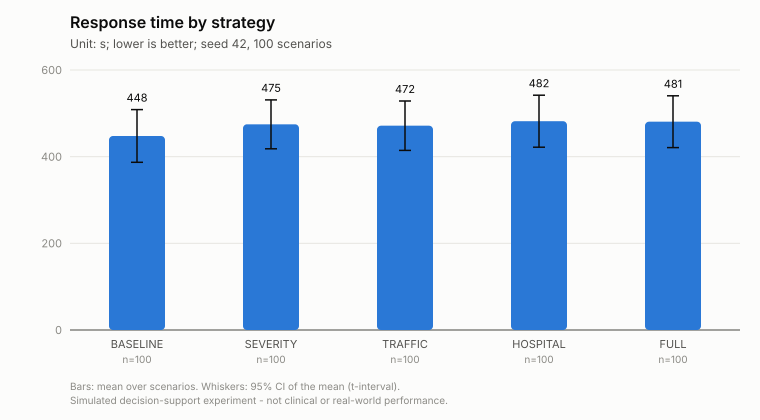
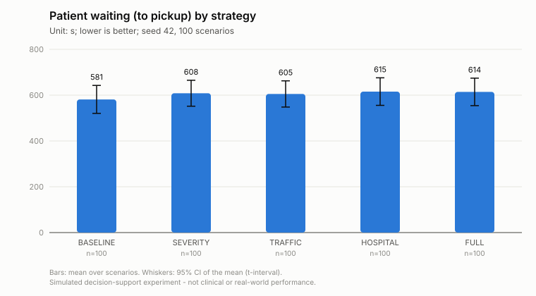
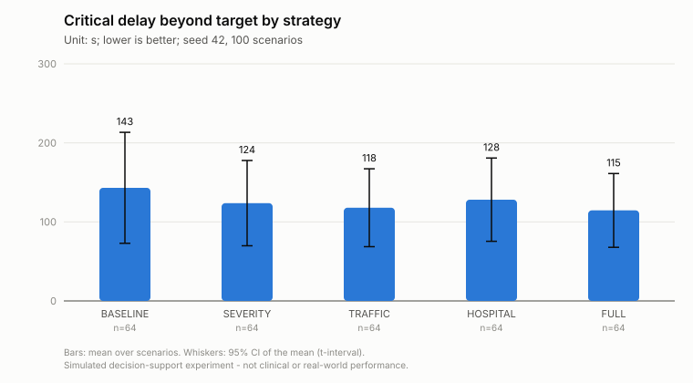
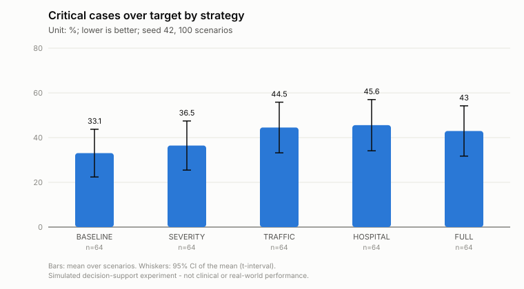
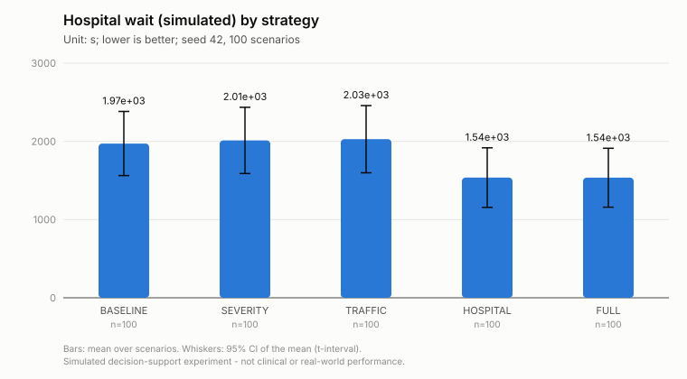
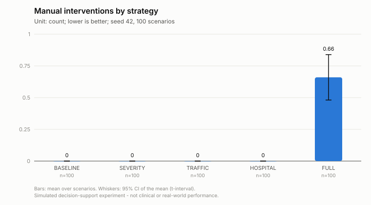
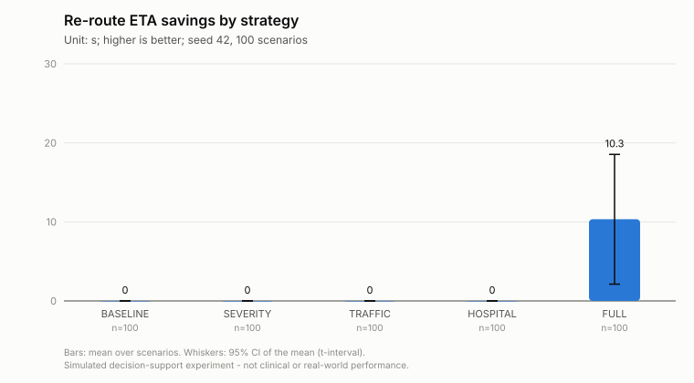
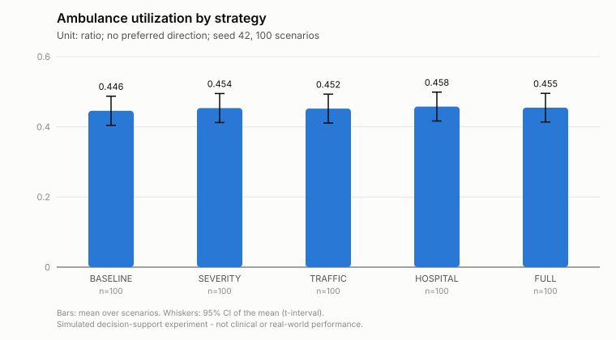
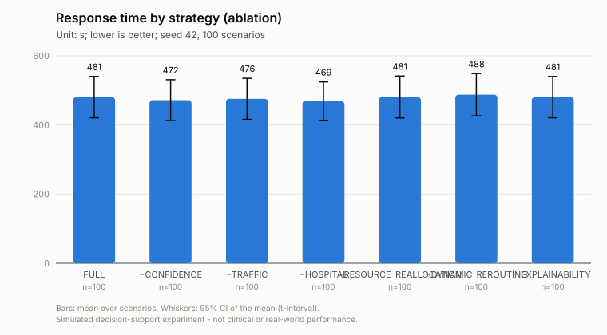
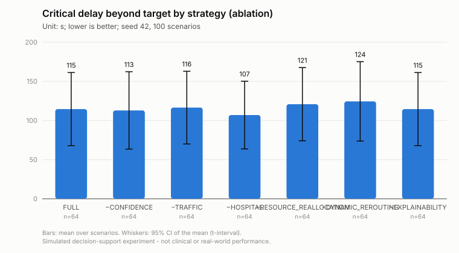
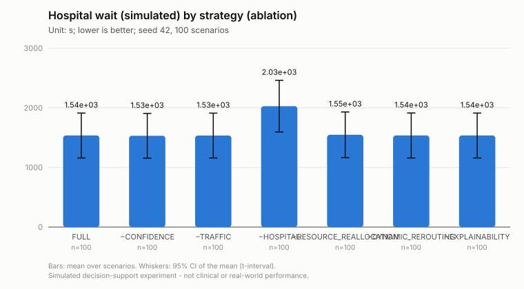

## Files

`comparison_summary.csv`, `scenario_results.csv`, `incident_results.csv`, `statistics.csv`, `paired_tests.csv`, `scenarios_summary.csv`, `scenarios.json` (complete scenario definitions), `summary.json`, `run_metadata.json`.

Metric definitions: `backend/app/evaluation/metrics.py`; test selection: `backend/app/evaluation/statistics.py`.