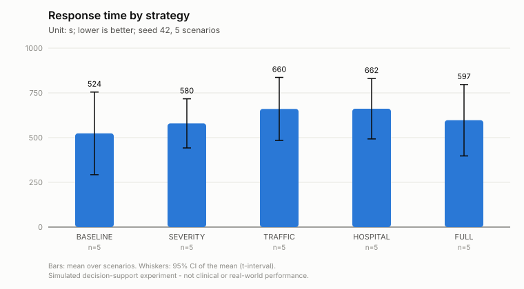
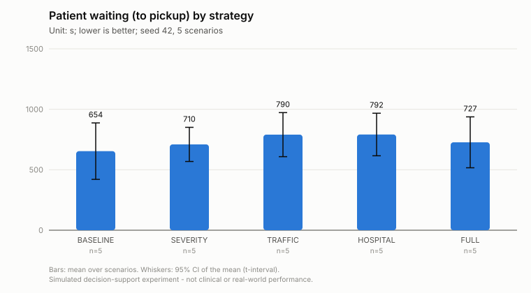
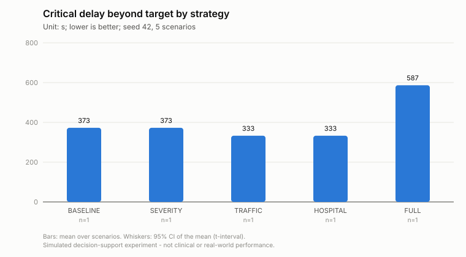
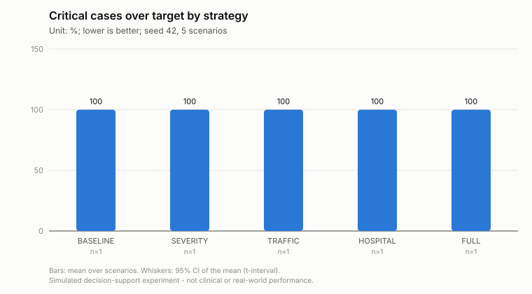
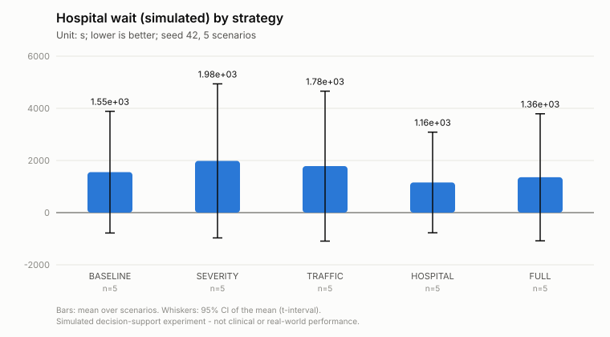
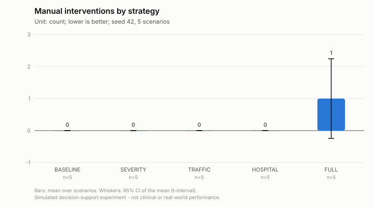
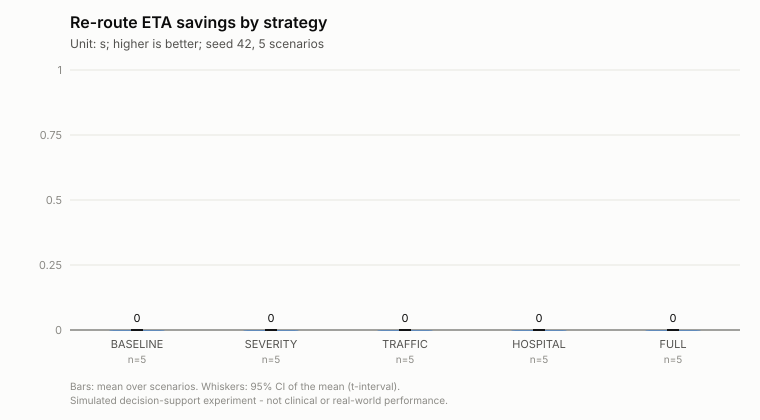
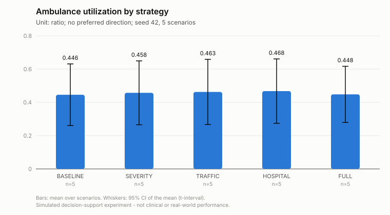

# Experiment step7-all-s42-n5

Simulated decision-support experiment. Values are measured in a deterministic simulation on the real road graph with simulated patients, traffic and hospital load; they are not clinical outcomes or real-world emergency-service performance.

* Status: **COMPLETED**, failures: 0
* Seed: 42, scenarios: 5, strategies: BASELINE, SEVERITY, TRAFFIC, HOSPITAL, FULL
* Code: `a2116caa46932fa024c47167e2d141d4e233568d` (branch research-evaluation, uncommitted changes: False)
* City: Monaco, road network: osm (11250 nodes, 19562 edges, sha 6cd79e4808ed8123), OSRM: enabled (http://localhost:5000)
* Severity model: rf-20261005182602 (dataset: synthetic)
* Traffic prediction: **FALLBACK** (traffic-fallback-v1-20261006160039) - RandomForest did not beat the persistence baseline on the hold-out - fallback model used
* Hospital prediction: hospital-queue-v1 - ESTIMATE (queueing approximation)
* Started 2026-10-06T16:00:42.513574+00:00, completed n/a

<!-- design-and-denominators:start -->
## Design and denominators

**Unit of analysis: the scenario.** Every number in this report is derived from the counts below.

| Quantity | Value | How it is obtained |
|---|---:|---|
| Scenarios | 5 | generated once from seed 42; scenario *k* uses RNG seed (42, *k*) and has a stored fingerprint |
| Strategy configurations | 5 | 5 progressive systems (BASELINE, SEVERITY, TRAFFIC, HOSPITAL, FULL) |
| **Simulation runs** | **25** | 5 scenarios × 5 configurations: every scenario is replayed once under every configuration (same patients, fleet, hospitals, traffic, disruptions; only the decision strategy differs) |
| Failed runs | 0 | recorded in failures.csv and excluded from that configuration's statistics |
| Emergency calls per configuration | 27 | sum of the calls of the 5 scenarios (9 with an uncertain report); identical for every configuration |
| Simulated call outcomes | 135 | 27 calls × 5 configurations (incident_results.csv) |

**How the statistics use these runs.**
* *Comparison table*: each cell is the mean over the scenarios of one configuration (scenario-level value = mean over that scenario's calls, or a count/share for the scenario). It is NOT a mean over 25 runs.
* *Paired tests*: one pair per scenario (the same scenario under two configurations), so at most 5 pairs per test; the runs of different configurations are never pooled. Families: vs BASELINE (4 comparisons); incremental, each system vs the previous one (4). Holm correction is applied within each comparison over all metrics.
* A metric that does not exist in a scenario (e.g. no CRITICAL patient, no re-route) is NULL there, so its *n* is smaller than the number of scenarios:

| Metric | scenarios with a value (FULL) | why |
|---|---:|---|
| Re-route improvement | 0 | scenarios with an accepted re-route with a finite old ETA |
| Critical response time | 1 | scenarios with at least one patient whose simulated label is CRITICAL |
| Critical delay beyond target | 1 | scenarios with at least one patient whose simulated label is CRITICAL |
| Critical cases over target | 1 | scenarios with at least one patient whose simulated label is CRITICAL |
| Worst critical delay | 1 | scenarios with at least one patient whose simulated label is CRITICAL |
| Delay imposed on donor missions (est.) | 1 | scenarios with an executed reallocation |
| Requester delay avoided (est.) | 0 | scenarios with an executed reallocation where a free alternative unit existed (otherwise the avoided delay is undefined) |

<!-- design-and-denominators:end -->

## Comparison (mean over scenarios)

| Metric | BASELINE | SEVERITY | TRAFFIC | HOSPITAL | FULL |
|---|---:|---:|---:|---:|---:|
| Response time (s) | 524 s (8.7 min) | 580 s (9.7 min) | 660 s (11.0 min) | 662 s (11.0 min) | 597 s (10.0 min) |
| Patient waiting (to pickup) (s) | 654 s (10.9 min) | 710 s (11.8 min) | 790 s (13.2 min) | 792 s (13.2 min) | 727 s (12.1 min) |
| Dispatch delay (queue + review) (s) | 65.57 | 56.30 | 68.30 | 68.30 | 69.03 |
| Initial route ETA (s) | 341 s (5.7 min) | 377 s (6.3 min) | 506 s (8.4 min) | 508 s (8.5 min) | 465 s (7.7 min) |
| Actual travel to scene (s) | 458 s (7.6 min) | 523 s (8.7 min) | 592 s (9.9 min) | 593 s (9.9 min) | 524 s (8.7 min) |
| |ETA error| (actual - planned) (s) | 68.15 | 85.77 | 26.71 | 26.65 | 28.96 |
| Proactive re-routes (count) | 0.00 | 0.00 | 0.00 | 0.00 | 0.40 |
| Re-route ETA savings (s) | 0.00 | 0.00 | 0.00 | 0.00 | 0.00 |
| Re-route improvement (%) | n/a | n/a | n/a | n/a | n/a |
| Reactive detours at closures (count) | 0.60 | 0.80 | 0.80 | 0.60 | 0.00 |
| Ambulance utilization (ratio) | 0.446 | 0.458 | 0.463 | 0.468 | 0.448 |
| Time with no unit available (%) | 11.38 | 11.38 | 12.73 | 13.51 | 11.36 |
| Reserve availability (ratio) | 0.554 | 0.542 | 0.537 | 0.532 | 0.552 |
| Hospital wait (simulated) (s) | 1553 s (25.9 min) | 1984 s (33.1 min) | 1783 s (29.7 min) | 1156 s (19.3 min) | 1356 s (22.6 min) |
| Hospital wait (predicted) (s) | n/a | n/a | n/a | 1146 s (19.1 min) | 1376 s (22.9 min) |
| Hospital capability gap (%) | 41.83 | 29.50 | 29.50 | 29.50 | 29.50 |
| Unsuitable first unit (vs simulated need) (%) | 34.50 | 21.50 | 17.50 | 17.50 | 15.00 |
| Perfect unit capability match (%) | 47.67 | 67.17 | 78.50 | 78.50 | 81.00 |
| Creation -> ED treatment (simulated) (s) | 2682 s (44.7 min) | 3168 s (52.8 min) | 3017 s (50.3 min) | 2433 s (40.6 min) | 2560 s (42.7 min) |
| Critical response time (s) | 853 s (14.2 min) | 853 s (14.2 min) | 813 s (13.5 min) | 813 s (13.5 min) | 1067 s (17.8 min) |
| Critical delay beyond target (s) | 373 s (6.2 min) | 373 s (6.2 min) | 333 s (5.5 min) | 333 s (5.5 min) | 587 s (9.8 min) |
| Critical cases over target (%) | 100.00 | 100.00 | 100.00 | 100.00 | 100.00 |
| Worst critical delay (s) | 373 s (6.2 min) | 373 s (6.2 min) | 333 s (5.5 min) | 333 s (5.5 min) | 587 s (9.8 min) |
| Review-trigger rate (%) | 0.00 | 0.00 | 0.00 | 0.00 | 12.33 |
| Automatic decision rate (%) | 100.00 | 100.00 | 100.00 | 100.00 | 84.89 |
| Potentially inappropriate auto-dispatch (count) | 0.80 | 0.80 | 0.80 | 0.80 | 0.00 |
| Under-triage vs simulated label (%) | n/a | 19.83 | 19.83 | 19.83 | 14.00 |
| Resource conflicts detected (count) | 0.00 | 0.00 | 0.00 | 0.00 | 0.40 |
| Automatic reallocations (count) | 0.00 | 0.00 | 0.00 | 0.00 | 0.20 |
| Conflicts escalated (count) | 0.00 | 0.00 | 0.00 | 0.00 | 0.20 |
| Delay imposed on donor missions (est.) (s) | n/a | n/a | n/a | n/a | 36.30 |
| Requester delay avoided (est.) (s) | n/a | n/a | n/a | n/a | n/a |
| Manual interventions (count) | 0.00 | 0.00 | 0.00 | 0.00 | 1.00 |
| Calls not reached (count) | 0.00 | 0.00 | 0.00 | 0.00 | 0.00 |

### Paired comparisons against BASELINE

| Comparison | Metric | Pairs | Mean diff | 95% CI | Test | p (Holm) | Significant |
|---|---|---:|---:|---|---|---:|---|
| SEVERITY vs BASELINE | Response time | 5 | +55.90 | n/a | none (insufficient pairs (n=5 < 10): no significance test) | n/a | – |
| SEVERITY vs BASELINE | Patient waiting (to pickup) | 5 | +55.90 | n/a | none (insufficient pairs (n=5 < 10): no significance test) | n/a | – |
| SEVERITY vs BASELINE | |ETA error| (actual - planned) | 5 | +17.63 | n/a | none (insufficient pairs (n=5 < 10): no significance test) | n/a | – |
| SEVERITY vs BASELINE | Re-route ETA savings | 5 | +0.00 | n/a | none (insufficient pairs (n=5 < 10): no significance test) | n/a | – |
| SEVERITY vs BASELINE | Reactive detours at closures | 5 | +0.20 | n/a | none (insufficient pairs (n=5 < 10): no significance test) | n/a | – |
| SEVERITY vs BASELINE | Hospital wait (simulated) | 5 | +431.09 | n/a | none (insufficient pairs (n=5 < 10): no significance test) | n/a | – |
| SEVERITY vs BASELINE | Hospital capability gap | 5 | -12.33 | n/a | none (insufficient pairs (n=5 < 10): no significance test) | n/a | – |
| SEVERITY vs BASELINE | Creation -> ED treatment (simulated) | 5 | +485.97 | n/a | none (insufficient pairs (n=5 < 10): no significance test) | n/a | – |
| SEVERITY vs BASELINE | Critical delay beyond target | 1 | +0.00 | n/a | none (insufficient pairs (n=1 < 10): no significance test) | n/a | – |
| SEVERITY vs BASELINE | Critical cases over target | 1 | +0.00 | n/a | none (insufficient pairs (n=1 < 10): no significance test) | n/a | – |
| SEVERITY vs BASELINE | Under-triage vs simulated label | 0 | n/a | n/a | none (insufficient pairs (n=0 < 10): no significance test) | n/a | – |
| SEVERITY vs BASELINE | Manual interventions | 5 | +0.00 | n/a | none (insufficient pairs (n=5 < 10): no significance test) | n/a | – |
| TRAFFIC vs BASELINE | Response time | 5 | +136.71 | n/a | none (insufficient pairs (n=5 < 10): no significance test) | n/a | – |
| TRAFFIC vs BASELINE | Patient waiting (to pickup) | 5 | +136.71 | n/a | none (insufficient pairs (n=5 < 10): no significance test) | n/a | – |
| TRAFFIC vs BASELINE | |ETA error| (actual - planned) | 5 | -41.43 | n/a | none (insufficient pairs (n=5 < 10): no significance test) | n/a | – |
| TRAFFIC vs BASELINE | Re-route ETA savings | 5 | +0.00 | n/a | none (insufficient pairs (n=5 < 10): no significance test) | n/a | – |
| TRAFFIC vs BASELINE | Reactive detours at closures | 5 | +0.20 | n/a | none (insufficient pairs (n=5 < 10): no significance test) | n/a | – |
| TRAFFIC vs BASELINE | Hospital wait (simulated) | 5 | +230.39 | n/a | none (insufficient pairs (n=5 < 10): no significance test) | n/a | – |
| TRAFFIC vs BASELINE | Hospital capability gap | 5 | -12.33 | n/a | none (insufficient pairs (n=5 < 10): no significance test) | n/a | – |
| TRAFFIC vs BASELINE | Creation -> ED treatment (simulated) | 5 | +335.19 | n/a | none (insufficient pairs (n=5 < 10): no significance test) | n/a | – |
| TRAFFIC vs BASELINE | Critical delay beyond target | 1 | -39.70 | n/a | none (insufficient pairs (n=1 < 10): no significance test) | n/a | – |
| TRAFFIC vs BASELINE | Critical cases over target | 1 | +0.00 | n/a | none (insufficient pairs (n=1 < 10): no significance test) | n/a | – |
| TRAFFIC vs BASELINE | Under-triage vs simulated label | 0 | n/a | n/a | none (insufficient pairs (n=0 < 10): no significance test) | n/a | – |
| TRAFFIC vs BASELINE | Manual interventions | 5 | +0.00 | n/a | none (insufficient pairs (n=5 < 10): no significance test) | n/a | – |
| HOSPITAL vs BASELINE | Response time | 5 | +137.81 | n/a | none (insufficient pairs (n=5 < 10): no significance test) | n/a | – |
| HOSPITAL vs BASELINE | Patient waiting (to pickup) | 5 | +137.81 | n/a | none (insufficient pairs (n=5 < 10): no significance test) | n/a | – |
| HOSPITAL vs BASELINE | |ETA error| (actual - planned) | 5 | -41.49 | n/a | none (insufficient pairs (n=5 < 10): no significance test) | n/a | – |
| HOSPITAL vs BASELINE | Re-route ETA savings | 5 | +0.00 | n/a | none (insufficient pairs (n=5 < 10): no significance test) | n/a | – |
| HOSPITAL vs BASELINE | Reactive detours at closures | 5 | +0.00 | n/a | none (insufficient pairs (n=5 < 10): no significance test) | n/a | – |
| HOSPITAL vs BASELINE | Hospital wait (simulated) | 5 | -396.53 | n/a | none (insufficient pairs (n=5 < 10): no significance test) | n/a | – |
| HOSPITAL vs BASELINE | Hospital capability gap | 5 | -12.33 | n/a | none (insufficient pairs (n=5 < 10): no significance test) | n/a | – |
| HOSPITAL vs BASELINE | Creation -> ED treatment (simulated) | 5 | -248.73 | n/a | none (insufficient pairs (n=5 < 10): no significance test) | n/a | – |
| HOSPITAL vs BASELINE | Critical delay beyond target | 1 | -39.70 | n/a | none (insufficient pairs (n=1 < 10): no significance test) | n/a | – |
| HOSPITAL vs BASELINE | Critical cases over target | 1 | +0.00 | n/a | none (insufficient pairs (n=1 < 10): no significance test) | n/a | – |
| HOSPITAL vs BASELINE | Under-triage vs simulated label | 0 | n/a | n/a | none (insufficient pairs (n=0 < 10): no significance test) | n/a | – |
| HOSPITAL vs BASELINE | Manual interventions | 5 | +0.00 | n/a | none (insufficient pairs (n=5 < 10): no significance test) | n/a | – |
| FULL vs BASELINE | Response time | 5 | +73.36 | n/a | none (insufficient pairs (n=5 < 10): no significance test) | n/a | – |
| FULL vs BASELINE | Patient waiting (to pickup) | 5 | +73.36 | n/a | none (insufficient pairs (n=5 < 10): no significance test) | n/a | – |
| FULL vs BASELINE | |ETA error| (actual - planned) | 5 | -39.19 | n/a | none (insufficient pairs (n=5 < 10): no significance test) | n/a | – |
| FULL vs BASELINE | Re-route ETA savings | 5 | +0.00 | n/a | none (insufficient pairs (n=5 < 10): no significance test) | n/a | – |
| FULL vs BASELINE | Reactive detours at closures | 5 | -0.60 | n/a | none (insufficient pairs (n=5 < 10): no significance test) | n/a | – |
| FULL vs BASELINE | Hospital wait (simulated) | 5 | -197.05 | n/a | none (insufficient pairs (n=5 < 10): no significance test) | n/a | – |
| FULL vs BASELINE | Hospital capability gap | 5 | -12.33 | n/a | none (insufficient pairs (n=5 < 10): no significance test) | n/a | – |
| FULL vs BASELINE | Creation -> ED treatment (simulated) | 5 | -122.12 | n/a | none (insufficient pairs (n=5 < 10): no significance test) | n/a | – |
| FULL vs BASELINE | Critical delay beyond target | 1 | +214.10 | n/a | none (insufficient pairs (n=1 < 10): no significance test) | n/a | – |
| FULL vs BASELINE | Critical cases over target | 1 | +0.00 | n/a | none (insufficient pairs (n=1 < 10): no significance test) | n/a | – |
| FULL vs BASELINE | Under-triage vs simulated label | 0 | n/a | n/a | none (insufficient pairs (n=0 < 10): no significance test) | n/a | – |
| FULL vs BASELINE | Manual interventions | 5 | +1.00 | n/a | none (insufficient pairs (n=5 < 10): no significance test) | n/a | – |

### Incremental contribution (each system vs the previous one)

| Comparison | Metric | Pairs | Mean diff | 95% CI | Test | p (Holm) | Significant |
|---|---|---:|---:|---|---|---:|---|
| SEVERITY vs BASELINE | Response time | 5 | +55.90 | n/a | none (insufficient pairs (n=5 < 10): no significance test) | n/a | – |
| SEVERITY vs BASELINE | Patient waiting (to pickup) | 5 | +55.90 | n/a | none (insufficient pairs (n=5 < 10): no significance test) | n/a | – |
| SEVERITY vs BASELINE | |ETA error| (actual - planned) | 5 | +17.63 | n/a | none (insufficient pairs (n=5 < 10): no significance test) | n/a | – |
| SEVERITY vs BASELINE | Re-route ETA savings | 5 | +0.00 | n/a | none (insufficient pairs (n=5 < 10): no significance test) | n/a | – |
| SEVERITY vs BASELINE | Reactive detours at closures | 5 | +0.20 | n/a | none (insufficient pairs (n=5 < 10): no significance test) | n/a | – |
| SEVERITY vs BASELINE | Hospital wait (simulated) | 5 | +431.09 | n/a | none (insufficient pairs (n=5 < 10): no significance test) | n/a | – |
| SEVERITY vs BASELINE | Hospital capability gap | 5 | -12.33 | n/a | none (insufficient pairs (n=5 < 10): no significance test) | n/a | – |
| SEVERITY vs BASELINE | Creation -> ED treatment (simulated) | 5 | +485.97 | n/a | none (insufficient pairs (n=5 < 10): no significance test) | n/a | – |
| SEVERITY vs BASELINE | Critical delay beyond target | 1 | +0.00 | n/a | none (insufficient pairs (n=1 < 10): no significance test) | n/a | – |
| SEVERITY vs BASELINE | Critical cases over target | 1 | +0.00 | n/a | none (insufficient pairs (n=1 < 10): no significance test) | n/a | – |
| SEVERITY vs BASELINE | Under-triage vs simulated label | 0 | n/a | n/a | none (insufficient pairs (n=0 < 10): no significance test) | n/a | – |
| SEVERITY vs BASELINE | Manual interventions | 5 | +0.00 | n/a | none (insufficient pairs (n=5 < 10): no significance test) | n/a | – |
| TRAFFIC vs SEVERITY | Response time | 5 | +80.81 | n/a | none (insufficient pairs (n=5 < 10): no significance test) | n/a | – |
| TRAFFIC vs SEVERITY | Patient waiting (to pickup) | 5 | +80.81 | n/a | none (insufficient pairs (n=5 < 10): no significance test) | n/a | – |
| TRAFFIC vs SEVERITY | |ETA error| (actual - planned) | 5 | -59.06 | n/a | none (insufficient pairs (n=5 < 10): no significance test) | n/a | – |
| TRAFFIC vs SEVERITY | Re-route ETA savings | 5 | +0.00 | n/a | none (insufficient pairs (n=5 < 10): no significance test) | n/a | – |
| TRAFFIC vs SEVERITY | Reactive detours at closures | 5 | +0.00 | n/a | none (insufficient pairs (n=5 < 10): no significance test) | n/a | – |
| TRAFFIC vs SEVERITY | Hospital wait (simulated) | 5 | -200.70 | n/a | none (insufficient pairs (n=5 < 10): no significance test) | n/a | – |
| TRAFFIC vs SEVERITY | Hospital capability gap | 5 | +0.00 | n/a | none (insufficient pairs (n=5 < 10): no significance test) | n/a | – |
| TRAFFIC vs SEVERITY | Creation -> ED treatment (simulated) | 5 | -150.78 | n/a | none (insufficient pairs (n=5 < 10): no significance test) | n/a | – |
| TRAFFIC vs SEVERITY | Critical delay beyond target | 1 | -39.70 | n/a | none (insufficient pairs (n=1 < 10): no significance test) | n/a | – |
| TRAFFIC vs SEVERITY | Critical cases over target | 1 | +0.00 | n/a | none (insufficient pairs (n=1 < 10): no significance test) | n/a | – |
| TRAFFIC vs SEVERITY | Under-triage vs simulated label | 5 | +0.00 | n/a | none (insufficient pairs (n=5 < 10): no significance test) | n/a | – |
| TRAFFIC vs SEVERITY | Manual interventions | 5 | +0.00 | n/a | none (insufficient pairs (n=5 < 10): no significance test) | n/a | – |
| HOSPITAL vs TRAFFIC | Response time | 5 | +1.11 | n/a | none (insufficient pairs (n=5 < 10): no significance test) | n/a | – |
| HOSPITAL vs TRAFFIC | Patient waiting (to pickup) | 5 | +1.11 | n/a | none (insufficient pairs (n=5 < 10): no significance test) | n/a | – |
| HOSPITAL vs TRAFFIC | |ETA error| (actual - planned) | 5 | -0.06 | n/a | none (insufficient pairs (n=5 < 10): no significance test) | n/a | – |
| HOSPITAL vs TRAFFIC | Re-route ETA savings | 5 | +0.00 | n/a | none (insufficient pairs (n=5 < 10): no significance test) | n/a | – |
| HOSPITAL vs TRAFFIC | Reactive detours at closures | 5 | -0.20 | n/a | none (insufficient pairs (n=5 < 10): no significance test) | n/a | – |
| HOSPITAL vs TRAFFIC | Hospital wait (simulated) | 5 | -626.91 | n/a | none (insufficient pairs (n=5 < 10): no significance test) | n/a | – |
| HOSPITAL vs TRAFFIC | Hospital capability gap | 5 | +0.00 | n/a | none (insufficient pairs (n=5 < 10): no significance test) | n/a | – |
| HOSPITAL vs TRAFFIC | Creation -> ED treatment (simulated) | 5 | -583.92 | n/a | none (insufficient pairs (n=5 < 10): no significance test) | n/a | – |
| HOSPITAL vs TRAFFIC | Critical delay beyond target | 1 | +0.00 | n/a | none (insufficient pairs (n=1 < 10): no significance test) | n/a | – |
| HOSPITAL vs TRAFFIC | Critical cases over target | 1 | +0.00 | n/a | none (insufficient pairs (n=1 < 10): no significance test) | n/a | – |
| HOSPITAL vs TRAFFIC | Under-triage vs simulated label | 5 | +0.00 | n/a | none (insufficient pairs (n=5 < 10): no significance test) | n/a | – |
| HOSPITAL vs TRAFFIC | Manual interventions | 5 | +0.00 | n/a | none (insufficient pairs (n=5 < 10): no significance test) | n/a | – |
| FULL vs HOSPITAL | Response time | 5 | -64.45 | n/a | none (insufficient pairs (n=5 < 10): no significance test) | n/a | – |
| FULL vs HOSPITAL | Patient waiting (to pickup) | 5 | -64.45 | n/a | none (insufficient pairs (n=5 < 10): no significance test) | n/a | – |
| FULL vs HOSPITAL | |ETA error| (actual - planned) | 5 | +2.30 | n/a | none (insufficient pairs (n=5 < 10): no significance test) | n/a | – |
| FULL vs HOSPITAL | Re-route ETA savings | 5 | +0.00 | n/a | none (insufficient pairs (n=5 < 10): no significance test) | n/a | – |
| FULL vs HOSPITAL | Reactive detours at closures | 5 | -0.60 | n/a | none (insufficient pairs (n=5 < 10): no significance test) | n/a | – |
| FULL vs HOSPITAL | Hospital wait (simulated) | 5 | +199.47 | n/a | none (insufficient pairs (n=5 < 10): no significance test) | n/a | – |
| FULL vs HOSPITAL | Hospital capability gap | 5 | +0.00 | n/a | none (insufficient pairs (n=5 < 10): no significance test) | n/a | – |
| FULL vs HOSPITAL | Creation -> ED treatment (simulated) | 5 | +126.61 | n/a | none (insufficient pairs (n=5 < 10): no significance test) | n/a | – |
| FULL vs HOSPITAL | Critical delay beyond target | 1 | +253.80 | n/a | none (insufficient pairs (n=1 < 10): no significance test) | n/a | – |
| FULL vs HOSPITAL | Critical cases over target | 1 | +0.00 | n/a | none (insufficient pairs (n=1 < 10): no significance test) | n/a | – |
| FULL vs HOSPITAL | Under-triage vs simulated label | 5 | -5.83 | n/a | none (insufficient pairs (n=5 < 10): no significance test) | n/a | – |
| FULL vs HOSPITAL | Manual interventions | 5 | +1.00 | n/a | none (insufficient pairs (n=5 < 10): no significance test) | n/a | – |

## Figures

## Files

`comparison_summary.csv`, `scenario_results.csv`, `incident_results.csv`, `statistics.csv`, `paired_tests.csv`, `scenarios_summary.csv`, `scenarios.json` (complete scenario definitions), `summary.json`, `run_metadata.json`.

Metric definitions: `backend/app/evaluation/metrics.py`; test selection: `backend/app/evaluation/statistics.py`.