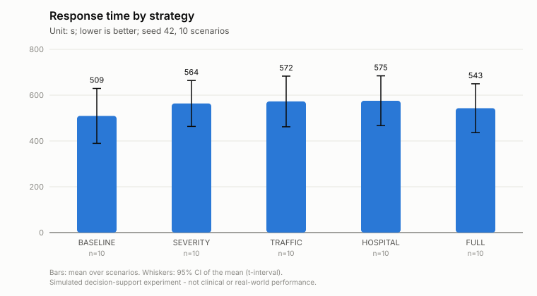
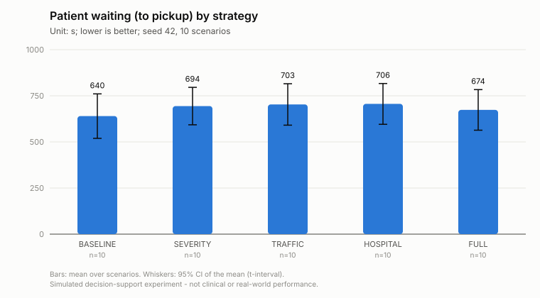
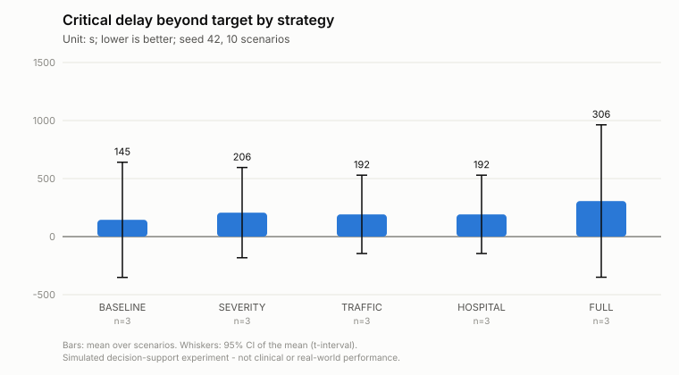
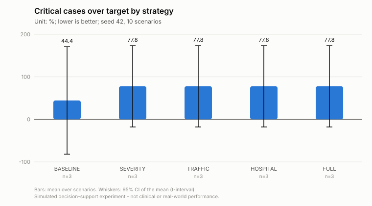
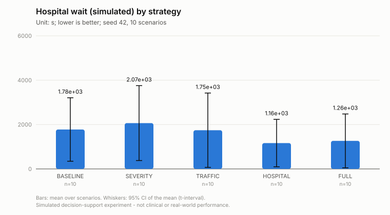
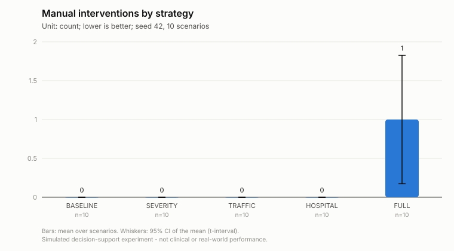
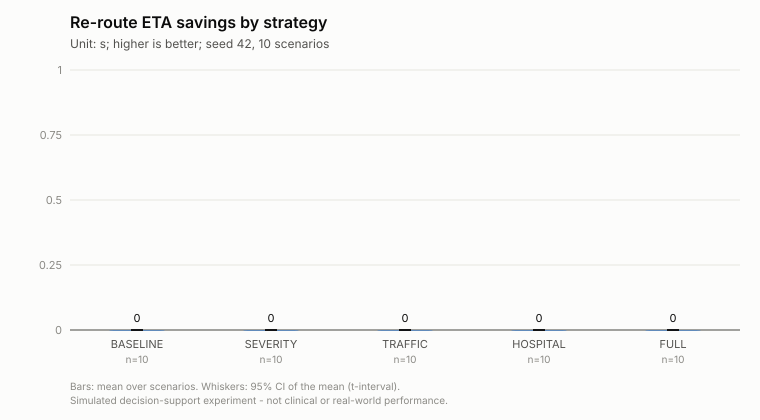
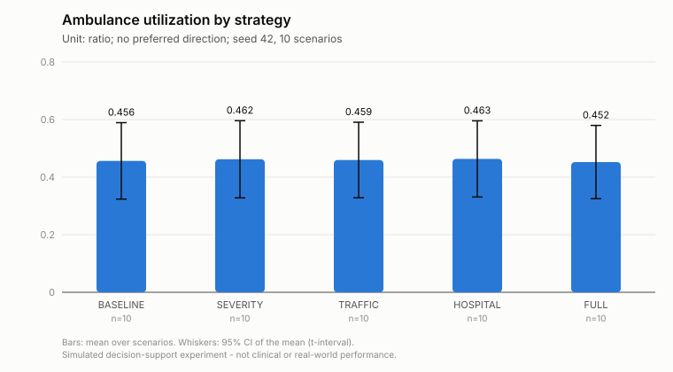

# Experiment step9-all-s42-n10

Simulated decision-support experiment. Values are measured in a deterministic simulation on the real road graph with simulated patients, traffic and hospital load; they are not clinical outcomes or real-world emergency-service performance.

* Status: **COMPLETED**, failures: 0
* Seed: 42, scenarios: 10, strategies: BASELINE, SEVERITY, TRAFFIC, HOSPITAL, FULL
* Code: `a2116caa46932fa024c47167e2d141d4e233568d` (branch research-evaluation, uncommitted changes: False)
* City: Monaco, road network: osm (11250 nodes, 19562 edges, sha 6cd79e4808ed8123), OSRM: enabled (http://localhost:5000)
* Severity model: rf-20261005182602 (dataset: synthetic)
* Traffic prediction: **FALLBACK** (traffic-fallback-v1-20261006160056) - RandomForest did not beat the persistence baseline on the hold-out - fallback model used
* Hospital prediction: hospital-queue-v1 - ESTIMATE (queueing approximation)
* Started 2026-10-06T16:00:59.208423+00:00, completed n/a

<!-- design-and-denominators:start -->
## Design and denominators

**Unit of analysis: the scenario.** Every number in this report is derived from the counts below.

| Quantity | Value | How it is obtained |
|---|---:|---|
| Scenarios | 10 | generated once from seed 42; scenario *k* uses RNG seed (42, *k*) and has a stored fingerprint |
| Strategy configurations | 5 | 5 progressive systems (BASELINE, SEVERITY, TRAFFIC, HOSPITAL, FULL) |
| **Simulation runs** | **50** | 10 scenarios × 5 configurations: every scenario is replayed once under every configuration (same patients, fleet, hospitals, traffic, disruptions; only the decision strategy differs) |
| Failed runs | 0 | recorded in failures.csv and excluded from that configuration's statistics |
| Emergency calls per configuration | 56 | sum of the calls of the 10 scenarios (18 with an uncertain report); identical for every configuration |
| Simulated call outcomes | 280 | 56 calls × 5 configurations (incident_results.csv) |

**How the statistics use these runs.**
* *Comparison table*: each cell is the mean over the scenarios of one configuration (scenario-level value = mean over that scenario's calls, or a count/share for the scenario). It is NOT a mean over 50 runs.
* *Paired tests*: one pair per scenario (the same scenario under two configurations), so at most 10 pairs per test; the runs of different configurations are never pooled. Families: vs BASELINE (4 comparisons); incremental, each system vs the previous one (4). Holm correction is applied within each comparison over all metrics.
* A metric that does not exist in a scenario (e.g. no CRITICAL patient, no re-route) is NULL there, so its *n* is smaller than the number of scenarios:

| Metric | scenarios with a value (FULL) | why |
|---|---:|---|
| Re-route improvement | 0 | scenarios with an accepted re-route with a finite old ETA |
| Critical response time | 3 | scenarios with at least one patient whose simulated label is CRITICAL |
| Critical delay beyond target | 3 | scenarios with at least one patient whose simulated label is CRITICAL |
| Critical cases over target | 3 | scenarios with at least one patient whose simulated label is CRITICAL |
| Worst critical delay | 3 | scenarios with at least one patient whose simulated label is CRITICAL |
| Delay imposed on donor missions (est.) | 2 | scenarios with an executed reallocation |
| Requester delay avoided (est.) | 2 | scenarios with an executed reallocation where a free alternative unit existed (otherwise the avoided delay is undefined) |

<!-- design-and-denominators:end -->

## Comparison (mean over scenarios)

| Metric | BASELINE | SEVERITY | TRAFFIC | HOSPITAL | FULL |
|---|---:|---:|---:|---:|---:|
| Response time (s) | 509 s (8.5 min) | 564 s (9.4 min) | 572 s (9.5 min) | 575 s (9.6 min) | 543 s (9.1 min) |
| Patient waiting (to pickup) (s) | 640 s (10.7 min) | 694 s (11.6 min) | 703 s (11.7 min) | 706 s (11.8 min) | 674 s (11.2 min) |
| Dispatch delay (queue + review) (s) | 40.34 | 35.70 | 41.70 | 42.33 | 44.06 |
| Initial route ETA (s) | 322 s (5.4 min) | 360 s (6.0 min) | 452 s (7.5 min) | 454 s (7.6 min) | 427 s (7.1 min) |
| Actual travel to scene (s) | 469 s (7.8 min) | 528 s (8.8 min) | 531 s (8.8 min) | 533 s (8.9 min) | 487 s (8.1 min) |
| |ETA error| (actual - planned) (s) | 111.96 | 130 s (2.2 min) | 32.97 | 33.26 | 41.48 |
| Proactive re-routes (count) | 0.00 | 0.00 | 0.00 | 0.00 | 0.90 |
| Re-route ETA savings (s) | 0.00 | 0.00 | 0.00 | 0.00 | 0.00 |
| Re-route improvement (%) | n/a | n/a | n/a | n/a | n/a |
| Reactive detours at closures (count) | 0.90 | 1.00 | 0.90 | 0.80 | 0.10 |
| Ambulance utilization (ratio) | 0.456 | 0.462 | 0.459 | 0.463 | 0.452 |
| Time with no unit available (%) | 10.33 | 10.33 | 10.79 | 11.46 | 10.38 |
| Reserve availability (ratio) | 0.533 | 0.528 | 0.530 | 0.526 | 0.538 |
| Hospital wait (simulated) (s) | 1777 s (29.6 min) | 2066 s (34.4 min) | 1746 s (29.1 min) | 1165 s (19.4 min) | 1265 s (21.1 min) |
| Hospital wait (predicted) (s) | n/a | n/a | n/a | 1132 s (18.9 min) | 1237 s (20.6 min) |
| Hospital capability gap (%) | 38.42 | 29.57 | 29.57 | 29.57 | 29.57 |
| Unsuitable first unit (vs simulated need) (%) | 30.82 | 12.18 | 10.18 | 10.18 | 8.93 |
| Perfect unit capability match (%) | 43.54 | 61.14 | 68.24 | 66.99 | 69.85 |
| Creation -> ED treatment (simulated) (s) | 2873 s (47.9 min) | 3217 s (53.6 min) | 2885 s (48.1 min) | 2338 s (39.0 min) | 2397 s (39.9 min) |
| Critical response time (s) | 501 s (8.4 min) | 635 s (10.6 min) | 620 s (10.3 min) | 620 s (10.3 min) | 734 s (12.2 min) |
| Critical delay beyond target (s) | 145 s (2.4 min) | 206 s (3.4 min) | 192 s (3.2 min) | 192 s (3.2 min) | 306 s (5.1 min) |
| Critical cases over target (%) | 44.44 | 77.78 | 77.78 | 77.78 | 77.78 |
| Worst critical delay (s) | 186 s (3.1 min) | 248 s (4.1 min) | 233 s (3.9 min) | 233 s (3.9 min) | 347 s (5.8 min) |
| Review-trigger rate (%) | 0.00 | 0.00 | 0.00 | 0.00 | 7.60 |
| Automatic decision rate (%) | 100.00 | 100.00 | 100.00 | 100.00 | 86.61 |
| Potentially inappropriate auto-dispatch (count) | 0.50 | 0.50 | 0.50 | 0.50 | 0.00 |
| Under-triage vs simulated label (%) | n/a | 14.20 | 14.20 | 14.20 | 9.86 |
| Resource conflicts detected (count) | 0.00 | 0.00 | 0.00 | 0.00 | 0.80 |
| Automatic reallocations (count) | 0.00 | 0.00 | 0.00 | 0.00 | 0.30 |
| Conflicts escalated (count) | 0.00 | 0.00 | 0.00 | 0.00 | 0.50 |
| Delay imposed on donor missions (est.) (s) | n/a | n/a | n/a | n/a | 116.40 |
| Requester delay avoided (est.) (s) | n/a | n/a | n/a | n/a | 198 s (3.3 min) |
| Manual interventions (count) | 0.00 | 0.00 | 0.00 | 0.00 | 1.00 |
| Calls not reached (count) | 0.00 | 0.00 | 0.00 | 0.00 | 0.00 |

### Paired comparisons against BASELINE

| Comparison | Metric | Pairs | Mean diff | 95% CI | Test | p (Holm) | Significant |
|---|---|---:|---:|---|---|---:|---|
| SEVERITY vs BASELINE | Response time | 10 | +54.44 | [-0.6, 109.5] | paired t-test | 0.1559 | no |
| SEVERITY vs BASELINE | Patient waiting (to pickup) | 10 | +54.44 | [-0.6, 109.5] | paired t-test | 0.1559 | no |
| SEVERITY vs BASELINE | |ETA error| (actual - planned) | 10 | +18.07 | [4.6, 34.5] | none (only 6 non-zero differences: no significance test) | n/a | – |
| SEVERITY vs BASELINE | Re-route ETA savings | 10 | +0.00 | [0.0, 0.0] | none (identical results in every scenario) | n/a | – |
| SEVERITY vs BASELINE | Reactive detours at closures | 10 | +0.10 | [0.0, 0.3] | none (only 1 non-zero differences: no significance test) | n/a | – |
| SEVERITY vs BASELINE | Hospital wait (simulated) | 10 | +288.33 | [10.7, 575.8] | none (only 6 non-zero differences: no significance test) | n/a | – |
| SEVERITY vs BASELINE | Hospital capability gap | 10 | -8.85 | [-14.7, -3.2] | none (only 5 non-zero differences: no significance test) | n/a | – |
| SEVERITY vs BASELINE | Creation -> ED treatment (simulated) | 10 | +344.46 | [70.6, 650.8] | none (only 8 non-zero differences: no significance test) | n/a | – |
| SEVERITY vs BASELINE | Critical delay beyond target | 3 | +61.50 | n/a | none (insufficient pairs (n=3 < 10): no significance test) | n/a | – |
| SEVERITY vs BASELINE | Critical cases over target | 3 | +33.33 | n/a | none (insufficient pairs (n=3 < 10): no significance test) | n/a | – |
| SEVERITY vs BASELINE | Under-triage vs simulated label | 0 | n/a | n/a | none (insufficient pairs (n=0 < 10): no significance test) | n/a | – |
| SEVERITY vs BASELINE | Manual interventions | 10 | +0.00 | [0.0, 0.0] | none (identical results in every scenario) | n/a | – |
| TRAFFIC vs BASELINE | Response time | 10 | +63.21 | [-43.1, 169.5] | paired t-test | 1.0000 | no |
| TRAFFIC vs BASELINE | Patient waiting (to pickup) | 10 | +63.21 | [-43.1, 169.5] | paired t-test | 1.0000 | no |
| TRAFFIC vs BASELINE | |ETA error| (actual - planned) | 10 | -78.99 | [-132.0, -25.9] | paired t-test | 0.0663 | no |
| TRAFFIC vs BASELINE | Re-route ETA savings | 10 | +0.00 | [0.0, 0.0] | none (identical results in every scenario) | n/a | – |
| TRAFFIC vs BASELINE | Reactive detours at closures | 10 | +0.00 | [-0.3, 0.3] | none (only 2 non-zero differences: no significance test) | n/a | – |
| TRAFFIC vs BASELINE | Hospital wait (simulated) | 10 | -31.59 | [-575.4, 395.1] | none (only 7 non-zero differences: no significance test) | n/a | – |
| TRAFFIC vs BASELINE | Hospital capability gap | 10 | -8.85 | [-14.7, -3.2] | none (only 5 non-zero differences: no significance test) | n/a | – |
| TRAFFIC vs BASELINE | Creation -> ED treatment (simulated) | 10 | +11.54 | [-596.7, 490.4] | Wilcoxon signed-rank | 1.0000 | no |
| TRAFFIC vs BASELINE | Critical delay beyond target | 3 | +47.07 | n/a | none (insufficient pairs (n=3 < 10): no significance test) | n/a | – |
| TRAFFIC vs BASELINE | Critical cases over target | 3 | +33.33 | n/a | none (insufficient pairs (n=3 < 10): no significance test) | n/a | – |
| TRAFFIC vs BASELINE | Under-triage vs simulated label | 0 | n/a | n/a | none (insufficient pairs (n=0 < 10): no significance test) | n/a | – |
| TRAFFIC vs BASELINE | Manual interventions | 10 | +0.00 | [0.0, 0.0] | none (identical results in every scenario) | n/a | – |
| HOSPITAL vs BASELINE | Response time | 10 | +66.15 | [-39.6, 171.9] | paired t-test | 0.9544 | no |
| HOSPITAL vs BASELINE | Patient waiting (to pickup) | 10 | +66.15 | [-39.6, 171.9] | paired t-test | 0.9544 | no |
| HOSPITAL vs BASELINE | |ETA error| (actual - planned) | 10 | -78.70 | [-131.5, -25.9] | paired t-test | 0.0743 | no |
| HOSPITAL vs BASELINE | Re-route ETA savings | 10 | +0.00 | [0.0, 0.0] | none (identical results in every scenario) | n/a | – |
| HOSPITAL vs BASELINE | Reactive detours at closures | 10 | -0.10 | [-0.3, 0.0] | none (only 1 non-zero differences: no significance test) | n/a | – |
| HOSPITAL vs BASELINE | Hospital wait (simulated) | 10 | -612.54 | [-1088.6, -204.8] | Wilcoxon signed-rank | 0.0234 | yes |
| HOSPITAL vs BASELINE | Hospital capability gap | 10 | -8.85 | [-14.7, -3.2] | none (only 5 non-zero differences: no significance test) | n/a | – |
| HOSPITAL vs BASELINE | Creation -> ED treatment (simulated) | 10 | -534.79 | [-1047.1, -116.1] | Wilcoxon signed-rank | 0.2930 | no |
| HOSPITAL vs BASELINE | Critical delay beyond target | 3 | +47.07 | n/a | none (insufficient pairs (n=3 < 10): no significance test) | n/a | – |
| HOSPITAL vs BASELINE | Critical cases over target | 3 | +33.33 | n/a | none (insufficient pairs (n=3 < 10): no significance test) | n/a | – |
| HOSPITAL vs BASELINE | Under-triage vs simulated label | 0 | n/a | n/a | none (insufficient pairs (n=0 < 10): no significance test) | n/a | – |
| HOSPITAL vs BASELINE | Manual interventions | 10 | +0.00 | [0.0, 0.0] | none (identical results in every scenario) | n/a | – |
| FULL vs BASELINE | Response time | 10 | +33.73 | [-62.5, 130.0] | paired t-test | 1.0000 | no |
| FULL vs BASELINE | Patient waiting (to pickup) | 10 | +33.73 | [-62.5, 130.0] | paired t-test | 1.0000 | no |
| FULL vs BASELINE | |ETA error| (actual - planned) | 10 | -70.48 | [-115.9, -31.6] | Wilcoxon signed-rank | 0.0312 | yes |
| FULL vs BASELINE | Re-route ETA savings | 10 | +0.00 | [0.0, 0.0] | none (identical results in every scenario) | n/a | – |
| FULL vs BASELINE | Reactive detours at closures | 10 | -0.80 | [-1.3, -0.3] | none (only 5 non-zero differences: no significance test) | n/a | – |
| FULL vs BASELINE | Hospital wait (simulated) | 10 | -512.80 | [-1005.8, -85.4] | Wilcoxon signed-rank | 0.2246 | no |
| FULL vs BASELINE | Hospital capability gap | 10 | -8.85 | [-14.7, -3.2] | none (only 5 non-zero differences: no significance test) | n/a | – |
| FULL vs BASELINE | Creation -> ED treatment (simulated) | 10 | -476.45 | [-1010.3, -33.4] | Wilcoxon signed-rank | 0.9297 | no |
| FULL vs BASELINE | Critical delay beyond target | 3 | +161.40 | n/a | none (insufficient pairs (n=3 < 10): no significance test) | n/a | – |
| FULL vs BASELINE | Critical cases over target | 3 | +33.33 | n/a | none (insufficient pairs (n=3 < 10): no significance test) | n/a | – |
| FULL vs BASELINE | Under-triage vs simulated label | 0 | n/a | n/a | none (insufficient pairs (n=0 < 10): no significance test) | n/a | – |
| FULL vs BASELINE | Manual interventions | 10 | +1.00 | [0.4, 1.7] | none (only 5 non-zero differences: no significance test) | n/a | – |

### Incremental contribution (each system vs the previous one)

| Comparison | Metric | Pairs | Mean diff | 95% CI | Test | p (Holm) | Significant |
|---|---|---:|---:|---|---|---:|---|
| SEVERITY vs BASELINE | Response time | 10 | +54.44 | [-0.6, 109.5] | paired t-test | 0.1559 | no |
| SEVERITY vs BASELINE | Patient waiting (to pickup) | 10 | +54.44 | [-0.6, 109.5] | paired t-test | 0.1559 | no |
| SEVERITY vs BASELINE | |ETA error| (actual - planned) | 10 | +18.07 | [4.6, 34.5] | none (only 6 non-zero differences: no significance test) | n/a | – |
| SEVERITY vs BASELINE | Re-route ETA savings | 10 | +0.00 | [0.0, 0.0] | none (identical results in every scenario) | n/a | – |
| SEVERITY vs BASELINE | Reactive detours at closures | 10 | +0.10 | [0.0, 0.3] | none (only 1 non-zero differences: no significance test) | n/a | – |
| SEVERITY vs BASELINE | Hospital wait (simulated) | 10 | +288.33 | [10.7, 575.8] | none (only 6 non-zero differences: no significance test) | n/a | – |
| SEVERITY vs BASELINE | Hospital capability gap | 10 | -8.85 | [-14.7, -3.2] | none (only 5 non-zero differences: no significance test) | n/a | – |
| SEVERITY vs BASELINE | Creation -> ED treatment (simulated) | 10 | +344.46 | [70.6, 650.8] | none (only 8 non-zero differences: no significance test) | n/a | – |
| SEVERITY vs BASELINE | Critical delay beyond target | 3 | +61.50 | n/a | none (insufficient pairs (n=3 < 10): no significance test) | n/a | – |
| SEVERITY vs BASELINE | Critical cases over target | 3 | +33.33 | n/a | none (insufficient pairs (n=3 < 10): no significance test) | n/a | – |
| SEVERITY vs BASELINE | Under-triage vs simulated label | 0 | n/a | n/a | none (insufficient pairs (n=0 < 10): no significance test) | n/a | – |
| SEVERITY vs BASELINE | Manual interventions | 10 | +0.00 | [0.0, 0.0] | none (identical results in every scenario) | n/a | – |
| TRAFFIC vs SEVERITY | Response time | 10 | +8.76 | [-71.1, 88.7] | paired t-test | 1.0000 | no |
| TRAFFIC vs SEVERITY | Patient waiting (to pickup) | 10 | +8.76 | [-71.1, 88.7] | paired t-test | 1.0000 | no |
| TRAFFIC vs SEVERITY | |ETA error| (actual - planned) | 10 | -97.05 | [-150.6, -52.4] | Wilcoxon signed-rank | 0.0117 | yes |
| TRAFFIC vs SEVERITY | Re-route ETA savings | 10 | +0.00 | [0.0, 0.0] | none (identical results in every scenario) | n/a | – |
| TRAFFIC vs SEVERITY | Reactive detours at closures | 10 | -0.10 | [-0.3, 0.0] | none (only 1 non-zero differences: no significance test) | n/a | – |
| TRAFFIC vs SEVERITY | Hospital wait (simulated) | 10 | -319.92 | [-765.0, 8.6] | none (only 5 non-zero differences: no significance test) | n/a | – |
| TRAFFIC vs SEVERITY | Hospital capability gap | 10 | +0.00 | [0.0, 0.0] | none (identical results in every scenario) | n/a | – |
| TRAFFIC vs SEVERITY | Creation -> ED treatment (simulated) | 10 | -332.92 | [-844.2, 24.0] | none (only 9 non-zero differences: no significance test) | n/a | – |
| TRAFFIC vs SEVERITY | Critical delay beyond target | 3 | -14.43 | n/a | none (insufficient pairs (n=3 < 10): no significance test) | n/a | – |
| TRAFFIC vs SEVERITY | Critical cases over target | 3 | +0.00 | n/a | none (insufficient pairs (n=3 < 10): no significance test) | n/a | – |
| TRAFFIC vs SEVERITY | Under-triage vs simulated label | 10 | +0.00 | [0.0, 0.0] | none (identical results in every scenario) | n/a | – |
| TRAFFIC vs SEVERITY | Manual interventions | 10 | +0.00 | [0.0, 0.0] | none (identical results in every scenario) | n/a | – |
| HOSPITAL vs TRAFFIC | Response time | 10 | +2.94 | [-2.4, 9.5] | none (only 3 non-zero differences: no significance test) | n/a | – |
| HOSPITAL vs TRAFFIC | Patient waiting (to pickup) | 10 | +2.94 | [-2.4, 9.5] | none (only 3 non-zero differences: no significance test) | n/a | – |
| HOSPITAL vs TRAFFIC | |ETA error| (actual - planned) | 10 | +0.29 | [-0.1, 1.0] | none (only 3 non-zero differences: no significance test) | n/a | – |
| HOSPITAL vs TRAFFIC | Re-route ETA savings | 10 | +0.00 | [0.0, 0.0] | none (identical results in every scenario) | n/a | – |
| HOSPITAL vs TRAFFIC | Reactive detours at closures | 10 | -0.10 | [-0.3, 0.0] | none (only 1 non-zero differences: no significance test) | n/a | – |
| HOSPITAL vs TRAFFIC | Hospital wait (simulated) | 10 | -580.95 | [-1137.6, -119.1] | none (only 8 non-zero differences: no significance test) | n/a | – |
| HOSPITAL vs TRAFFIC | Hospital capability gap | 10 | +0.00 | [0.0, 0.0] | none (identical results in every scenario) | n/a | – |
| HOSPITAL vs TRAFFIC | Creation -> ED treatment (simulated) | 10 | -546.33 | [-1079.7, -103.9] | none (only 8 non-zero differences: no significance test) | n/a | – |
| HOSPITAL vs TRAFFIC | Critical delay beyond target | 3 | +0.00 | n/a | none (insufficient pairs (n=3 < 10): no significance test) | n/a | – |
| HOSPITAL vs TRAFFIC | Critical cases over target | 3 | +0.00 | n/a | none (insufficient pairs (n=3 < 10): no significance test) | n/a | – |
| HOSPITAL vs TRAFFIC | Under-triage vs simulated label | 10 | +0.00 | [0.0, 0.0] | none (identical results in every scenario) | n/a | – |
| HOSPITAL vs TRAFFIC | Manual interventions | 10 | +0.00 | [0.0, 0.0] | none (identical results in every scenario) | n/a | – |
| FULL vs HOSPITAL | Response time | 10 | -32.42 | [-93.3, 6.5] | none (only 8 non-zero differences: no significance test) | n/a | – |
| FULL vs HOSPITAL | Patient waiting (to pickup) | 10 | -32.42 | [-93.3, 6.5] | none (only 8 non-zero differences: no significance test) | n/a | – |
| FULL vs HOSPITAL | |ETA error| (actual - planned) | 10 | +8.22 | [-1.0, 24.0] | none (only 7 non-zero differences: no significance test) | n/a | – |
| FULL vs HOSPITAL | Re-route ETA savings | 10 | +0.00 | [0.0, 0.0] | none (identical results in every scenario) | n/a | – |
| FULL vs HOSPITAL | Reactive detours at closures | 10 | -0.70 | [-1.2, -0.2] | none (only 5 non-zero differences: no significance test) | n/a | – |
| FULL vs HOSPITAL | Hospital wait (simulated) | 10 | +99.74 | [0.0, 287.5] | none (only 3 non-zero differences: no significance test) | n/a | – |
| FULL vs HOSPITAL | Hospital capability gap | 10 | +0.00 | [0.0, 0.0] | none (identical results in every scenario) | n/a | – |
| FULL vs HOSPITAL | Creation -> ED treatment (simulated) | 10 | +58.34 | [-15.1, 186.0] | none (only 7 non-zero differences: no significance test) | n/a | – |
| FULL vs HOSPITAL | Critical delay beyond target | 3 | +114.33 | n/a | none (insufficient pairs (n=3 < 10): no significance test) | n/a | – |
| FULL vs HOSPITAL | Critical cases over target | 3 | +0.00 | n/a | none (insufficient pairs (n=3 < 10): no significance test) | n/a | – |
| FULL vs HOSPITAL | Under-triage vs simulated label | 10 | -4.35 | [-8.9, 0.0] | none (only 3 non-zero differences: no significance test) | n/a | – |
| FULL vs HOSPITAL | Manual interventions | 10 | +1.00 | [0.4, 1.7] | none (only 5 non-zero differences: no significance test) | n/a | – |

## Figures

## Files

`comparison_summary.csv`, `scenario_results.csv`, `incident_results.csv`, `statistics.csv`, `paired_tests.csv`, `scenarios_summary.csv`, `scenarios.json` (complete scenario definitions), `summary.json`, `run_metadata.json`.

Metric definitions: `backend/app/evaluation/metrics.py`; test selection: `backend/app/evaluation/statistics.py`.