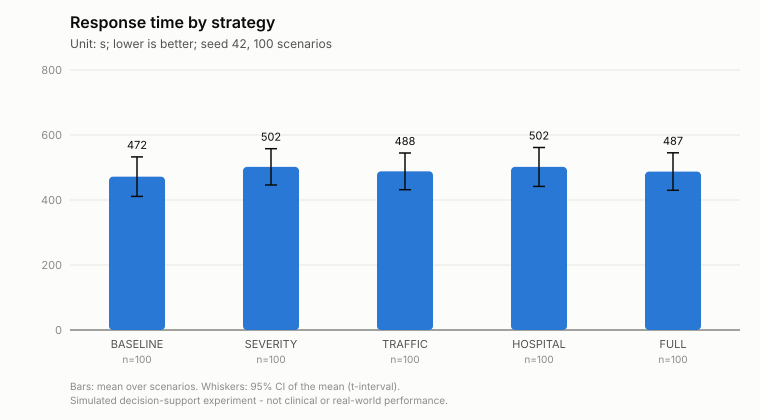
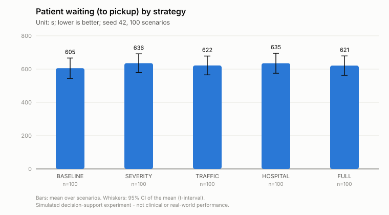
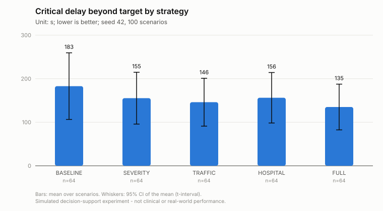
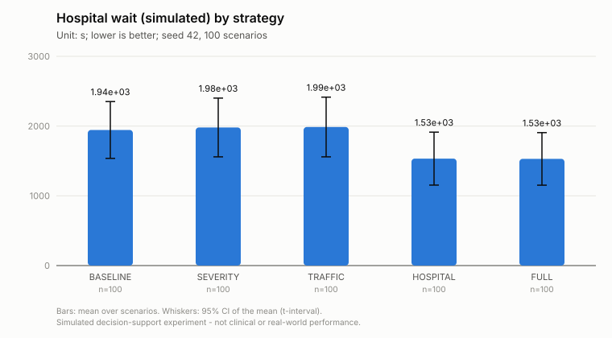
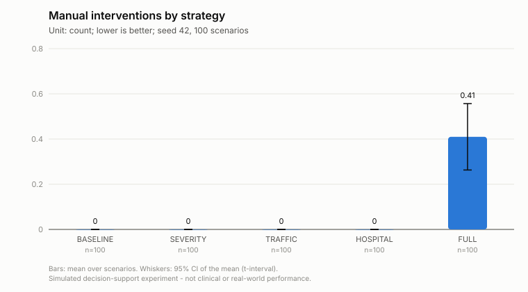
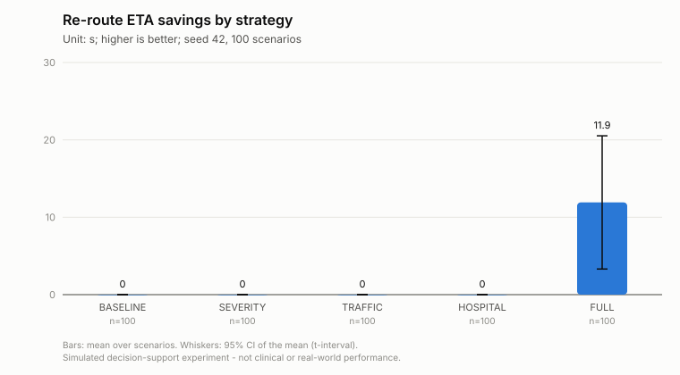
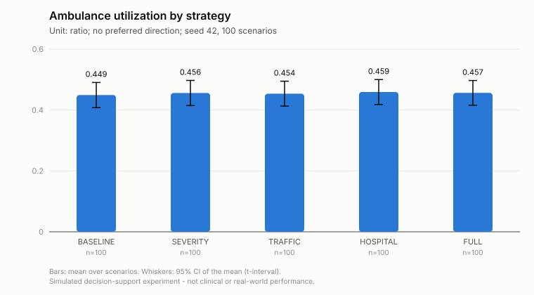
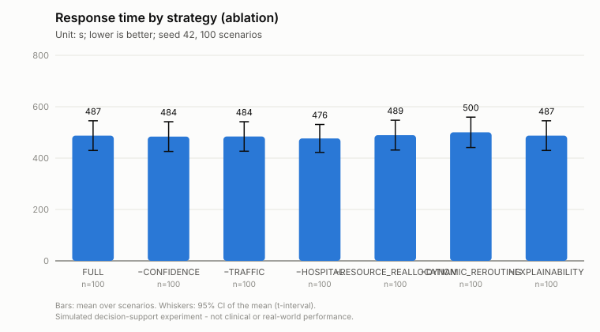
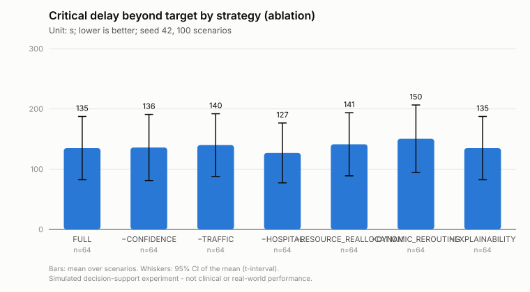
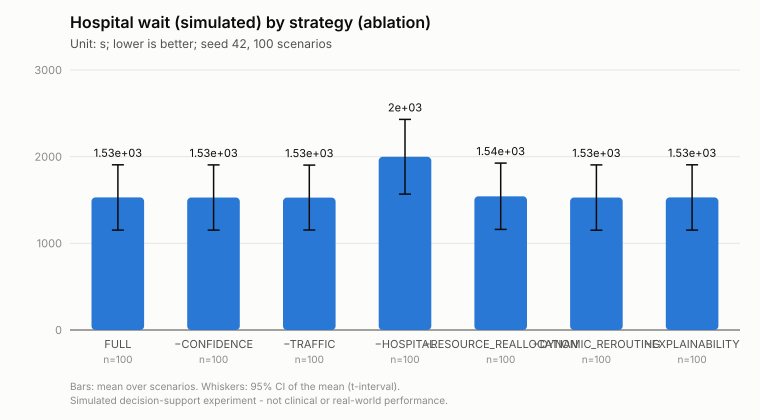

# Experiment upgrade-s42-n100

Simulated decision-support experiment. Values are measured in a deterministic simulation on the real road graph with simulated patients, traffic and hospital load; they are not clinical outcomes or real-world emergency-service performance.

* Status: **COMPLETED**, failures: 0
* Seed: 42, scenarios: 100, strategies: BASELINE, SEVERITY, TRAFFIC, HOSPITAL, FULL, FULL-CONFIDENCE, FULL-TRAFFIC, FULL-HOSPITAL, FULL-RESOURCE_REALLOCATION, FULL-DYNAMIC_REROUTING, FULL-EXPLAINABILITY
* Code: `a2116caa46932fa024c47167e2d141d4e233568d` (branch research-evaluation, uncommitted changes: True)
* City: Monaco, road network: osm (11250 nodes, 19562 edges, sha 6cd79e4808ed8123), OSRM: enabled (http://localhost:5000)
* Severity model: rf-20261006172011 (dataset: synthetic)
* Traffic prediction: **LEARNED** (traffic-rf-20261007025603) - RandomForest beats the persistence baseline on the time-ordered hold-out
* Hospital prediction: hospital-queue-v1 - ESTIMATE (queueing approximation)
* Started 2026-10-07T02:56:09.061771+00:00, completed 2026-10-07T03:11:35.856892+00:00

<!-- design-and-denominators:start -->
## Design and denominators

**Unit of analysis: the scenario.** Every number in this report is derived from the counts below.

| Quantity | Value | How it is obtained |
|---|---:|---|
| Scenarios | 100 | generated once from seed 42; scenario *k* uses RNG seed (42, *k*) and has a stored fingerprint |
| Strategy configurations | 11 | 5 progressive systems (BASELINE, SEVERITY, TRAFFIC, HOSPITAL, FULL) + 6 ablations of FULL (FULL-CONFIDENCE, FULL-TRAFFIC, FULL-HOSPITAL, FULL-RESOURCE_REALLOCATION, FULL-DYNAMIC_REROUTING, FULL-EXPLAINABILITY); FULL is run once and serves as the last progressive system **and** the ablation reference |
| **Simulation runs** | **1100** | 100 scenarios × 11 configurations: every scenario is replayed once under every configuration (same patients, fleet, hospitals, traffic, disruptions; only the decision strategy differs) |
| Failed runs | 0 | recorded in failures.csv and excluded from that configuration's statistics |
| Emergency calls per configuration | 562 | sum of the calls of the 100 scenarios (216 with an uncertain report); identical for every configuration |
| Simulated call outcomes | 6182 | 562 calls × 11 configurations (incident_results.csv) |

**How the statistics use these runs.**
* *Comparison table*: each cell is the mean over the scenarios of one configuration (scenario-level value = mean over that scenario's calls, or a count/share for the scenario). It is NOT a mean over 1100 runs.
* *Paired tests*: one pair per scenario (the same scenario under two configurations), so at most 100 pairs per test; the runs of different configurations are never pooled. Families: vs BASELINE (4 comparisons); incremental, each system vs the previous one (4); ablation vs FULL (6). Holm correction is applied within each comparison over all metrics.
* A metric that does not exist in a scenario (e.g. no CRITICAL patient, no re-route) is NULL there, so its *n* is smaller than the number of scenarios:

| Metric | scenarios with a value (FULL) | why |
|---|---:|---|
| Re-route improvement | 11 | scenarios with an accepted re-route with a finite old ETA |
| Critical response time | 64 | scenarios with at least one patient whose simulated label is CRITICAL |
| Critical delay beyond target | 64 | scenarios with at least one patient whose simulated label is CRITICAL |
| Critical cases over target | 64 | scenarios with at least one patient whose simulated label is CRITICAL |
| Worst critical delay | 64 | scenarios with at least one patient whose simulated label is CRITICAL |
| Delay imposed on donor missions (est.) | 10 | scenarios with an executed reallocation |
| Requester delay avoided (est.) | 3 | scenarios with an executed reallocation where a free alternative unit existed (otherwise the avoided delay is undefined) |
| Replacement unit ETA for donor (est.) | 10 | scenarios where the metric is measurable |

<!-- design-and-denominators:end -->

## Comparison (mean over scenarios)

| Metric | BASELINE | SEVERITY | TRAFFIC | HOSPITAL | FULL | FULL-CONFIDENCE | FULL-TRAFFIC | FULL-HOSPITAL | FULL-RESOURCE_REALLOCATION | FULL-DYNAMIC_REROUTING | FULL-EXPLAINABILITY |
|---|---:|---:|---:|---:|---:|---:|---:|---:|---:|---:|---:|
| Response time (s) | 472 s (7.9 min) | 502 s (8.4 min) | 488 s (8.1 min) | 502 s (8.4 min) | 487 s (8.1 min) | 484 s (8.1 min) | 484 s (8.1 min) | 476 s (7.9 min) | 489 s (8.2 min) | 500 s (8.3 min) | 487 s (8.1 min) |
| Patient waiting (to pickup) (s) | 605 s (10.1 min) | 636 s (10.6 min) | 622 s (10.4 min) | 635 s (10.6 min) | 621 s (10.4 min) | 617 s (10.3 min) | 618 s (10.3 min) | 610 s (10.2 min) | 623 s (10.4 min) | 634 s (10.6 min) | 621 s (10.4 min) |
| Dispatch delay (queue + review) (s) | 94.99 | 90.56 | 88.93 | 100.19 | 99.96 | 96.68 | 99.50 | 92.71 | 98.94 | 104.51 | 99.96 |
| Initial route ETA (s) | 282 s (4.7 min) | 308 s (5.1 min) | 332 s (5.5 min) | 335 s (5.6 min) | 332 s (5.5 min) | 332 s (5.5 min) | 334 s (5.6 min) | 329 s (5.5 min) | 334 s (5.6 min) | 332 s (5.5 min) | 332 s (5.5 min) |
| Actual travel to scene (s) | 374 s (6.2 min) | 406 s (6.8 min) | 390 s (6.5 min) | 393 s (6.5 min) | 378 s (6.3 min) | 377 s (6.3 min) | 376 s (6.3 min) | 375 s (6.2 min) | 382 s (6.4 min) | 386 s (6.4 min) | 378 s (6.3 min) |
| |ETA error| (actual - planned) (s) | 77.97 | 84.86 | 45.75 | 45.98 | 37.43 | 38.28 | 33.95 | 37.25 | 37.79 | 44.79 | 37.43 |
| Proactive re-routes (count) | 0.00 | 0.00 | 0.00 | 0.00 | 0.42 | 0.42 | 0.46 | 0.45 | 0.40 | 0.00 | 0.42 |
| Re-route ETA savings (s) | 0.00 | 0.00 | 0.00 | 0.00 | 11.92 | 11.92 | 33.82 | 13.19 | 11.02 | 0.00 | 11.92 |
| Re-route improvement (%) | n/a | n/a | n/a | n/a | 25.56 | 25.56 | 28.64 | 25.44 | 26.53 | n/a | 25.56 |
| Reactive detours at closures (count) | 0.26 | 0.23 | 0.25 | 0.25 | 0.00 | 0.00 | 0.00 | 0.00 | 0.00 | 0.25 | 0.00 |
| Ambulance utilization (ratio) | 0.449 | 0.456 | 0.454 | 0.459 | 0.457 | 0.457 | 0.456 | 0.451 | 0.457 | 0.458 | 0.457 |
| Time with no unit available (%) | 15.40 | 15.85 | 15.85 | 16.38 | 16.12 | 16.12 | 16.18 | 15.62 | 16.21 | 16.25 | 16.12 |
| Reserve availability (ratio) | 0.532 | 0.525 | 0.527 | 0.522 | 0.525 | 0.524 | 0.525 | 0.530 | 0.525 | 0.523 | 0.525 |
| Hospital wait (simulated) (s) | 1944 s (32.4 min) | 1980 s (33.0 min) | 1987 s (33.1 min) | 1533 s (25.6 min) | 1529 s (25.5 min) | 1529 s (25.5 min) | 1528 s (25.5 min) | 1999 s (33.3 min) | 1543 s (25.7 min) | 1528 s (25.5 min) | 1529 s (25.5 min) |
| Hospital wait (predicted) (s) | n/a | n/a | n/a | 1519 s (25.3 min) | 1495 s (24.9 min) | 1497 s (24.9 min) | 1501 s (25.0 min) | n/a | 1518 s (25.3 min) | 1506 s (25.1 min) | 1495 s (24.9 min) |
| Hospital capability gap (%) | 38.18 | 34.18 | 34.25 | 34.25 | 34.18 | 34.25 | 34.18 | 34.18 | 34.18 | 34.18 | 34.18 |
| Unsuitable first unit (vs simulated need) (%) | 25.03 | 13.88 | 13.40 | 13.26 | 11.89 | 12.05 | 11.69 | 11.87 | 13.09 | 11.69 | 11.89 |
| Perfect unit capability match (%) | 39.41 | 46.65 | 54.63 | 54.87 | 55.59 | 55.24 | 55.83 | 56.04 | 54.94 | 55.93 | 55.59 |
| Creation -> ED treatment (simulated) (s) | 2905 s (48.4 min) | 2973 s (49.5 min) | 2958 s (49.3 min) | 2548 s (42.5 min) | 2527 s (42.1 min) | 2522 s (42.0 min) | 2520 s (42.0 min) | 2957 s (49.3 min) | 2543 s (42.4 min) | 2541 s (42.3 min) | 2527 s (42.1 min) |
| Critical response time (s) | 504 s (8.4 min) | 499 s (8.3 min) | 497 s (8.3 min) | 508 s (8.5 min) | 481 s (8.0 min) | 480 s (8.0 min) | 488 s (8.1 min) | 473 s (7.9 min) | 494 s (8.2 min) | 497 s (8.3 min) | 481 s (8.0 min) |
| Critical delay beyond target (s) | 183 s (3.0 min) | 155 s (2.6 min) | 146 s (2.4 min) | 156 s (2.6 min) | 135 s (2.2 min) | 136 s (2.3 min) | 140 s (2.3 min) | 127 s (2.1 min) | 141 s (2.4 min) | 150 s (2.5 min) | 135 s (2.2 min) |
| Critical cases over target (%) | 36.33 | 38.15 | 46.22 | 47.27 | 43.36 | 43.36 | 45.70 | 43.88 | 47.27 | 43.36 | 43.36 |
| Worst critical delay (s) | 258 s (4.3 min) | 215 s (3.6 min) | 209 s (3.5 min) | 218 s (3.6 min) | 186 s (3.1 min) | 186 s (3.1 min) | 193 s (3.2 min) | 181 s (3.0 min) | 191 s (3.2 min) | 216 s (3.6 min) | 186 s (3.1 min) |
| Review-trigger rate (%) | 0.00 | 0.00 | 0.00 | 0.00 | 2.85 | 0.00 | 2.85 | 2.85 | 2.85 | 2.85 | 2.85 |
| Automatic decision rate (%) | 100.00 | 100.00 | 100.00 | 100.00 | 93.47 | 95.07 | 93.02 | 93.69 | 98.28 | 93.61 | 93.47 |
| Potentially inappropriate auto-dispatch (count) | 0.16 | 0.16 | 0.16 | 0.16 | 0.06 | 0.16 | 0.06 | 0.06 | 0.06 | 0.06 | 0.06 |
| Under-triage vs simulated label (%) | n/a | 12.65 | 12.65 | 12.65 | 11.51 | 12.65 | 11.51 | 11.51 | 11.51 | 11.51 | 11.51 |
| Resource conflicts detected (count) | 0.00 | 0.00 | 0.00 | 0.00 | 0.42 | 0.42 | 0.43 | 0.40 | 0.00 | 0.41 | 0.42 |
| Automatic reallocations (count) | 0.00 | 0.00 | 0.00 | 0.00 | 0.11 | 0.11 | 0.09 | 0.11 | 0.00 | 0.11 | 0.11 |
| Conflicts escalated (count) | 0.00 | 0.00 | 0.00 | 0.00 | 0.31 | 0.31 | 0.34 | 0.29 | 0.00 | 0.30 | 0.31 |
| Delay imposed on donor missions (est.) (s) | n/a | n/a | n/a | n/a | -8.69 | -73.28 | -31.99 | -8.69 | n/a | -25.40 | -8.69 |
| Requester delay avoided (est.) (s) | n/a | n/a | n/a | n/a | 315 s (5.2 min) | 298 s (5.0 min) | 342 s (5.7 min) | 315 s (5.2 min) | n/a | 315 s (5.2 min) | 315 s (5.2 min) |
| Manual interventions (count) | 0.00 | 0.00 | 0.00 | 0.00 | 0.41 | 0.31 | 0.44 | 0.39 | 0.10 | 0.40 | 0.41 |
| Calls not reached (count) | 0.00 | 0.00 | 0.00 | 0.00 | 0.00 | 0.00 | 0.00 | 0.00 | 0.00 | 0.00 | 0.00 |
| Priority violations (vs simulated label) (count) | 0.02 | 0.02 | 0.02 | 0.02 | 0.06 | 0.02 | 0.06 | 0.06 | 0.06 | 0.06 | 0.06 |
| Route failures (no drivable route) (count) | 0.43 | 0.53 | 0.51 | 0.50 | 0.50 | 0.44 | 0.49 | 0.51 | 0.49 | 0.56 | 0.50 |
| Units stopped at a closure (count) | 0.28 | 0.32 | 0.27 | 0.27 | 0.20 | 0.20 | 0.19 | 0.20 | 0.21 | 0.25 | 0.20 |
| Unsafe reallocations (vs simulated label) (count) | 0.00 | 0.00 | 0.00 | 0.00 | 0.02 | 0.03 | 0.01 | 0.02 | 0.00 | 0.02 | 0.02 |
| Replacement unit ETA for donor (est.) (s) | n/a | n/a | n/a | n/a | 414 s (6.9 min) | 374 s (6.2 min) | 389 s (6.5 min) | 414 s (6.9 min) | n/a | 414 s (6.9 min) | 414 s (6.9 min) |
| Hospital load prediction MAE (patients, SIMULATION) (patients) | n/a | n/a | n/a | 0.56 | 0.56 | 0.56 | 0.56 | n/a | 0.56 | 0.55 | 0.56 |
| Hospital load persistence MAE (patients, SIMULATION) (patients) | n/a | n/a | n/a | 0.59 | 0.59 | 0.59 | 0.59 | n/a | 0.59 | 0.59 | 0.59 |
| Hospital wait prediction MAE (SIMULATION) (s) | n/a | n/a | n/a | 267 s (4.5 min) | 276 s (4.6 min) | 275 s (4.6 min) | 280 s (4.7 min) | n/a | 268 s (4.5 min) | 272 s (4.5 min) | 276 s (4.6 min) |
| Hospital wait persistence MAE (SIMULATION) (s) | n/a | n/a | n/a | 255 s (4.2 min) | 264 s (4.4 min) | 266 s (4.4 min) | 265 s (4.4 min) | n/a | 255 s (4.3 min) | 262 s (4.4 min) | 264 s (4.4 min) |
| Traffic prediction accuracy (vs simulated state) (%) | n/a | n/a | 76.10 | 76.44 | 76.51 | 76.51 | n/a | 76.14 | 76.37 | 76.52 | 76.51 |
| Fallback rules accuracy (%) | n/a | n/a | 32.94 | 32.56 | 32.63 | 32.70 | n/a | 33.04 | 32.52 | 32.63 | 32.63 |
| Fallback rules MAE (levels) (levels) | n/a | n/a | 0.76 | 0.76 | 0.76 | 0.76 | n/a | 0.76 | 0.76 | 0.76 | 0.76 |
| Persistence baseline accuracy (%) | n/a | n/a | 98.63 | 98.73 | 98.72 | 98.73 | n/a | 98.62 | 98.71 | 98.73 | 98.72 |
| Traffic prediction MAE (levels) (levels) | n/a | n/a | 0.35 | 0.35 | 0.35 | 0.35 | n/a | 0.35 | 0.35 | 0.35 | 0.35 |
| Persistence baseline MAE (levels) (levels) | n/a | n/a | 0.05 | 0.05 | 0.05 | 0.05 | n/a | 0.05 | 0.05 | 0.05 | 0.05 |

## Severity model on the scenario patients

Reference: simulated generator label - not clinical ground truth. Triage is identical under every strategy.

| Calls | n | Accuracy | Precision (macro) | Recall (macro) | F1 (macro) | Brier | ECE | Median confidence | Share < 0.75 |
|---|---:|---:|---:|---:|---:|---:|---:|---:|---:|
| all | 562 | 0.824 | 0.837 | 0.833 | 0.831 | 0.282 | 0.100 | 0.969 | 0.084 |
| clear reports | 346 | 0.965 | 0.966 | 0.968 | 0.967 | 0.059 | 0.007 | 0.969 | 0.012 |
| uncertain reports | 216 | 0.597 | 0.629 | 0.617 | 0.605 | 0.638 | 0.261 | 0.912 | 0.199 |

### Paired comparisons against BASELINE

| Comparison | Metric | Pairs | Median ref | Median strat | Mean diff | 95% CI | Test | p (raw) | p (Holm) | Effect size | Significant |
|---|---|---:|---:|---:|---:|---|---|---:|---:|---|---|
| SEVERITY vs BASELINE | Response time | 100 | 416.10 | 454.83 | +30.11 | [12.8, 48.0] | Wilcoxon signed-rank | 0.0001747 | 0.0023 | +0.51 (rank_biserial, large) | yes |
| SEVERITY vs BASELINE | Patient waiting (to pickup) | 100 | 545.99 | 587.35 | +30.11 | [12.8, 48.0] | Wilcoxon signed-rank | 0.0001747 | 0.0023 | +0.51 (rank_biserial, large) | yes |
| SEVERITY vs BASELINE | |ETA error| (actual - planned) | 100 | 44.80 | 51.81 | +6.88 | [-4.8, 18.3] | Wilcoxon signed-rank | 0.08154 | 0.6523 | +0.26 (rank_biserial, small) | no |
| SEVERITY vs BASELINE | Re-route ETA savings | 100 | 0.00 | 0.00 | +0.00 | [0.0, 0.0] | none (identical results in every scenario) | n/a | n/a | +0.00 (rank_biserial, none (identical)) | – |
| SEVERITY vs BASELINE | Reactive detours at closures | 100 | 0.00 | 0.00 | -0.03 | [-0.1, 0.0] | none (only 7 non-zero differences: no significance test) | n/a | n/a | -0.43 (rank_biserial, medium) | – |
| SEVERITY vs BASELINE | Hospital wait (simulated) | 100 | 1012.50 | 1060.74 | +35.64 | [-85.2, 140.2] | Wilcoxon signed-rank | 0.1726 | 1.0000 | +0.22 (rank_biserial, small) | no |
| SEVERITY vs BASELINE | Hospital capability gap | 100 | 37.50 | 33.33 | -4.00 | [-5.5, -2.5] | Wilcoxon signed-rank | 1.694e-05 | 0.0003 | -1.00 (rank_biserial, large) | yes |
| SEVERITY vs BASELINE | Creation -> ED treatment (simulated) | 100 | 2063.97 | 2057.80 | +67.55 | [-48.6, 169.2] | Wilcoxon signed-rank | 9.499e-05 | 0.0013 | +0.52 (rank_biserial, large) | yes |
| SEVERITY vs BASELINE | Critical delay beyond target | 64 | 0.00 | 0.00 | -27.64 | [-83.2, 21.2] | Wilcoxon signed-rank | 0.761 | 1.0000 | -0.07 (rank_biserial, negligible) | no |
| SEVERITY vs BASELINE | Critical cases over target | 64 | 0.00 | 0.00 | +1.82 | [-6.2, 9.6] | Wilcoxon signed-rank | 0.5914 | 1.0000 | +0.16 (rank_biserial, small) | no |
| SEVERITY vs BASELINE | Under-triage vs simulated label | 0 | n/a | n/a | n/a | n/a | none (insufficient pairs (n=0 < 10): no significance test - insufficient sample size for reliable statistical inference) | n/a | n/a | n/a | – |
| SEVERITY vs BASELINE | Manual interventions | 100 | 0.00 | 0.00 | +0.00 | [0.0, 0.0] | none (identical results in every scenario) | n/a | n/a | +0.00 (rank_biserial, none (identical)) | – |
| SEVERITY vs BASELINE | Priority violations (vs simulated label) | 100 | 0.00 | 0.00 | +0.00 | [-0.0, 0.0] | none (only 2 non-zero differences: no significance test) | n/a | n/a | +0.00 (rank_biserial, negligible) | – |
| SEVERITY vs BASELINE | Route failures (no drivable route) | 100 | 0.00 | 0.00 | +0.10 | [-0.0, 0.3] | none (only 8 non-zero differences: no significance test) | n/a | n/a | +0.50 (rank_biserial, large) | – |
| SEVERITY vs BASELINE | Unsafe reallocations (vs simulated label) | 100 | 0.00 | 0.00 | +0.00 | [0.0, 0.0] | none (identical results in every scenario) | n/a | n/a | +0.00 (rank_biserial, none (identical)) | – |
| SEVERITY vs BASELINE | Hospital load prediction MAE (patients, SIMULATION) | 0 | n/a | n/a | n/a | n/a | none (insufficient pairs (n=0 < 10): no significance test - insufficient sample size for reliable statistical inference) | n/a | n/a | n/a | – |
| SEVERITY vs BASELINE | Traffic prediction accuracy (vs simulated state) | 0 | n/a | n/a | n/a | n/a | none (insufficient pairs (n=0 < 10): no significance test - insufficient sample size for reliable statistical inference) | n/a | n/a | n/a | – |
| TRAFFIC vs BASELINE | Response time | 100 | 416.10 | 433.90 | +16.43 | [-7.2, 39.8] | Wilcoxon signed-rank | 0.02593 | 0.3111 | +0.27 (rank_biserial, small) | no |
| TRAFFIC vs BASELINE | Patient waiting (to pickup) | 100 | 545.99 | 574.04 | +16.43 | [-7.2, 39.8] | Wilcoxon signed-rank | 0.02593 | 0.3111 | +0.27 (rank_biserial, small) | no |
| TRAFFIC vs BASELINE | |ETA error| (actual - planned) | 100 | 44.80 | 9.79 | -32.23 | [-51.1, -15.2] | Wilcoxon signed-rank | 8.076e-09 | 0.0000 | -0.69 (rank_biserial, large) | yes |
| TRAFFIC vs BASELINE | Re-route ETA savings | 100 | 0.00 | 0.00 | +0.00 | [0.0, 0.0] | none (identical results in every scenario) | n/a | n/a | +0.00 (rank_biserial, none (identical)) | – |
| TRAFFIC vs BASELINE | Reactive detours at closures | 100 | 0.00 | 0.00 | -0.01 | [-0.1, 0.1] | Wilcoxon signed-rank | 0.7963 | 1.0000 | -0.07 (rank_biserial, negligible) | no |
| TRAFFIC vs BASELINE | Hospital wait (simulated) | 100 | 1012.50 | 1000.54 | +42.60 | [-124.8, 202.1] | Wilcoxon signed-rank | 0.1989 | 1.0000 | +0.18 (rank_biserial, small) | no |
| TRAFFIC vs BASELINE | Hospital capability gap | 100 | 37.50 | 33.33 | -3.93 | [-5.5, -2.5] | Wilcoxon signed-rank | 2.497e-05 | 0.0004 | -1.00 (rank_biserial, large) | yes |
| TRAFFIC vs BASELINE | Creation -> ED treatment (simulated) | 100 | 2063.97 | 1980.82 | +53.33 | [-114.6, 208.9] | Wilcoxon signed-rank | 0.04232 | 0.3996 | +0.24 (rank_biserial, small) | no |
| TRAFFIC vs BASELINE | Critical delay beyond target | 64 | 0.00 | 12.82 | -36.91 | [-95.3, 14.4] | Wilcoxon signed-rank | 0.5553 | 1.0000 | -0.12 (rank_biserial, small) | no |
| TRAFFIC vs BASELINE | Critical cases over target | 64 | 0.00 | 50.00 | +9.90 | [0.8, 19.5] | Wilcoxon signed-rank | 0.04679 | 0.3996 | +0.54 (rank_biserial, large) | no |
| TRAFFIC vs BASELINE | Under-triage vs simulated label | 0 | n/a | n/a | n/a | n/a | none (insufficient pairs (n=0 < 10): no significance test - insufficient sample size for reliable statistical inference) | n/a | n/a | n/a | – |
| TRAFFIC vs BASELINE | Manual interventions | 100 | 0.00 | 0.00 | +0.00 | [0.0, 0.0] | none (identical results in every scenario) | n/a | n/a | +0.00 (rank_biserial, none (identical)) | – |
| TRAFFIC vs BASELINE | Priority violations (vs simulated label) | 100 | 0.00 | 0.00 | +0.00 | [-0.0, 0.0] | none (only 2 non-zero differences: no significance test) | n/a | n/a | +0.00 (rank_biserial, negligible) | – |
| TRAFFIC vs BASELINE | Route failures (no drivable route) | 100 | 0.00 | 0.00 | +0.08 | [-0.0, 0.2] | none (only 9 non-zero differences: no significance test) | n/a | n/a | +0.31 (rank_biserial, medium) | – |
| TRAFFIC vs BASELINE | Unsafe reallocations (vs simulated label) | 100 | 0.00 | 0.00 | +0.00 | [0.0, 0.0] | none (identical results in every scenario) | n/a | n/a | +0.00 (rank_biserial, none (identical)) | – |
| TRAFFIC vs BASELINE | Hospital load prediction MAE (patients, SIMULATION) | 0 | n/a | n/a | n/a | n/a | none (insufficient pairs (n=0 < 10): no significance test - insufficient sample size for reliable statistical inference) | n/a | n/a | n/a | – |
| TRAFFIC vs BASELINE | Traffic prediction accuracy (vs simulated state) | 0 | n/a | n/a | n/a | n/a | none (insufficient pairs (n=0 < 10): no significance test - insufficient sample size for reliable statistical inference) | n/a | n/a | n/a | – |
| HOSPITAL vs BASELINE | Response time | 100 | 416.10 | 443.00 | +29.90 | [5.3, 54.2] | Wilcoxon signed-rank | 0.001334 | 0.0160 | +0.39 (rank_biserial, medium) | yes |
| HOSPITAL vs BASELINE | Patient waiting (to pickup) | 100 | 545.99 | 580.65 | +29.90 | [5.3, 54.2] | Wilcoxon signed-rank | 0.001334 | 0.0160 | +0.39 (rank_biserial, medium) | yes |
| HOSPITAL vs BASELINE | |ETA error| (actual - planned) | 100 | 44.80 | 10.09 | -31.99 | [-50.9, -15.0] | Wilcoxon signed-rank | 2.056e-08 | 0.0000 | -0.67 (rank_biserial, large) | yes |
| HOSPITAL vs BASELINE | Re-route ETA savings | 100 | 0.00 | 0.00 | +0.00 | [0.0, 0.0] | none (identical results in every scenario) | n/a | n/a | +0.00 (rank_biserial, none (identical)) | – |
| HOSPITAL vs BASELINE | Reactive detours at closures | 100 | 0.00 | 0.00 | -0.01 | [-0.1, 0.1] | Wilcoxon signed-rank | 0.8084 | 1.0000 | -0.06 (rank_biserial, negligible) | no |
| HOSPITAL vs BASELINE | Hospital wait (simulated) | 100 | 1012.50 | 700.17 | -410.98 | [-563.1, -273.1] | Wilcoxon signed-rank | 2.237e-10 | 0.0000 | -0.80 (rank_biserial, large) | yes |
| HOSPITAL vs BASELINE | Hospital capability gap | 100 | 37.50 | 33.33 | -3.93 | [-5.5, -2.5] | Wilcoxon signed-rank | 2.497e-05 | 0.0003 | -1.00 (rank_biserial, large) | yes |
| HOSPITAL vs BASELINE | Creation -> ED treatment (simulated) | 100 | 2063.97 | 1767.10 | -357.17 | [-511.3, -219.6] | Wilcoxon signed-rank | 9.388e-05 | 0.0012 | -0.46 (rank_biserial, medium) | yes |
| HOSPITAL vs BASELINE | Critical delay beyond target | 64 | 0.00 | 25.00 | -26.72 | [-82.0, 23.9] | Wilcoxon signed-rank | 0.7686 | 1.0000 | -0.06 (rank_biserial, negligible) | no |
| HOSPITAL vs BASELINE | Critical cases over target | 64 | 0.00 | 50.00 | +10.94 | [1.3, 21.4] | Wilcoxon signed-rank | 0.03093 | 0.2784 | +0.55 (rank_biserial, large) | no |
| HOSPITAL vs BASELINE | Under-triage vs simulated label | 0 | n/a | n/a | n/a | n/a | none (insufficient pairs (n=0 < 10): no significance test - insufficient sample size for reliable statistical inference) | n/a | n/a | n/a | – |
| HOSPITAL vs BASELINE | Manual interventions | 100 | 0.00 | 0.00 | +0.00 | [0.0, 0.0] | none (identical results in every scenario) | n/a | n/a | +0.00 (rank_biserial, none (identical)) | – |
| HOSPITAL vs BASELINE | Priority violations (vs simulated label) | 100 | 0.00 | 0.00 | +0.00 | [-0.0, 0.0] | none (only 2 non-zero differences: no significance test) | n/a | n/a | +0.00 (rank_biserial, negligible) | – |
| HOSPITAL vs BASELINE | Route failures (no drivable route) | 100 | 0.00 | 0.00 | +0.07 | [-0.1, 0.2] | Wilcoxon signed-rank | 0.57 | 1.0000 | +0.18 (rank_biserial, small) | no |
| HOSPITAL vs BASELINE | Unsafe reallocations (vs simulated label) | 100 | 0.00 | 0.00 | +0.00 | [0.0, 0.0] | none (identical results in every scenario) | n/a | n/a | +0.00 (rank_biserial, none (identical)) | – |
| HOSPITAL vs BASELINE | Hospital load prediction MAE (patients, SIMULATION) | 0 | n/a | n/a | n/a | n/a | none (insufficient pairs (n=0 < 10): no significance test - insufficient sample size for reliable statistical inference) | n/a | n/a | n/a | – |
| HOSPITAL vs BASELINE | Traffic prediction accuracy (vs simulated state) | 0 | n/a | n/a | n/a | n/a | none (insufficient pairs (n=0 < 10): no significance test - insufficient sample size for reliable statistical inference) | n/a | n/a | n/a | – |
| FULL vs BASELINE | Response time | 100 | 416.10 | 428.20 | +15.67 | [-7.6, 37.6] | Wilcoxon signed-rank | 0.01725 | 0.1725 | +0.28 (rank_biserial, small) | no |
| FULL vs BASELINE | Patient waiting (to pickup) | 100 | 545.99 | 563.79 | +15.67 | [-7.6, 37.6] | Wilcoxon signed-rank | 0.01725 | 0.1725 | +0.28 (rank_biserial, small) | no |
| FULL vs BASELINE | |ETA error| (actual - planned) | 100 | 44.80 | 6.62 | -40.55 | [-59.4, -24.2] | Wilcoxon signed-rank | 4.383e-10 | 0.0000 | -0.75 (rank_biserial, large) | yes |
| FULL vs BASELINE | Re-route ETA savings | 100 | 0.00 | 0.00 | +11.92 | [4.5, 21.4] | Wilcoxon signed-rank | 0.003346 | 0.0368 | +1.00 (rank_biserial, large) | yes |
| FULL vs BASELINE | Reactive detours at closures | 100 | 0.00 | 0.00 | -0.26 | [-0.4, -0.2] | Wilcoxon signed-rank | 2.184e-05 | 0.0004 | -1.00 (rank_biserial, large) | yes |
| FULL vs BASELINE | Hospital wait (simulated) | 100 | 1012.50 | 712.08 | -415.04 | [-567.7, -275.0] | Wilcoxon signed-rank | 1.036e-09 | 0.0000 | -0.76 (rank_biserial, large) | yes |
| FULL vs BASELINE | Hospital capability gap | 100 | 37.50 | 33.33 | -4.00 | [-5.5, -2.5] | Wilcoxon signed-rank | 1.694e-05 | 0.0003 | -1.00 (rank_biserial, large) | yes |
| FULL vs BASELINE | Creation -> ED treatment (simulated) | 100 | 2063.97 | 1753.03 | -378.11 | [-530.0, -242.0] | Wilcoxon signed-rank | 9.85e-06 | 0.0002 | -0.52 (rank_biserial, large) | yes |
| FULL vs BASELINE | Critical delay beyond target | 64 | 0.00 | 9.70 | -47.95 | [-104.4, 3.9] | Wilcoxon signed-rank | 0.1957 | 1.0000 | -0.25 (rank_biserial, small) | no |
| FULL vs BASELINE | Critical cases over target | 64 | 0.00 | 41.67 | +7.03 | [-2.1, 16.7] | Wilcoxon signed-rank | 0.1473 | 1.0000 | +0.39 (rank_biserial, medium) | no |
| FULL vs BASELINE | Under-triage vs simulated label | 0 | n/a | n/a | n/a | n/a | none (insufficient pairs (n=0 < 10): no significance test - insufficient sample size for reliable statistical inference) | n/a | n/a | n/a | – |
| FULL vs BASELINE | Manual interventions | 100 | 0.00 | 0.00 | +0.41 | [0.3, 0.6] | Wilcoxon signed-rank | 9.424e-07 | 0.0000 | +1.00 (rank_biserial, large) | yes |
| FULL vs BASELINE | Priority violations (vs simulated label) | 100 | 0.00 | 0.00 | +0.04 | [-0.0, 0.1] | none (only 3 non-zero differences: no significance test) | n/a | n/a | +0.50 (rank_biserial, large) | – |
| FULL vs BASELINE | Route failures (no drivable route) | 100 | 0.00 | 0.00 | +0.07 | [-0.1, 0.3] | Wilcoxon signed-rank | 0.9358 | 1.0000 | +0.02 (rank_biserial, negligible) | no |
| FULL vs BASELINE | Unsafe reallocations (vs simulated label) | 100 | 0.00 | 0.00 | +0.02 | [0.0, 0.1] | none (only 2 non-zero differences: no significance test) | n/a | n/a | +1.00 (rank_biserial, large) | – |
| FULL vs BASELINE | Hospital load prediction MAE (patients, SIMULATION) | 0 | n/a | n/a | n/a | n/a | none (insufficient pairs (n=0 < 10): no significance test - insufficient sample size for reliable statistical inference) | n/a | n/a | n/a | – |
| FULL vs BASELINE | Traffic prediction accuracy (vs simulated state) | 0 | n/a | n/a | n/a | n/a | none (insufficient pairs (n=0 < 10): no significance test - insufficient sample size for reliable statistical inference) | n/a | n/a | n/a | – |

### Incremental contribution (each system vs the previous one)

| Comparison | Metric | Pairs | Median ref | Median strat | Mean diff | 95% CI | Test | p (raw) | p (Holm) | Effect size | Significant |
|---|---|---:|---:|---:|---:|---|---|---:|---:|---|---|
| SEVERITY vs BASELINE | Response time | 100 | 416.10 | 454.83 | +30.11 | [12.8, 48.0] | Wilcoxon signed-rank | 0.0001747 | 0.0023 | +0.51 (rank_biserial, large) | yes |
| SEVERITY vs BASELINE | Patient waiting (to pickup) | 100 | 545.99 | 587.35 | +30.11 | [12.8, 48.0] | Wilcoxon signed-rank | 0.0001747 | 0.0023 | +0.51 (rank_biserial, large) | yes |
| SEVERITY vs BASELINE | |ETA error| (actual - planned) | 100 | 44.80 | 51.81 | +6.88 | [-4.8, 18.3] | Wilcoxon signed-rank | 0.08154 | 0.6523 | +0.26 (rank_biserial, small) | no |
| SEVERITY vs BASELINE | Re-route ETA savings | 100 | 0.00 | 0.00 | +0.00 | [0.0, 0.0] | none (identical results in every scenario) | n/a | n/a | +0.00 (rank_biserial, none (identical)) | – |
| SEVERITY vs BASELINE | Reactive detours at closures | 100 | 0.00 | 0.00 | -0.03 | [-0.1, 0.0] | none (only 7 non-zero differences: no significance test) | n/a | n/a | -0.43 (rank_biserial, medium) | – |
| SEVERITY vs BASELINE | Hospital wait (simulated) | 100 | 1012.50 | 1060.74 | +35.64 | [-85.2, 140.2] | Wilcoxon signed-rank | 0.1726 | 1.0000 | +0.22 (rank_biserial, small) | no |
| SEVERITY vs BASELINE | Hospital capability gap | 100 | 37.50 | 33.33 | -4.00 | [-5.5, -2.5] | Wilcoxon signed-rank | 1.694e-05 | 0.0003 | -1.00 (rank_biserial, large) | yes |
| SEVERITY vs BASELINE | Creation -> ED treatment (simulated) | 100 | 2063.97 | 2057.80 | +67.55 | [-48.6, 169.2] | Wilcoxon signed-rank | 9.499e-05 | 0.0013 | +0.52 (rank_biserial, large) | yes |
| SEVERITY vs BASELINE | Critical delay beyond target | 64 | 0.00 | 0.00 | -27.64 | [-83.2, 21.2] | Wilcoxon signed-rank | 0.761 | 1.0000 | -0.07 (rank_biserial, negligible) | no |
| SEVERITY vs BASELINE | Critical cases over target | 64 | 0.00 | 0.00 | +1.82 | [-6.2, 9.6] | Wilcoxon signed-rank | 0.5914 | 1.0000 | +0.16 (rank_biserial, small) | no |
| SEVERITY vs BASELINE | Under-triage vs simulated label | 0 | n/a | n/a | n/a | n/a | none (insufficient pairs (n=0 < 10): no significance test - insufficient sample size for reliable statistical inference) | n/a | n/a | n/a | – |
| SEVERITY vs BASELINE | Manual interventions | 100 | 0.00 | 0.00 | +0.00 | [0.0, 0.0] | none (identical results in every scenario) | n/a | n/a | +0.00 (rank_biserial, none (identical)) | – |
| SEVERITY vs BASELINE | Priority violations (vs simulated label) | 100 | 0.00 | 0.00 | +0.00 | [-0.0, 0.0] | none (only 2 non-zero differences: no significance test) | n/a | n/a | +0.00 (rank_biserial, negligible) | – |
| SEVERITY vs BASELINE | Route failures (no drivable route) | 100 | 0.00 | 0.00 | +0.10 | [-0.0, 0.3] | none (only 8 non-zero differences: no significance test) | n/a | n/a | +0.50 (rank_biserial, large) | – |
| SEVERITY vs BASELINE | Unsafe reallocations (vs simulated label) | 100 | 0.00 | 0.00 | +0.00 | [0.0, 0.0] | none (identical results in every scenario) | n/a | n/a | +0.00 (rank_biserial, none (identical)) | – |
| SEVERITY vs BASELINE | Hospital load prediction MAE (patients, SIMULATION) | 0 | n/a | n/a | n/a | n/a | none (insufficient pairs (n=0 < 10): no significance test - insufficient sample size for reliable statistical inference) | n/a | n/a | n/a | – |
| SEVERITY vs BASELINE | Traffic prediction accuracy (vs simulated state) | 0 | n/a | n/a | n/a | n/a | none (insufficient pairs (n=0 < 10): no significance test - insufficient sample size for reliable statistical inference) | n/a | n/a | n/a | – |
| TRAFFIC vs SEVERITY | Response time | 100 | 454.83 | 433.90 | -13.69 | [-31.4, 3.3] | Wilcoxon signed-rank | 0.3212 | 1.0000 | -0.13 (rank_biserial, small) | no |
| TRAFFIC vs SEVERITY | Patient waiting (to pickup) | 100 | 587.35 | 574.04 | -13.69 | [-31.4, 3.3] | Wilcoxon signed-rank | 0.3212 | 1.0000 | -0.13 (rank_biserial, small) | no |
| TRAFFIC vs SEVERITY | |ETA error| (actual - planned) | 100 | 51.81 | 9.79 | -39.11 | [-54.0, -26.4] | Wilcoxon signed-rank | 5.383e-14 | 0.0000 | -0.91 (rank_biserial, large) | yes |
| TRAFFIC vs SEVERITY | Re-route ETA savings | 100 | 0.00 | 0.00 | +0.00 | [0.0, 0.0] | none (identical results in every scenario) | n/a | n/a | +0.00 (rank_biserial, none (identical)) | – |
| TRAFFIC vs SEVERITY | Reactive detours at closures | 100 | 0.00 | 0.00 | +0.02 | [-0.0, 0.1] | Wilcoxon signed-rank | 0.5271 | 1.0000 | +0.20 (rank_biserial, small) | no |
| TRAFFIC vs SEVERITY | Hospital wait (simulated) | 100 | 1060.74 | 1000.54 | +6.97 | [-97.6, 110.2] | Wilcoxon signed-rank | 0.3775 | 1.0000 | +0.14 (rank_biserial, small) | no |
| TRAFFIC vs SEVERITY | Hospital capability gap | 100 | 33.33 | 33.33 | +0.07 | [0.0, 0.2] | none (only 1 non-zero differences: no significance test) | n/a | n/a | n/a | – |
| TRAFFIC vs SEVERITY | Creation -> ED treatment (simulated) | 100 | 2057.80 | 1980.82 | -14.22 | [-122.3, 89.7] | Wilcoxon signed-rank | 0.7934 | 1.0000 | -0.03 (rank_biserial, negligible) | no |
| TRAFFIC vs SEVERITY | Critical delay beyond target | 64 | 0.00 | 12.82 | -9.27 | [-29.9, 10.9] | Wilcoxon signed-rank | 0.4264 | 1.0000 | -0.19 (rank_biserial, small) | no |
| TRAFFIC vs SEVERITY | Critical cases over target | 64 | 0.00 | 50.00 | +8.07 | [1.3, 15.6] | Wilcoxon signed-rank | 0.04331 | 0.6064 | +0.71 (rank_biserial, large) | no |
| TRAFFIC vs SEVERITY | Under-triage vs simulated label | 100 | 12.50 | 12.50 | +0.00 | [0.0, 0.0] | none (identical results in every scenario) | n/a | n/a | +0.00 (rank_biserial, none (identical)) | – |
| TRAFFIC vs SEVERITY | Manual interventions | 100 | 0.00 | 0.00 | +0.00 | [0.0, 0.0] | none (identical results in every scenario) | n/a | n/a | +0.00 (rank_biserial, none (identical)) | – |
| TRAFFIC vs SEVERITY | Priority violations (vs simulated label) | 100 | 0.00 | 0.00 | +0.00 | [0.0, 0.0] | none (identical results in every scenario) | n/a | n/a | +0.00 (rank_biserial, none (identical)) | – |
| TRAFFIC vs SEVERITY | Route failures (no drivable route) | 100 | 0.00 | 0.00 | -0.02 | [-0.1, 0.0] | none (only 3 non-zero differences: no significance test) | n/a | n/a | -0.50 (rank_biserial, large) | – |
| TRAFFIC vs SEVERITY | Unsafe reallocations (vs simulated label) | 100 | 0.00 | 0.00 | +0.00 | [0.0, 0.0] | none (identical results in every scenario) | n/a | n/a | +0.00 (rank_biserial, none (identical)) | – |
| TRAFFIC vs SEVERITY | Hospital load prediction MAE (patients, SIMULATION) | 0 | n/a | n/a | n/a | n/a | none (insufficient pairs (n=0 < 10): no significance test - insufficient sample size for reliable statistical inference) | n/a | n/a | n/a | – |
| TRAFFIC vs SEVERITY | Traffic prediction accuracy (vs simulated state) | 0 | n/a | n/a | n/a | n/a | none (insufficient pairs (n=0 < 10): no significance test - insufficient sample size for reliable statistical inference) | n/a | n/a | n/a | – |
| HOSPITAL vs TRAFFIC | Response time | 100 | 433.90 | 443.00 | +13.48 | [4.2, 26.0] | Wilcoxon signed-rank | 0.01341 | 0.0939 | +0.46 (rank_biserial, medium) | no |
| HOSPITAL vs TRAFFIC | Patient waiting (to pickup) | 100 | 574.04 | 580.65 | +13.48 | [4.2, 26.0] | Wilcoxon signed-rank | 0.01341 | 0.0939 | +0.46 (rank_biserial, medium) | no |
| HOSPITAL vs TRAFFIC | |ETA error| (actual - planned) | 100 | 9.79 | 10.09 | +0.23 | [-0.1, 0.6] | Wilcoxon signed-rank | 0.5755 | 0.6230 | +0.14 (rank_biserial, small) | no |
| HOSPITAL vs TRAFFIC | Re-route ETA savings | 100 | 0.00 | 0.00 | +0.00 | [0.0, 0.0] | none (identical results in every scenario) | n/a | n/a | +0.00 (rank_biserial, none (identical)) | – |
| HOSPITAL vs TRAFFIC | Reactive detours at closures | 100 | 0.00 | 0.00 | +0.00 | [-0.0, 0.0] | none (only 2 non-zero differences: no significance test) | n/a | n/a | +0.00 (rank_biserial, negligible) | – |
| HOSPITAL vs TRAFFIC | Hospital wait (simulated) | 100 | 1000.54 | 700.17 | -453.58 | [-618.4, -296.5] | Wilcoxon signed-rank | 2.282e-11 | 0.0000 | -0.87 (rank_biserial, large) | yes |
| HOSPITAL vs TRAFFIC | Hospital capability gap | 100 | 33.33 | 33.33 | +0.00 | [0.0, 0.0] | none (identical results in every scenario) | n/a | n/a | +0.00 (rank_biserial, none (identical)) | – |
| HOSPITAL vs TRAFFIC | Creation -> ED treatment (simulated) | 100 | 1980.82 | 1767.10 | -410.50 | [-571.7, -255.7] | Wilcoxon signed-rank | 4.625e-09 | 0.0000 | -0.74 (rank_biserial, large) | yes |
| HOSPITAL vs TRAFFIC | Critical delay beyond target | 64 | 12.82 | 25.00 | +10.19 | [1.3, 22.2] | none (only 6 non-zero differences: no significance test) | n/a | n/a | +0.90 (rank_biserial, large) | – |
| HOSPITAL vs TRAFFIC | Critical cases over target | 64 | 50.00 | 50.00 | +1.04 | [-1.6, 4.7] | none (only 2 non-zero differences: no significance test) | n/a | n/a | +0.33 (rank_biserial, medium) | – |
| HOSPITAL vs TRAFFIC | Under-triage vs simulated label | 100 | 12.50 | 12.50 | +0.00 | [0.0, 0.0] | none (identical results in every scenario) | n/a | n/a | +0.00 (rank_biserial, none (identical)) | – |
| HOSPITAL vs TRAFFIC | Manual interventions | 100 | 0.00 | 0.00 | +0.00 | [0.0, 0.0] | none (identical results in every scenario) | n/a | n/a | +0.00 (rank_biserial, none (identical)) | – |
| HOSPITAL vs TRAFFIC | Priority violations (vs simulated label) | 100 | 0.00 | 0.00 | +0.00 | [0.0, 0.0] | none (identical results in every scenario) | n/a | n/a | +0.00 (rank_biserial, none (identical)) | – |
| HOSPITAL vs TRAFFIC | Route failures (no drivable route) | 100 | 0.00 | 0.00 | -0.01 | [-0.0, 0.0] | none (only 3 non-zero differences: no significance test) | n/a | n/a | -0.33 (rank_biserial, medium) | – |
| HOSPITAL vs TRAFFIC | Unsafe reallocations (vs simulated label) | 100 | 0.00 | 0.00 | +0.00 | [0.0, 0.0] | none (identical results in every scenario) | n/a | n/a | +0.00 (rank_biserial, none (identical)) | – |
| HOSPITAL vs TRAFFIC | Hospital load prediction MAE (patients, SIMULATION) | 0 | n/a | n/a | n/a | n/a | none (insufficient pairs (n=0 < 10): no significance test - insufficient sample size for reliable statistical inference) | n/a | n/a | n/a | – |
| HOSPITAL vs TRAFFIC | Traffic prediction accuracy (vs simulated state) | 100 | 80.74 | 81.08 | +0.35 | [0.2, 0.5] | Wilcoxon signed-rank | 1.086e-06 | 0.0000 | +0.62 (rank_biserial, large) | yes |
| FULL vs HOSPITAL | Response time | 100 | 443.00 | 428.20 | -14.23 | [-27.8, -3.0] | Wilcoxon signed-rank | 0.009576 | 0.2394 | -0.45 (rank_biserial, medium) | no |
| FULL vs HOSPITAL | Patient waiting (to pickup) | 100 | 580.65 | 563.79 | -14.23 | [-27.8, -3.0] | Wilcoxon signed-rank | 0.009576 | 0.2394 | -0.45 (rank_biserial, medium) | no |
| FULL vs HOSPITAL | |ETA error| (actual - planned) | 100 | 10.09 | 6.62 | -8.56 | [-14.0, -3.8] | Wilcoxon signed-rank | 0.0008794 | 0.0273 | -0.63 (rank_biserial, large) | yes |
| FULL vs HOSPITAL | Re-route ETA savings | 100 | 0.00 | 0.00 | +11.92 | [4.5, 21.4] | Wilcoxon signed-rank | 0.003346 | 0.0870 | +1.00 (rank_biserial, large) | no |
| FULL vs HOSPITAL | Reactive detours at closures | 100 | 0.00 | 0.00 | -0.25 | [-0.4, -0.1] | Wilcoxon signed-rank | 3.559e-05 | 0.0012 | -1.00 (rank_biserial, large) | yes |
| FULL vs HOSPITAL | Hospital wait (simulated) | 100 | 700.17 | 712.08 | -4.06 | [-41.5, 23.6] | Wilcoxon signed-rank | 0.3318 | 1.0000 | +0.27 (rank_biserial, small) | no |
| FULL vs HOSPITAL | Hospital capability gap | 100 | 33.33 | 33.33 | -0.07 | [-0.2, 0.0] | none (only 1 non-zero differences: no significance test) | n/a | n/a | n/a | – |
| FULL vs HOSPITAL | Creation -> ED treatment (simulated) | 100 | 1767.10 | 1753.03 | -20.94 | [-60.3, 6.5] | Wilcoxon signed-rank | 0.02294 | 0.5276 | -0.39 (rank_biserial, medium) | no |
| FULL vs HOSPITAL | Critical delay beyond target | 64 | 25.00 | 9.70 | -21.23 | [-47.4, 1.1] | Wilcoxon signed-rank | 0.06838 | 1.0000 | -0.50 (rank_biserial, large) | no |
| FULL vs HOSPITAL | Critical cases over target | 64 | 50.00 | 41.67 | -3.91 | [-9.4, 0.8] | none (only 4 non-zero differences: no significance test) | n/a | n/a | -0.80 (rank_biserial, large) | – |
| FULL vs HOSPITAL | Under-triage vs simulated label | 100 | 12.50 | 6.25 | -1.14 | [-2.0, -0.4] | none (only 7 non-zero differences: no significance test) | n/a | n/a | -1.00 (rank_biserial, large) | – |
| FULL vs HOSPITAL | Manual interventions | 100 | 0.00 | 0.00 | +0.41 | [0.3, 0.6] | Wilcoxon signed-rank | 9.424e-07 | 0.0000 | +1.00 (rank_biserial, large) | yes |
| FULL vs HOSPITAL | Priority violations (vs simulated label) | 100 | 0.00 | 0.00 | +0.04 | [0.0, 0.1] | none (only 1 non-zero differences: no significance test) | n/a | n/a | n/a | – |
| FULL vs HOSPITAL | Route failures (no drivable route) | 100 | 0.00 | 0.00 | +0.00 | [-0.1, 0.2] | Wilcoxon signed-rank | 0.1655 | 1.0000 | -0.45 (rank_biserial, medium) | no |
| FULL vs HOSPITAL | Unsafe reallocations (vs simulated label) | 100 | 0.00 | 0.00 | +0.02 | [0.0, 0.1] | none (only 2 non-zero differences: no significance test) | n/a | n/a | +1.00 (rank_biserial, large) | – |
| FULL vs HOSPITAL | Hospital load prediction MAE (patients, SIMULATION) | 100 | 0.46 | 0.46 | +0.00 | [-0.0, 0.0] | Wilcoxon signed-rank | 0.4366 | 1.0000 | +0.15 (rank_biserial, small) | no |
| FULL vs HOSPITAL | Traffic prediction accuracy (vs simulated state) | 100 | 81.08 | 80.81 | +0.07 | [-0.2, 0.4] | Wilcoxon signed-rank | 0.2685 | 1.0000 | -0.20 (rank_biserial, small) | no |

### Ablation (FULL minus one capability vs FULL)

| Comparison | Metric | Pairs | Median ref | Median strat | Mean diff | 95% CI | Test | p (raw) | p (Holm) | Effect size | Significant |
|---|---|---:|---:|---:|---:|---|---|---:|---:|---|---|
| FULL-CONFIDENCE vs FULL | Response time | 100 | 428.20 | 423.20 | -3.77 | [-8.1, -0.4] | Wilcoxon signed-rank | 0.03546 | 0.3901 | -0.64 (rank_biserial, large) | no |
| FULL-CONFIDENCE vs FULL | Patient waiting (to pickup) | 100 | 563.79 | 556.74 | -3.77 | [-8.1, -0.4] | Wilcoxon signed-rank | 0.03546 | 0.3901 | -0.64 (rank_biserial, large) | no |
| FULL-CONFIDENCE vs FULL | |ETA error| (actual - planned) | 100 | 6.62 | 6.27 | +0.86 | [-1.3, 4.0] | none (only 6 non-zero differences: no significance test) | n/a | n/a | -0.05 (rank_biserial, negligible) | – |
| FULL-CONFIDENCE vs FULL | Re-route ETA savings | 100 | 0.00 | 0.00 | +0.00 | [0.0, 0.0] | none (identical results in every scenario) | n/a | n/a | +0.00 (rank_biserial, none (identical)) | – |
| FULL-CONFIDENCE vs FULL | Reactive detours at closures | 100 | 0.00 | 0.00 | +0.00 | [0.0, 0.0] | none (identical results in every scenario) | n/a | n/a | +0.00 (rank_biserial, none (identical)) | – |
| FULL-CONFIDENCE vs FULL | Hospital wait (simulated) | 100 | 712.08 | 712.08 | -0.72 | [-7.6, 5.3] | none (only 4 non-zero differences: no significance test) | n/a | n/a | -0.20 (rank_biserial, small) | – |
| FULL-CONFIDENCE vs FULL | Hospital capability gap | 100 | 33.33 | 33.33 | +0.07 | [0.0, 0.2] | none (only 1 non-zero differences: no significance test) | n/a | n/a | n/a | – |
| FULL-CONFIDENCE vs FULL | Creation -> ED treatment (simulated) | 100 | 1753.03 | 1745.48 | -4.46 | [-12.8, 2.8] | Wilcoxon signed-rank | 0.2455 | 1.0000 | -0.35 (rank_biserial, medium) | no |
| FULL-CONFIDENCE vs FULL | Critical delay beyond target | 64 | 9.70 | 9.70 | +0.95 | [-15.6, 22.5] | none (only 5 non-zero differences: no significance test) | n/a | n/a | -0.33 (rank_biserial, medium) | – |
| FULL-CONFIDENCE vs FULL | Critical cases over target | 64 | 41.67 | 41.67 | +0.00 | [0.0, 0.0] | none (identical results in every scenario) | n/a | n/a | +0.00 (rank_biserial, none (identical)) | – |
| FULL-CONFIDENCE vs FULL | Under-triage vs simulated label | 100 | 6.25 | 12.50 | +1.14 | [0.4, 2.0] | none (only 7 non-zero differences: no significance test) | n/a | n/a | +1.00 (rank_biserial, large) | – |
| FULL-CONFIDENCE vs FULL | Manual interventions | 100 | 0.00 | 0.00 | -0.10 | [-0.2, -0.0] | Wilcoxon signed-rank | 0.007526 | 0.1129 | -0.83 (rank_biserial, large) | no |
| FULL-CONFIDENCE vs FULL | Priority violations (vs simulated label) | 100 | 0.00 | 0.00 | -0.04 | [-0.1, 0.0] | none (only 1 non-zero differences: no significance test) | n/a | n/a | n/a | – |
| FULL-CONFIDENCE vs FULL | Route failures (no drivable route) | 100 | 0.00 | 0.00 | -0.06 | [-0.2, 0.0] | none (only 2 non-zero differences: no significance test) | n/a | n/a | -0.33 (rank_biserial, medium) | – |
| FULL-CONFIDENCE vs FULL | Unsafe reallocations (vs simulated label) | 100 | 0.00 | 0.00 | +0.01 | [0.0, 0.0] | none (only 1 non-zero differences: no significance test) | n/a | n/a | n/a | – |
| FULL-CONFIDENCE vs FULL | Hospital load prediction MAE (patients, SIMULATION) | 100 | 0.46 | 0.46 | -0.00 | [-0.0, 0.0] | none (only 9 non-zero differences: no significance test) | n/a | n/a | -0.29 (rank_biserial, small) | – |
| FULL-CONFIDENCE vs FULL | Traffic prediction accuracy (vs simulated state) | 100 | 80.81 | 80.80 | +0.00 | [-0.1, 0.1] | Wilcoxon signed-rank | 0.2213 | 1.0000 | +0.38 (rank_biserial, medium) | no |
| FULL-TRAFFIC vs FULL | Response time | 100 | 428.20 | 430.33 | -3.42 | [-9.2, 1.4] | Wilcoxon signed-rank | 0.3812 | 1.0000 | -0.19 (rank_biserial, small) | no |
| FULL-TRAFFIC vs FULL | Patient waiting (to pickup) | 100 | 563.79 | 563.79 | -3.42 | [-9.2, 1.4] | Wilcoxon signed-rank | 0.3812 | 1.0000 | -0.19 (rank_biserial, small) | no |
| FULL-TRAFFIC vs FULL | |ETA error| (actual - planned) | 100 | 6.62 | 0.00 | -3.47 | [-6.3, -0.5] | Wilcoxon signed-rank | 4.391e-10 | 0.0000 | -0.90 (rank_biserial, large) | yes |
| FULL-TRAFFIC vs FULL | Re-route ETA savings | 100 | 0.00 | 0.00 | +21.90 | [7.0, 44.6] | Wilcoxon signed-rank | 0.0007764 | 0.0093 | +0.96 (rank_biserial, large) | yes |
| FULL-TRAFFIC vs FULL | Reactive detours at closures | 100 | 0.00 | 0.00 | +0.00 | [0.0, 0.0] | none (identical results in every scenario) | n/a | n/a | +0.00 (rank_biserial, none (identical)) | – |
| FULL-TRAFFIC vs FULL | Hospital wait (simulated) | 100 | 712.08 | 712.08 | -1.18 | [-23.6, 16.5] | Wilcoxon signed-rank | 0.1788 | 1.0000 | +0.38 (rank_biserial, medium) | no |
| FULL-TRAFFIC vs FULL | Hospital capability gap | 100 | 33.33 | 33.33 | +0.00 | [0.0, 0.0] | none (identical results in every scenario) | n/a | n/a | +0.00 (rank_biserial, none (identical)) | – |
| FULL-TRAFFIC vs FULL | Creation -> ED treatment (simulated) | 100 | 1753.03 | 1753.03 | -6.84 | [-32.6, 13.0] | Wilcoxon signed-rank | 0.5453 | 1.0000 | -0.11 (rank_biserial, small) | no |
| FULL-TRAFFIC vs FULL | Critical delay beyond target | 64 | 9.70 | 37.83 | +4.99 | [-2.8, 16.1] | none (only 6 non-zero differences: no significance test) | n/a | n/a | +0.33 (rank_biserial, medium) | – |
| FULL-TRAFFIC vs FULL | Critical cases over target | 64 | 41.67 | 50.00 | +2.34 | [-3.1, 7.8] | none (only 4 non-zero differences: no significance test) | n/a | n/a | +0.40 (rank_biserial, medium) | – |
| FULL-TRAFFIC vs FULL | Under-triage vs simulated label | 100 | 6.25 | 6.25 | +0.00 | [0.0, 0.0] | none (identical results in every scenario) | n/a | n/a | +0.00 (rank_biserial, none (identical)) | – |
| FULL-TRAFFIC vs FULL | Manual interventions | 100 | 0.00 | 0.00 | +0.03 | [0.0, 0.1] | none (only 2 non-zero differences: no significance test) | n/a | n/a | +1.00 (rank_biserial, large) | – |
| FULL-TRAFFIC vs FULL | Priority violations (vs simulated label) | 100 | 0.00 | 0.00 | +0.00 | [0.0, 0.0] | none (identical results in every scenario) | n/a | n/a | +0.00 (rank_biserial, none (identical)) | – |
| FULL-TRAFFIC vs FULL | Route failures (no drivable route) | 100 | 0.00 | 0.00 | -0.01 | [-0.0, 0.0] | none (only 1 non-zero differences: no significance test) | n/a | n/a | n/a | – |
| FULL-TRAFFIC vs FULL | Unsafe reallocations (vs simulated label) | 100 | 0.00 | 0.00 | -0.01 | [-0.0, 0.0] | none (only 1 non-zero differences: no significance test) | n/a | n/a | n/a | – |
| FULL-TRAFFIC vs FULL | Hospital load prediction MAE (patients, SIMULATION) | 100 | 0.46 | 0.49 | -0.00 | [-0.0, 0.0] | Wilcoxon signed-rank | 0.107 | 0.9628 | +0.26 (rank_biserial, small) | no |
| FULL-TRAFFIC vs FULL | Traffic prediction accuracy (vs simulated state) | 0 | n/a | n/a | n/a | n/a | none (insufficient pairs (n=0 < 10): no significance test - insufficient sample size for reliable statistical inference) | n/a | n/a | n/a | – |
| FULL-HOSPITAL vs FULL | Response time | 100 | 428.20 | 419.32 | -11.03 | [-18.4, -4.6] | Wilcoxon signed-rank | 0.006377 | 0.0446 | -0.49 (rank_biserial, medium) | yes |
| FULL-HOSPITAL vs FULL | Patient waiting (to pickup) | 100 | 563.79 | 556.74 | -11.03 | [-18.4, -4.6] | Wilcoxon signed-rank | 0.006377 | 0.0446 | -0.49 (rank_biserial, medium) | yes |
| FULL-HOSPITAL vs FULL | |ETA error| (actual - planned) | 100 | 6.62 | 6.27 | -0.17 | [-0.6, 0.2] | Wilcoxon signed-rank | 0.6012 | 1.0000 | -0.13 (rank_biserial, small) | no |
| FULL-HOSPITAL vs FULL | Re-route ETA savings | 100 | 0.00 | 0.00 | +1.27 | [0.0, 3.8] | none (only 1 non-zero differences: no significance test) | n/a | n/a | n/a | – |
| FULL-HOSPITAL vs FULL | Reactive detours at closures | 100 | 0.00 | 0.00 | +0.00 | [0.0, 0.0] | none (identical results in every scenario) | n/a | n/a | +0.00 (rank_biserial, none (identical)) | – |
| FULL-HOSPITAL vs FULL | Hospital wait (simulated) | 100 | 712.08 | 966.64 | +469.53 | [318.4, 630.3] | Wilcoxon signed-rank | 3.082e-12 | 0.0000 | +0.91 (rank_biserial, large) | yes |
| FULL-HOSPITAL vs FULL | Hospital capability gap | 100 | 33.33 | 33.33 | +0.00 | [0.0, 0.0] | none (identical results in every scenario) | n/a | n/a | +0.00 (rank_biserial, none (identical)) | – |
| FULL-HOSPITAL vs FULL | Creation -> ED treatment (simulated) | 100 | 1753.03 | 1992.25 | +429.96 | [282.6, 587.2] | Wilcoxon signed-rank | 4.79e-10 | 0.0000 | +0.78 (rank_biserial, large) | yes |
| FULL-HOSPITAL vs FULL | Critical delay beyond target | 64 | 9.70 | 11.85 | -7.95 | [-20.2, 1.4] | none (only 7 non-zero differences: no significance test) | n/a | n/a | -0.57 (rank_biserial, large) | – |
| FULL-HOSPITAL vs FULL | Critical cases over target | 64 | 41.67 | 41.67 | +0.52 | [-4.2, 5.2] | none (only 3 non-zero differences: no significance test) | n/a | n/a | +0.17 (rank_biserial, small) | – |
| FULL-HOSPITAL vs FULL | Under-triage vs simulated label | 100 | 6.25 | 6.25 | +0.00 | [0.0, 0.0] | none (identical results in every scenario) | n/a | n/a | +0.00 (rank_biserial, none (identical)) | – |
| FULL-HOSPITAL vs FULL | Manual interventions | 100 | 0.00 | 0.00 | -0.02 | [-0.1, 0.0] | none (only 4 non-zero differences: no significance test) | n/a | n/a | -0.50 (rank_biserial, large) | – |
| FULL-HOSPITAL vs FULL | Priority violations (vs simulated label) | 100 | 0.00 | 0.00 | +0.00 | [0.0, 0.0] | none (identical results in every scenario) | n/a | n/a | +0.00 (rank_biserial, none (identical)) | – |
| FULL-HOSPITAL vs FULL | Route failures (no drivable route) | 100 | 0.00 | 0.00 | +0.01 | [0.0, 0.0] | none (only 1 non-zero differences: no significance test) | n/a | n/a | n/a | – |
| FULL-HOSPITAL vs FULL | Unsafe reallocations (vs simulated label) | 100 | 0.00 | 0.00 | +0.00 | [0.0, 0.0] | none (identical results in every scenario) | n/a | n/a | +0.00 (rank_biserial, none (identical)) | – |
| FULL-HOSPITAL vs FULL | Hospital load prediction MAE (patients, SIMULATION) | 0 | n/a | n/a | n/a | n/a | none (insufficient pairs (n=0 < 10): no significance test - insufficient sample size for reliable statistical inference) | n/a | n/a | n/a | – |
| FULL-HOSPITAL vs FULL | Traffic prediction accuracy (vs simulated state) | 100 | 80.81 | 80.84 | -0.36 | [-0.6, -0.2] | Wilcoxon signed-rank | 4.405e-07 | 0.0000 | -0.64 (rank_biserial, large) | yes |
| FULL-RESOURCE_REALLOCATION vs FULL | Response time | 100 | 428.20 | 425.32 | +1.88 | [-2.8, 7.5] | Wilcoxon signed-rank | 0.9594 | 1.0000 | +0.02 (rank_biserial, negligible) | no |
| FULL-RESOURCE_REALLOCATION vs FULL | Patient waiting (to pickup) | 100 | 563.79 | 562.38 | +1.88 | [-2.8, 7.5] | Wilcoxon signed-rank | 0.9594 | 1.0000 | +0.02 (rank_biserial, negligible) | no |
| FULL-RESOURCE_REALLOCATION vs FULL | |ETA error| (actual - planned) | 100 | 6.62 | 6.81 | +0.36 | [-0.9, 2.2] | none (only 8 non-zero differences: no significance test) | n/a | n/a | -0.22 (rank_biserial, small) | – |
| FULL-RESOURCE_REALLOCATION vs FULL | Re-route ETA savings | 100 | 0.00 | 0.00 | -0.90 | [-2.7, 0.0] | none (only 1 non-zero differences: no significance test) | n/a | n/a | n/a | – |
| FULL-RESOURCE_REALLOCATION vs FULL | Reactive detours at closures | 100 | 0.00 | 0.00 | +0.00 | [0.0, 0.0] | none (identical results in every scenario) | n/a | n/a | +0.00 (rank_biserial, none (identical)) | – |
| FULL-RESOURCE_REALLOCATION vs FULL | Hospital wait (simulated) | 100 | 712.08 | 712.08 | +13.77 | [-1.9, 43.7] | none (only 8 non-zero differences: no significance test) | n/a | n/a | +0.00 (rank_biserial, negligible) | – |
| FULL-RESOURCE_REALLOCATION vs FULL | Hospital capability gap | 100 | 33.33 | 33.33 | +0.00 | [0.0, 0.0] | none (identical results in every scenario) | n/a | n/a | +0.00 (rank_biserial, none (identical)) | – |
| FULL-RESOURCE_REALLOCATION vs FULL | Creation -> ED treatment (simulated) | 100 | 1753.03 | 1749.46 | +15.96 | [-2.3, 49.5] | Wilcoxon signed-rank | 0.7213 | 1.0000 | +0.13 (rank_biserial, small) | no |
| FULL-RESOURCE_REALLOCATION vs FULL | Critical delay beyond target | 64 | 9.70 | 25.00 | +6.36 | [-3.3, 18.9] | none (only 5 non-zero differences: no significance test) | n/a | n/a | +0.47 (rank_biserial, medium) | – |
| FULL-RESOURCE_REALLOCATION vs FULL | Critical cases over target | 64 | 41.67 | 50.00 | +3.91 | [-0.8, 9.4] | none (only 4 non-zero differences: no significance test) | n/a | n/a | +0.80 (rank_biserial, large) | – |
| FULL-RESOURCE_REALLOCATION vs FULL | Under-triage vs simulated label | 100 | 6.25 | 6.25 | +0.00 | [0.0, 0.0] | none (identical results in every scenario) | n/a | n/a | +0.00 (rank_biserial, none (identical)) | – |
| FULL-RESOURCE_REALLOCATION vs FULL | Manual interventions | 100 | 0.00 | 0.00 | -0.31 | [-0.4, -0.2] | Wilcoxon signed-rank | 1.922e-05 | 0.0003 | -1.00 (rank_biserial, large) | yes |
| FULL-RESOURCE_REALLOCATION vs FULL | Priority violations (vs simulated label) | 100 | 0.00 | 0.00 | +0.00 | [0.0, 0.0] | none (identical results in every scenario) | n/a | n/a | +0.00 (rank_biserial, none (identical)) | – |
| FULL-RESOURCE_REALLOCATION vs FULL | Route failures (no drivable route) | 100 | 0.00 | 0.00 | -0.01 | [-0.0, 0.0] | none (only 1 non-zero differences: no significance test) | n/a | n/a | n/a | – |
| FULL-RESOURCE_REALLOCATION vs FULL | Unsafe reallocations (vs simulated label) | 100 | 0.00 | 0.00 | -0.02 | [-0.1, 0.0] | none (only 2 non-zero differences: no significance test) | n/a | n/a | -1.00 (rank_biserial, large) | – |
| FULL-RESOURCE_REALLOCATION vs FULL | Hospital load prediction MAE (patients, SIMULATION) | 100 | 0.46 | 0.46 | +0.00 | [-0.0, 0.0] | none (only 8 non-zero differences: no significance test) | n/a | n/a | -0.22 (rank_biserial, small) | – |
| FULL-RESOURCE_REALLOCATION vs FULL | Traffic prediction accuracy (vs simulated state) | 100 | 80.81 | 80.81 | -0.14 | [-0.5, 0.0] | Wilcoxon signed-rank | 0.9594 | 1.0000 | -0.02 (rank_biserial, negligible) | no |
| FULL-DYNAMIC_REROUTING vs FULL | Response time | 100 | 428.20 | 444.87 | +12.84 | [5.6, 23.3] | Wilcoxon signed-rank | 1.437e-05 | 0.0003 | +0.88 (rank_biserial, large) | yes |
| FULL-DYNAMIC_REROUTING vs FULL | Patient waiting (to pickup) | 100 | 563.79 | 578.74 | +12.84 | [5.6, 23.3] | Wilcoxon signed-rank | 1.437e-05 | 0.0003 | +0.88 (rank_biserial, large) | yes |
| FULL-DYNAMIC_REROUTING vs FULL | |ETA error| (actual - planned) | 100 | 6.62 | 10.80 | +7.37 | [3.4, 12.0] | Wilcoxon signed-rank | 7.252e-05 | 0.0012 | +0.84 (rank_biserial, large) | yes |
| FULL-DYNAMIC_REROUTING vs FULL | Re-route ETA savings | 100 | 0.00 | 0.00 | -11.92 | [-21.4, -4.5] | Wilcoxon signed-rank | 0.003346 | 0.0535 | -1.00 (rank_biserial, large) | no |
| FULL-DYNAMIC_REROUTING vs FULL | Reactive detours at closures | 100 | 0.00 | 0.00 | +0.25 | [0.1, 0.4] | Wilcoxon signed-rank | 5.901e-05 | 0.0011 | +1.00 (rank_biserial, large) | yes |
| FULL-DYNAMIC_REROUTING vs FULL | Hospital wait (simulated) | 100 | 712.08 | 712.08 | -1.12 | [-7.1, 4.7] | none (only 8 non-zero differences: no significance test) | n/a | n/a | -0.22 (rank_biserial, small) | – |
| FULL-DYNAMIC_REROUTING vs FULL | Hospital capability gap | 100 | 33.33 | 33.33 | +0.00 | [0.0, 0.0] | none (identical results in every scenario) | n/a | n/a | +0.00 (rank_biserial, none (identical)) | – |
| FULL-DYNAMIC_REROUTING vs FULL | Creation -> ED treatment (simulated) | 100 | 1753.03 | 1767.10 | +13.71 | [3.7, 27.1] | Wilcoxon signed-rank | 2.789e-05 | 0.0006 | +0.84 (rank_biserial, large) | yes |
| FULL-DYNAMIC_REROUTING vs FULL | Critical delay beyond target | 64 | 9.70 | 9.70 | +15.44 | [4.8, 29.1] | none (only 9 non-zero differences: no significance test) | n/a | n/a | +1.00 (rank_biserial, large) | – |
| FULL-DYNAMIC_REROUTING vs FULL | Critical cases over target | 64 | 41.67 | 41.67 | +0.00 | [0.0, 0.0] | none (identical results in every scenario) | n/a | n/a | +0.00 (rank_biserial, none (identical)) | – |
| FULL-DYNAMIC_REROUTING vs FULL | Under-triage vs simulated label | 100 | 6.25 | 6.25 | +0.00 | [0.0, 0.0] | none (identical results in every scenario) | n/a | n/a | +0.00 (rank_biserial, none (identical)) | – |
| FULL-DYNAMIC_REROUTING vs FULL | Manual interventions | 100 | 0.00 | 0.00 | -0.01 | [-0.1, 0.0] | none (only 3 non-zero differences: no significance test) | n/a | n/a | -0.33 (rank_biserial, medium) | – |
| FULL-DYNAMIC_REROUTING vs FULL | Priority violations (vs simulated label) | 100 | 0.00 | 0.00 | +0.00 | [0.0, 0.0] | none (identical results in every scenario) | n/a | n/a | +0.00 (rank_biserial, none (identical)) | – |
| FULL-DYNAMIC_REROUTING vs FULL | Route failures (no drivable route) | 100 | 0.00 | 0.00 | +0.06 | [0.0, 0.1] | none (only 6 non-zero differences: no significance test) | n/a | n/a | +1.00 (rank_biserial, large) | – |
| FULL-DYNAMIC_REROUTING vs FULL | Unsafe reallocations (vs simulated label) | 100 | 0.00 | 0.00 | +0.00 | [0.0, 0.0] | none (identical results in every scenario) | n/a | n/a | +0.00 (rank_biserial, none (identical)) | – |
| FULL-DYNAMIC_REROUTING vs FULL | Hospital load prediction MAE (patients, SIMULATION) | 100 | 0.46 | 0.46 | -0.01 | [-0.0, 0.0] | Wilcoxon signed-rank | 0.7366 | 1.0000 | -0.08 (rank_biserial, negligible) | no |
| FULL-DYNAMIC_REROUTING vs FULL | Traffic prediction accuracy (vs simulated state) | 100 | 80.81 | 81.09 | +0.01 | [-0.1, 0.1] | Wilcoxon signed-rank | 0.6664 | 1.0000 | +0.09 (rank_biserial, negligible) | no |
| FULL-EXPLAINABILITY vs FULL | Response time | 100 | 428.20 | 428.20 | +0.00 | [0.0, 0.0] | none (identical results in every scenario) | n/a | n/a | +0.00 (rank_biserial, none (identical)) | – |
| FULL-EXPLAINABILITY vs FULL | Patient waiting (to pickup) | 100 | 563.79 | 563.79 | +0.00 | [0.0, 0.0] | none (identical results in every scenario) | n/a | n/a | +0.00 (rank_biserial, none (identical)) | – |
| FULL-EXPLAINABILITY vs FULL | |ETA error| (actual - planned) | 100 | 6.62 | 6.62 | +0.00 | [0.0, 0.0] | none (identical results in every scenario) | n/a | n/a | +0.00 (rank_biserial, none (identical)) | – |
| FULL-EXPLAINABILITY vs FULL | Re-route ETA savings | 100 | 0.00 | 0.00 | +0.00 | [0.0, 0.0] | none (identical results in every scenario) | n/a | n/a | +0.00 (rank_biserial, none (identical)) | – |
| FULL-EXPLAINABILITY vs FULL | Reactive detours at closures | 100 | 0.00 | 0.00 | +0.00 | [0.0, 0.0] | none (identical results in every scenario) | n/a | n/a | +0.00 (rank_biserial, none (identical)) | – |
| FULL-EXPLAINABILITY vs FULL | Hospital wait (simulated) | 100 | 712.08 | 712.08 | +0.00 | [0.0, 0.0] | none (identical results in every scenario) | n/a | n/a | +0.00 (rank_biserial, none (identical)) | – |
| FULL-EXPLAINABILITY vs FULL | Hospital capability gap | 100 | 33.33 | 33.33 | +0.00 | [0.0, 0.0] | none (identical results in every scenario) | n/a | n/a | +0.00 (rank_biserial, none (identical)) | – |
| FULL-EXPLAINABILITY vs FULL | Creation -> ED treatment (simulated) | 100 | 1753.03 | 1753.03 | +0.00 | [0.0, 0.0] | none (identical results in every scenario) | n/a | n/a | +0.00 (rank_biserial, none (identical)) | – |
| FULL-EXPLAINABILITY vs FULL | Critical delay beyond target | 64 | 9.70 | 9.70 | +0.00 | [0.0, 0.0] | none (identical results in every scenario) | n/a | n/a | +0.00 (rank_biserial, none (identical)) | – |
| FULL-EXPLAINABILITY vs FULL | Critical cases over target | 64 | 41.67 | 41.67 | +0.00 | [0.0, 0.0] | none (identical results in every scenario) | n/a | n/a | +0.00 (rank_biserial, none (identical)) | – |
| FULL-EXPLAINABILITY vs FULL | Under-triage vs simulated label | 100 | 6.25 | 6.25 | +0.00 | [0.0, 0.0] | none (identical results in every scenario) | n/a | n/a | +0.00 (rank_biserial, none (identical)) | – |
| FULL-EXPLAINABILITY vs FULL | Manual interventions | 100 | 0.00 | 0.00 | +0.00 | [0.0, 0.0] | none (identical results in every scenario) | n/a | n/a | +0.00 (rank_biserial, none (identical)) | – |
| FULL-EXPLAINABILITY vs FULL | Priority violations (vs simulated label) | 100 | 0.00 | 0.00 | +0.00 | [0.0, 0.0] | none (identical results in every scenario) | n/a | n/a | +0.00 (rank_biserial, none (identical)) | – |
| FULL-EXPLAINABILITY vs FULL | Route failures (no drivable route) | 100 | 0.00 | 0.00 | +0.00 | [0.0, 0.0] | none (identical results in every scenario) | n/a | n/a | +0.00 (rank_biserial, none (identical)) | – |
| FULL-EXPLAINABILITY vs FULL | Unsafe reallocations (vs simulated label) | 100 | 0.00 | 0.00 | +0.00 | [0.0, 0.0] | none (identical results in every scenario) | n/a | n/a | +0.00 (rank_biserial, none (identical)) | – |
| FULL-EXPLAINABILITY vs FULL | Hospital load prediction MAE (patients, SIMULATION) | 100 | 0.46 | 0.46 | +0.00 | [0.0, 0.0] | none (identical results in every scenario) | n/a | n/a | +0.00 (rank_biserial, none (identical)) | – |
| FULL-EXPLAINABILITY vs FULL | Traffic prediction accuracy (vs simulated state) | 100 | 80.81 | 80.81 | +0.00 | [0.0, 0.0] | none (identical results in every scenario) | n/a | n/a | +0.00 (rank_biserial, none (identical)) | – |

## Figures

## Files

`comparison_summary.csv`, `scenario_results.csv`, `incident_results.csv`, `statistics.csv`, `paired_tests.csv`, `scenarios_summary.csv`, `scenarios.json` (complete scenario definitions), `summary.json`, `run_metadata.json`.

Metric definitions: `backend/app/evaluation/metrics.py`; test selection: `backend/app/evaluation/statistics.py`.